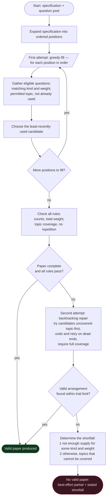

# Question-Paper Generation — Raw Algorithm

A pure description of the generation method, free of any code, variable, file, or framework detail.
It reads as a standalone algorithm: given a paper specification and a pool of available questions,
produce a valid paper or explain precisely why none exists.

---

## Inputs

- A **specification** describing the desired paper:
  - an ordered list of **groups**, each requiring a number of questions of a fixed **kind** and a
    fixed **weight** (marks);
  - a set of **permitted topics**;
  - a required **total weight** for the whole paper.
- A **pool** of available questions, each with a kind, a weight, a topic, and a usage history.

## Output

- Either a **complete valid paper** together with a per-rule report showing every rule passed,
- or, when no valid paper exists, a **best-effort partial paper** together with a precise statement
  of what the pool lacks.

## Rules a valid paper must satisfy

1. **Counts** — each group holds exactly the number of questions it asks for.
2. **Total weight** — the sum of all question weights equals the required total.
3. **Topic coverage** — every permitted topic appears at least once.
4. **No repetition** — no question appears twice in the same paper.

---

## The method

The method works in two attempts. A fast, simple first attempt usually succeeds; a more thorough
second attempt repairs the cases where the first attempt produces an invalid paper even though a
valid one exists. If both fail, the method explains the shortfall.

### Step 1 — Expand the specification into positions
Turn the specification into an ordered list of single **positions**. A group that asks for *n*
questions of a given kind and weight becomes *n* positions, each to be filled by exactly one
question of that kind and weight. The positions keep the group order.

### Step 2 — First attempt: greedy fill
Walk the positions in order. For each position:
1. Gather every eligible question — one whose kind and weight match the position, whose topic is
   permitted, and which has not already been placed in this paper.
2. Order those candidates by **least-recently-used first** (fewest past uses, ties broken by a
   fixed stable key), and take the first one.
3. If at least one candidate exists, place it and remember it so it cannot be reused; if none
   exists, leave the position empty.

This step is intentionally **blind to topic coverage** — it only optimises freshness. That blindness
is what allows it to occasionally produce a paper that is complete yet fails coverage (for example,
by drawing every question from only a few topics), which the next step exists to fix.

### Step 3 — Check the rules
Measure the filled paper against all four rules. If every position is filled **and** every rule
passes, the paper is valid — **stop and return success**.

### Step 4 — Second attempt: backtracking repair
If the greedy paper is invalid, search for a fully valid arrangement by systematic trial and error:
1. For every position, prepare its complete set of eligible candidates.
2. Fill positions one at a time, in order. At each position, try its candidates ordered so that
   **questions from not-yet-covered topics come first** (then by least-recently-used, then by the
   stable key). Never reuse a question already chosen on the current attempt.
3. Each time a choice is made, move on to the next position. If a later position cannot be completed,
   undo the most recent choice and try the next candidate instead. When the last position is reached,
   accept the arrangement **only if every topic is covered**; otherwise keep backtracking.
4. Bound the search by a fixed maximum number of trials so it always terminates.

If this search finds a complete, fully covering arrangement, re-check the rules and **return success**.

### Step 5 — Explain the shortfall
If even the thorough search fails, no valid paper exists. Return the best partial paper obtained so
far, together with a precise statement of what is missing, determined in two tiers:
1. **Not enough supply (checked first):** for each distinct combination of kind and weight, compare
   how many positions need it against how many distinct eligible questions exist. Every combination
   that is short becomes a stated shortfall, e.g. *"needs three more long questions worth twenty
   marks each."*
2. **Cannot cover all topics (otherwise):** if supply is sufficient everywhere yet no arrangement
   covers every topic, name each topic that could not be covered.

---

## A note on repeatability

The candidate ordering is a **total order** (least-recently-used, then a fixed stable key), so the
method is fully deterministic: the same pool and the same specification always yield the same paper.
For successive papers to differ, the usage history must change between runs (each placed question
becoming "more used") and recently produced papers must be excluded from future pools — both of which
are properties of the surrounding workflow rather than of this core method.

---

## Cost

Let the paper have a number of positions, and let each position have at most a certain number of
eligible candidates.
- The greedy attempt and the rule check together cost on the order of *positions × candidates* —
  one pass with a simple selection per position.
- The backtracking attempt is, in the worst case, exponential, but the fixed trial limit caps it,
  and the "uncovered-topics-first" ordering reaches a covering arrangement quickly in practice.

---

## Raw flowchart



---

## Pseudocode

```
GENERATE(specification, pool):
    positions ← expand each group into one position per required question, in order

    # First attempt — greedy
    chosen ← empty
    for each position in positions:
        candidates ← questions in pool matching the position's kind and weight,
                     with a permitted topic, not already in chosen
        order candidates by least-recently-used, then a stable key
        if candidates not empty:
            place the first candidate into the position; add it to chosen

    if every position filled and ALL-RULES-PASS(chosen, specification):
        return SUCCESS(chosen)

    # Second attempt — backtracking
    arrangement ← SEARCH(positions, 0, empty)        # depth-first, bounded by a trial limit
    if arrangement found:
        return SUCCESS(arrangement)

    # No valid paper
    return FAILURE(best partial = chosen, shortfall = EXPLAIN(positions, pool))


SEARCH(positions, index, partial):
    if trial limit exceeded: return none
    if index = number of positions:
        return partial if every permitted topic is covered, else none
    candidates ← eligible questions for positions[index], not used in partial
    order candidates by (uncovered topic first, then least-recently-used, then stable key)
    for each candidate:
        result ← SEARCH(positions, index + 1, partial + candidate)
        if result found: return result
    return none


ALL-RULES-PASS(chosen, specification):
    return  each group has exactly its required count
        and total weight equals the required total
        and every permitted topic appears at least once
        and no question repeats


EXPLAIN(positions, pool):
    for each distinct (kind, weight):
        deficit ← positions needing it − distinct eligible questions available
        if deficit > 0: record "need <deficit> more <kind> worth <weight>"
    if any deficits recorded: return them
    else: return each permitted topic that no arrangement could cover
```
