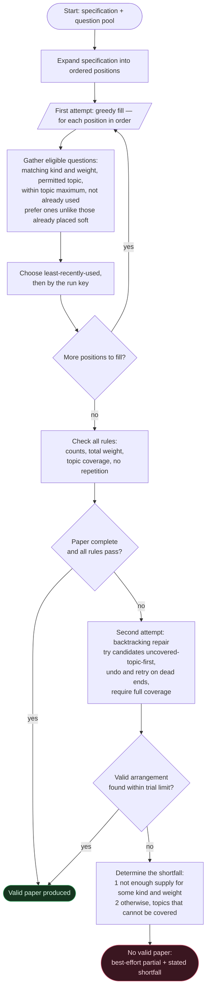

# Question-Paper Generation — Raw Algorithm

A pure description of the generation method, free of any code, variable, file, or framework detail.
It reads as a standalone algorithm: given a paper specification and a pool of available questions,
produce a valid paper or explain precisely why none exists.

---

## Inputs

- A **specification** describing the desired paper:
  - an ordered list of **groups**, each requiring a number of questions of a fixed **kind** and a
    fixed **weight** (marks);
  - a set of **permitted topics**, each optionally carrying a **maximum** number of questions it may
    contribute;
  - a required **total weight** for the whole paper.
- A **pool** of available questions, each with a kind, a weight, one or more topics, and a usage
  history.
- A **run key** — a value chosen afresh for each run (or fixed to reproduce a previous paper) that
  settles ties between otherwise-equal candidates.

## Output

- Either a **complete valid paper** together with a per-rule report showing every rule passed,
- or, when no valid paper exists, a **best-effort partial paper** together with a precise statement
  of what the pool lacks.

## Rules a valid paper must satisfy

1. **Counts** — each group holds exactly the number of questions it asks for.
2. **Total weight** — the sum of all question weights equals the required total.
3. **Topic coverage** — every permitted topic appears at least once.
4. **Topic maximums** — no topic contributes more than its stated maximum (topics without a stated
   maximum are unlimited). A question belonging to several topics counts toward each of them.
5. **No repetition** — no question appears twice in the same paper.

A softer **preference**, not a rule: where a choice is otherwise free, avoid placing a question that
is very **similar in meaning** to one already in the paper. It never overrides a rule and never
blocks a paper — see Step 2.

---

## The method

The method works in two attempts. A fast, simple first attempt usually succeeds; a more thorough
second attempt repairs the cases where the first attempt produces an invalid paper even though a
valid one exists. If both fail, the method explains the shortfall.

### Step 1 — Expand the specification into positions
Turn the specification into an ordered list of single **positions**. A group that asks for *n*
questions of a given kind and weight becomes *n* positions, each to be filled by exactly one
question of that kind and weight. The positions keep the group order.

### Step 2 — First attempt: greedy fill
Walk the positions in order. For each position:
1. Gather every eligible question — one whose kind and weight match the position, whose topic is
   permitted, whose placement would not exceed any topic maximum so far, and which has not already
   been placed in this paper.
2. **Prefer variety:** set aside candidates that are very similar in meaning to a question already
   placed — *unless* setting them aside would leave nothing, in which case keep them all. This is a
   preference, never a blocker: it can never empty the set of choices, and if the similarity signal
   is unavailable it simply does nothing.
3. Order what remains by **least-recently-used first** (fewest past uses), then by the **run key**
   (which settles ties — a fixed value reproduces a previous paper, a fresh value yields a different
   valid one), and take the first.
4. If at least one candidate exists, place it and remember it so it cannot be reused, updating the
   covered topics and per-topic tallies; if none exists, leave the position empty.

This step is intentionally **blind to topic coverage** — it only optimises freshness (and variety).
That blindness is what allows it to occasionally produce a paper that is complete yet fails coverage
(for example, by drawing every question from only a few topics), which the next step exists to fix.

### Step 3 — Check the rules
Measure the filled paper against all four rules. If every position is filled **and** every rule
passes, the paper is valid — **stop and return success**.

### Step 4 — Second attempt: backtracking repair
If the greedy paper is invalid, search for a fully valid arrangement by systematic trial and error:
1. For every position, prepare its complete set of eligible candidates.
2. Fill positions one at a time, in order. At each position, try its candidates ordered so that
   **questions from not-yet-covered topics come first** (then by least-recently-used, then by the
   run key). Skip any that would exceed a topic maximum on the current path, and never reuse a
   question already chosen on the current attempt. *(The similarity preference from Step 2 is
   deliberately not applied here: it is a soft preference, not a rule, and enforcing it during repair
   could reject the only valid arrangement. Repair optimises for a valid paper above all.)*
3. Each time a choice is made, move on to the next position. If a later position cannot be completed,
   undo the most recent choice and try the next candidate instead. When the last position is reached,
   accept the arrangement **only if every topic is covered**; otherwise keep backtracking.
4. Bound the search by a fixed maximum number of trials so it always terminates.

If this search finds a complete, fully covering arrangement, re-check the rules and **return success**.

### Step 5 — Explain the shortfall
If even the thorough search fails, no valid paper exists. Return the best partial paper obtained so
far, together with a precise statement of what is missing, determined in two tiers:
1. **Not enough supply (checked first):** for each distinct combination of kind and weight, compare
   how many positions need it against how many distinct eligible questions exist. Every combination
   that is short becomes a stated shortfall, e.g. *"needs three more long questions worth twenty
   marks each."*
2. **Cannot cover all topics (otherwise):** if supply is sufficient everywhere yet no arrangement
   covers every topic, name each topic that could not be covered.

---

## A note on repeatability

The candidate ordering is a **total order** (least-recently-used, then the run key), so the method is
**deterministic given its run key**: the same pool, the same specification *and the same run key*
always yield the same paper — which is what makes any result reproducible and re-checkable. The run
key is the method's only source of variation, and it only reorders candidates the rest of the
ordering already ties, so it never overrides counts, coverage, maximums or any rule.

Because a fresh run key is normally chosen per run, two runs of the *same* specification produce two
*different* valid papers — so the method no longer collapses to one fixed output. (Two further
sources of divergence live in the surrounding workflow: usage history changes as placed questions
become "more used", and recently produced papers are excluded from future pools.) Fix the run key and
the paper is reproduced exactly.

---

## Cost

Let the paper have a number of positions, and let each position have at most a certain number of
eligible candidates.
- The greedy attempt and the rule check together cost on the order of *positions × candidates* —
  one pass with a simple selection per position.
- The backtracking attempt is, in the worst case, exponential, but the fixed trial limit caps it,
  and the "uncovered-topics-first" ordering reaches a covering arrangement quickly in practice.

---

## Raw flowchart



---

## Pseudocode

```
GENERATE(specification, pool, runKey):
    positions ← expand each group into one position per required question, in order

    # First attempt — greedy
    chosen ← empty
    for each position in positions:
        candidates ← questions in pool matching the position's kind and weight,
                     with a permitted topic, within every topic's maximum given chosen,
                     not already in chosen
        fresh ← candidates minus those very similar in meaning to something in chosen
        if fresh not empty: candidates ← fresh          # preference only — never empties
        order candidates by least-recently-used, then by runKey
        if candidates not empty:
            place the first candidate into the position; add it to chosen

    if every position filled and ALL-RULES-PASS(chosen, specification):
        return SUCCESS(chosen)

    # Second attempt — backtracking (similarity preference intentionally dropped here)
    arrangement ← SEARCH(positions, 0, empty, runKey)   # depth-first, bounded by a trial limit
    if arrangement found:
        return SUCCESS(arrangement)

    # No valid paper
    return FAILURE(best partial = chosen, shortfall = EXPLAIN(positions, pool))


SEARCH(positions, index, partial, runKey):
    if trial limit exceeded: return none
    if index = number of positions:
        return partial if every permitted topic is covered, else none
    candidates ← eligible questions for positions[index], not used in partial,
                 and not exceeding any topic maximum on this path
    order candidates by (uncovered topic first, then least-recently-used, then runKey)
    for each candidate:
        result ← SEARCH(positions, index + 1, partial + candidate, runKey)
        if result found: return result
    return none


ALL-RULES-PASS(chosen, specification):
    return  each group has exactly its required count
        and total weight equals the required total
        and every permitted topic appears at least once
        and no topic exceeds its stated maximum
        and no question repeats


EXPLAIN(positions, pool):
    for each distinct (kind, weight):
        deficit ← positions needing it − distinct eligible questions available
        if deficit > 0: record "need <deficit> more <kind> worth <weight>"
    if any deficits recorded: return them
    else: return each permitted topic that no arrangement could cover
```
