# QForge Paper-Generation Algorithm (M2)

> The academic centerpiece. A **deterministic greedy + backtracking** engine that turns a
> blueprint into a valid question paper — or, when the bank is too thin, reports exactly what it
> lacks. Pure PHP, no external solver, fully unit-tested.
>
> Scope: originally written at **Milestone 2**, updated through **Post-M6**. Later-milestone
> changes are called out inline: cross-paper "exclude last N" + `used_count` bumping (M3),
> multi-unit questions / union coverage (Post-M5), coverage-aware greedy + per-unit maximums +
> the corrected structural-infeasibility rule (Post-M5.1), and a **seeded tie-break** + **within-paper
> semantic-duplicate guard** (Post-M6 — the paper varies per run yet stays reproducible per seed,
> and one paper avoids near-duplicate questions).

Source: [`code/app/Services/PaperGeneration/`](../code/app/Services/PaperGeneration/)

---

## 1. Vocabulary

| Term | Meaning |
|---|---|
| **Blueprint** | A teacher-owned template: `sections` (the paper structure), `unitRules` (allowed units), `unitAllocations` (per-unit **max** caps since Post-M5.1; `marks` display-only), `exclusionRules`. Stored as JSON in `blueprints.definition`. |
| **Slot** | One position in the paper to be filled by exactly one question, carrying `(sectionLabel, type, marks, displayNo)`. Sections are flattened into an ordered list of slots. |
| **Candidate** | An **approved** question matching a slot's `subject + type + marks`, within the allowed units. |
| **Coverage** | The hard rule that *every* allowed unit (`unitRules`) appears at least once in the finished paper. |
| **GenerationResult** | The output: either a valid paper + all-pass `constraint_results`, or a best-effort partial + `missing_slots` naming the shortfall. |

**Design stance.** `sections` are authoritative for structure. `unitRules` is *both* the hard
candidate filter *and* the coverage rule. `unitAllocations` was a **soft** hint in M2; since
Post-M5.1 its `count` is enforced as a per-unit **maximum** (unset = uncapped, `marks` stays
display-only). The greedy step was deliberately unit-agnostic in M2 (pure least-recently-used) —
which is what let a naïve pass starve a unit and what the backtracking pass repaired. Since
Post-M5.1 the greedy is **coverage-aware** (uncovered-unit-first, same rank the backtracker always
used), so most papers cover all units on the first pass; backtracking remains the repair pass for
what greedy's myopia still misses (cap and marks-shape conflicts across later slots). Selection is
rule-based on purpose — coverage is a hard rank, repetition a hard exclusion window, overload a
hard cap — rather than a tuned additive score whose weights could trade a unit away.

Two Post-M6 refinements sit *underneath* those hard rules without weakening them. **Seeded
tie-break:** the final ordering key changed from raw `id` to `TieBreaker::key(seed, id)`, so the seed
only reorders candidates the rank *already treats as equal* — coverage, LRU, caps and every
constraint are untouched, but a fresh seed per run yields a *different valid paper* (and the same seed
reproduces one exactly). **Within-paper duplicate guard:** the greedy pass additionally *prefers*
candidates that aren't near-duplicates (by embedding cosine) of questions already placed — a **soft,
pool-non-emptying, fail-open** preference, applied in greedy only (never backtracking), so it can
never cause a shortfall or turn a satisfiable paper infeasible. It is the one place RAG reaches into
selection, and only as far as breaking a tie toward variety.

---

## 2. The components (single responsibility each)

| Class | Responsibility |
|---|---|
| `BlueprintCompiler` | `blueprint.definition` → `CompiledBlueprint` (ordered **slots**, `allowedUnitIds`, per-unit **max caps**, `lastNPapers`, `excludeExamYearsBack`, structural-feasibility predicates). |
| `CandidateFilter` | For a slot, query approved questions matching subject/type/marks with **any tagged unit** in the allowed set, excluding already-chosen ids. (Cross-paper repetition is an injectable closure — **no-op in M2**; post-M6 the generator composes two into it: last-N **papers** and last-N **exam-years**.) |
| `GreedySelector` | Pick the best candidate **coverage-first**: covers-an-uncovered-unit, then `used_count` asc, then the **seeded tie-break** (`TieBreaker::key(seed, id)` — `id` order when unseeded, a per-seed shuffle otherwise). Deterministic given the seed; degenerates to pure LRU with no unit rules and no seed. |
| `ConstraintValidator` | Score selections → per-section counts, total marks, **unit coverage**, **unit maximums**, no in-paper repetition → `ConstraintResult[]`. |
| `BacktrackingResolver` | On an invalid greedy result, search for a fully-valid assignment via a bounded DFS (uncovered-unit-first, then `used_count`, then the same seeded tie-break; cap-busting candidates pruned). |
| `SimilarityGuard` | *(Post-M6)* Within-paper near-duplicate guard the greedy pass consults. `NullSimilarityGuard` (default, no-op → engine stays a pure function of the bank) or `VectorSimilarityGuard` (cosine over Qdrant question vectors, threshold `RAG_DUPLICATE_THRESHOLD`, **fails open**). |
| `PaperGenerator` | Facade that orchestrates all of the above and returns a `GenerationResult`. Pure — **no DB writes**. Takes an optional `?int $seed` and `?SimilarityGuard $guard` per run. |

Persistence (draft `papers` + `paper_questions`) is the **controller's** job, not the engine's — this
keeps the engine unit-testable in isolation.

---

## 3. The algorithm, step by step

### Phase 0 — Compile (`BlueprintCompiler::compile`)
1. Read `definition.sections`. For each section of `count` n, emit **n slots**, each carrying the
   section label, the normalised `type` (`"Short Answer"` → `short`, `"Long Answer"` → `long`,
   `"MCQ"` → `mcq`), `marksEach`, and a running 1-based `displayNo`. Slots stay in section order.
2. Resolve `definition.unitRules` (the truthy unit **names**) to `allowedUnitIds` within the subject.
   *Empty ⇒ no unit restriction and no coverage requirement.*
3. Compile `unitAllocations` counts into **per-unit max caps** (`unitId => Σcount`; only allowed
   units, entries ≤ 0 dropped ⇒ uncapped) and capture `exclusionRules.lastNPapers` +
   `exclusionRules.excludeExamYearsBack`.
4. Return a `CompiledBlueprint{ subjectId, totalMarks, slots[], allowedUnitIds[], unitNames{}, unitCaps{}, lastNPapers, excludeExamYearsBack }`,
   which also carries the structural-feasibility predicates (see Phase 3).

### Phase 1 — Greedy fill (`PaperGenerator::greedyFill`)
For each slot **in order**:
1. **Filter** (`CandidateFilter::for`): approved questions where
   `subject_id = X AND status = 'approved' AND type = slot.type AND marks = slot.marks`,
   restricted to `allowedUnitIds`, **excluding ids already chosen in this paper**, ordered
   `used_count ASC, id ASC`.
   *(The cross-paper exclusion closure is wired here but inert in M2. Post-M6 the generator composes
   two rules into it: **last-N papers** — questions on the most recent N papers/imported exams — and
   **last-N exam-years** — questions whose `attributes.exam_year` is in the N years before the current
   one, `excludeExamYearsBack`; both build an excluded-id set, so questions with no recorded year are
   never dropped.)*
2. **Cap guard** (Post-M5.1): reject candidates whose selection would push any tagged capped unit
   past its maximum (a multi-unit question counts against every tagged capped unit).
3. **Prefer-dissimilar** (Post-M6): drop candidates the `SimilarityGuard` flags as near-duplicates of
   questions already placed on this paper — **but only if that leaves at least one candidate**, so
   dedup can never empty the pool. Inert when no guard is supplied or RAG is down (fails open).
4. **Pick** (`GreedySelector::pick`): candidates covering a **still-uncovered allowed unit** rank
   first, then lowest `used_count`, then the **seeded tie-break** (lowest `id` when unseeded). If the
   pool is empty, the slot is left unfilled.
5. Record the pick, add its id to the in-paper exclusion set (guarantees no repetition), and merge
   its tagged units into the running covered set / cap usage.

### Phase 2 — Validate (`ConstraintValidator::validate`)
Score the current selections into a `ConstraintResult[]` (`{label, expected, got, pass}`):
- **Per section:** filled count == required count.
- **Total marks:** Σ(marks of filled slots) == `blueprint.total_marks`.
- **Unit coverage** (only when units are restricted): distinct units used == |allowedUnitIds| —
  union semantics, a multi-unit question covers every allowed unit it is tagged with.
- **Unit maximums** (only when caps exist): every capped unit tagged by ≤ its max questions.
- **No repetition:** zero duplicate question ids within the paper.

If **every slot is filled** *and* **every constraint passes** → return **success**
(`satisfiable = true`). Done.

### Phase 3 — Backtracking repair (`BacktrackingResolver::resolve`)
Greedy is coverage-aware but **myopic** — it cannot see how a pick constrains later slots (cap
exhaustion, marks-shape conflicts), so an invalid greedy paper is still possible. When it is,
search for a fully-valid assignment:

0. **Structural short-circuit** (Post-M5.1): when `CompiledBlueprint::structurallyInfeasible()`
   holds — coverage demands more units than the paper can ever reach
   (`|allowedUnitIds| > MAX_AI_UNITS_PER_QUESTION(2) × |slots|`), or every allowed unit is capped
   and the caps sum below the slot count — skip the DFS entirely (it cannot succeed) and go
   straight to Phase 4.
1. Build the **full candidate pool per slot** (no per-paper exclusions; the resolver enforces
   uniqueness itself).
2. **Depth-first search** over slots, depth = slot index:
   - At each slot, order its remaining candidates **uncovered-allowed-unit first**, then `used_count`,
     then the **seeded tie-break** (`id` when unseeded) — actively steering toward coverage.
   - Skip any candidate whose id is already used on this path (no repetition) and **prune** any
     that would exceed a per-unit cap on this path.
   - Recurse. On reaching the last slot, **accept only if coverage holds**; otherwise backtrack and
     try the next candidate.
   - *(The Post-M6 similarity guard is deliberately **not** applied here — similarity is a soft
     preference, not a constraint, so enforcing it in the repair pass could turn a satisfiable paper
     infeasible. The repair pass optimises for a valid assignment above all.)*
3. Bounded by `MAX_ITERATIONS = 50_000` so it always terminates. Returns a complete valid assignment,
   or `null` if none exists within the budget.

If the resolver returns an assignment → re-validate → **success** (`satisfiable = true`).

### Phase 4 — Explain the shortfall (`PaperGenerator::computeMissingSlots`)
If backtracking also fails, the blueprint is infeasible. Return a **best-effort partial** (the greedy
fill — whatever *could* be placed) plus `missing_slots[]`, computed in two tiers:

1. **Supply deficit (primary):** group slots by `(section, type, marks)`; for each group,
   `deficit = required − distinct approved questions available`. Every group with `deficit > 0`
   becomes a `MissingSlot{ type, marks, need: deficit, unitIds }`, e.g. *"3× 20-mark long"*,
   targeting the scarcest allowed unit (the **two** scarcest when units outnumber slots, so an AI
   top-up question pulls coverage double duty).
2. **Coverage deficit (fallback):** if supply is adequate everywhere but the paper still can't be
   covered — when `|units| ≤ |slots|`, name each **uncovered allowed unit** as a single-unit
   missing slot; when `|units| > |slots|`, only unit-spanning questions can close the gap, so
   **pair the `2×(units − slots)` scarcest units** (one missing slot per pair, plus singles for
   any uncovered leftovers). Each `MissingSlot.unitIds` is ordered scarcest-first — the AI top-up
   makes index 0 the new question's primary unit and tags the full set.

### Phase 5 — Preview then Save (Post-M6)
Generation is a **two-step, preview-first flow** — `generate` never persists.

- **Generate = preview** (`POST /papers/generate`, `PaperController::generate`): the controller draws
  a fresh `random_int` seed per request (or accepts a client `seed` to reproduce a paper), runs the
  engine, and returns the paper **with `id: null`** plus the `seed` and `blueprint_id`. **Nothing is
  written** — no `papers` row, no `used_count` bump, no `last_used_at` — so experimenting with
  regenerations never clutters history or skews usage/repetition stats. Infeasible responses are the
  same shape (unpersisted partial + `missing_slots`). Both are HTTP **200**.
- **Save = persist** (`POST /papers`, `PaperController::store`): the client sends back
  `{ blueprint_id, seed, name? }`. Because the engine is deterministic given its seed, Save
  **re-generates** rather than trusting a client-supplied selection, then in a transaction inserts a
  `papers` row (`status = saved`) + one `paper_questions` row per selection, **increments each picked
  question's `used_count`** (the denormalized LRU/display counter — the last-N rule itself reads
  `paper_questions`, not this column), and stamps the blueprint's `last_used_at`. If the bank changed
  so the seed no longer yields a full paper, Save returns **422** ("regenerate") rather than persist
  something the teacher never saw. Success is HTTP **201**.
- **Export** (`GET /papers/{id}/export`) bumps `export_count` and flips `status` to `exported`.

So the lifecycle is **preview (unsaved) → saved → exported**; there is no auto-created `draft`.

---

## 4. Why it's deterministic (given its seed)

Candidate ordering is a total order — `uncoveredRank, used_count ASC, TieBreaker::key(seed, id)` —
every tie chain ends in a key that is unique per `id`. So the ordering is fully determined by the
inputs **plus the seed**: same bank + same blueprint + **same seed** ⇒ the same paper, every time
(the tests pin this by passing a `null` seed, which reproduces the original pure-`id` order). The
seed is the *only* source of variation, and it only reorders candidates the rank already ties —
coverage, LRU, caps and constraints are never overridden.

*Historical note (M2):* before Post-M6 the final key was raw `id`, and in M2 nothing mutated the
ordering between runs (`used_count` bumping arrived in M3, last-N was inert), so consecutive
generations were **identical by design**. Two things now make successive papers diverge on purpose:
M3's `used_count` bump + last-N repetition control (across runs) and the Post-M6 per-run seed (within
a single blueprint, without needing prior papers).

---

## 5. Complexity

Let `S` = slots, `C` = max candidates per slot.
- **Greedy + validate:** `O(S · C)` — one filtered query + linear pick per slot.
- **Backtracking:** worst case exponential, but bounded by `MAX_ITERATIONS`; the uncovered-unit-first
  ordering reaches a covering assignment quickly in practice, so it rarely approaches the cap.

---

## 6. Flowchart

Source: [`diagrams/algorithm-m2.mmd`](diagrams/algorithm-m2.mmd)

```mermaid
flowchart TD
    A([POST /papers/generate · blueprint_id]) --> B[BlueprintCompiler:<br/>sections → ordered slots,<br/>unitRules → allowedUnitIds]

    B --> C[/Greedy pass — for each slot in order/]
    C --> D[CandidateFilter:<br/>approved · subject · type · marks<br/>any tag ∈ allowedUnits · exclude chosen<br/>reject cap-busting candidates<br/>prefer non-near-duplicates soft · M6]
    D --> E[GreedySelector:<br/>uncovered-unit-first,<br/>then used_count,<br/>then seeded tie-break · M6]
    E --> F{More slots?}
    F -- yes --> C

    F -- no --> G[ConstraintValidator:<br/>counts · total marks · unit coverage ·<br/>unit maximums · no repetition]
    G --> H{All slots filled<br/>AND all constraints pass?}

    H -- yes --> S1([SUCCESS])

    H -- no --> H2{Structurally infeasible?<br/>units > 2×slots, or every unit<br/>capped and Σcaps < slots}
    H2 -- yes --> L
    H2 -- no --> I[Build full candidate pool per slot]
    I --> J[BacktrackingResolver:<br/>bounded DFS, uncovered-unit-first,<br/>distinct ids, caps pruned,<br/>coverage must hold]
    J --> K{Valid assignment<br/>found?}

    K -- yes --> G2[Re-validate selections] --> S1

    K -- no --> L[computeMissingSlots:<br/>1 supply deficit = required − available<br/>2 else uncovered allowed units<br/>paired scarcest-first when units > slots]
    L --> F2([INFEASIBLE:<br/>best-effort partial + missing_slots])

    S1 --> R1([200 · PREVIEW: paper id=null + seed + blueprint_id<br/>+ constraint_results · nothing persisted])
    R1 --> P[/Later: POST /papers Save<br/>re-generate from seed/]
    P --> P2[persist papers status=saved + paper_questions<br/>bump used_count · stamp last_used_at · 201]

    F2 --> R2([200 · satisfiable:false ·<br/>partial paper + missing_slots + constraint_results + seed<br/>nothing persisted])

    classDef ok fill:#16351f,stroke:#3fae6b,color:#d7f5e3;
    classDef bad fill:#3a1620,stroke:#d65a76,color:#f7d9e1;
    class S1,R1 ok;
    class F2,R2 bad;
```

---

## 7. How the unit tests map to the phases

These live in [`code/tests/Unit/PaperGeneration/PaperGeneratorTest.php`](../code/tests/Unit/PaperGeneration/PaperGeneratorTest.php)
and *are* the proof of the contribution:

| Test | Exercises |
|---|---|
| feasible blueprint → valid paper, all pass | Phases 0–2 |
| unit coverage enforced | Phase 2 coverage rule |
| no in-paper repetition | Phase 1 exclusion set |
| infeasible → correct `missing_slots` | Phase 4 supply deficit |
| **backtracking recovers a greedy-fails case** | Phase 3 — the centerpiece (first proves the *naive LRU* greedy alone starves a unit, then the full engine recovers) |
| coverage-aware greedy covers all units first-pass | Phase 1 coverage rank (Post-M5.1) |
| unit cap limits a rich unit / multi-unit question consumes both caps | Phases 1–3 cap guard (Post-M5.1) |
| caps summing below slots → structurally infeasible | Phase 3 short-circuit + message (Post-M5.1) |
| multi-unit questions cover more units than slots | Phase 2 union coverage (Post-M5) |
| missing slots pair the scarcest units when units > slots | Phase 4 pairing (Post-M5.1) |
| empty unit rules leave coverage and caps inert | regression — engine equals plain LRU |
| no seed preserves the legacy id ordering | Phases 1/3 seeded tie-break, `null` seed (Post-M6) |
| same seed reproduces a paper; different seeds vary it | Phases 1/3 seeded tie-break (Post-M6) |
| greedy avoids a near-duplicate when an alternative exists | Phase 1 prefer-dissimilar step (Post-M6) |
| duplicate avoidance never causes a shortfall | Phase 1 pool-non-emptying rule (Post-M6) |
| excludes questions from a recent exam year | Phase 1 exam-year exclusion (Post-M6) |
| exam-year exclusion is inert at 0 and keeps year-less questions | Phase 1 exam-year exclusion boundary (Post-M6) |

Two focused suites back the Post-M6 rows:
[`TieBreakerTest`](../code/tests/Unit/PaperGeneration/TieBreakerTest.php) (the ordering key: `null` =
id order, stable per seed, reshuffles between seeds) and
[`VectorSimilarityGuardTest`](../code/tests/Unit/PaperGeneration/VectorSimilarityGuardTest.php)
(cosine-over-threshold flags a duplicate, orthogonal vectors don't, fails open when RAG is off or the
index errors).
