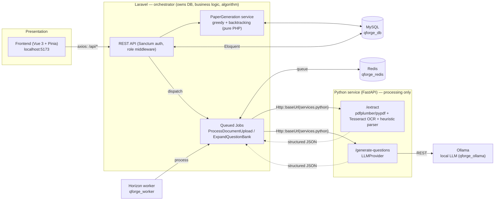
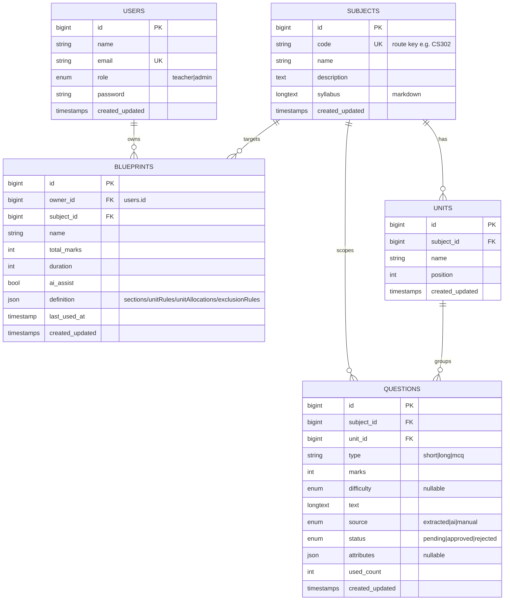
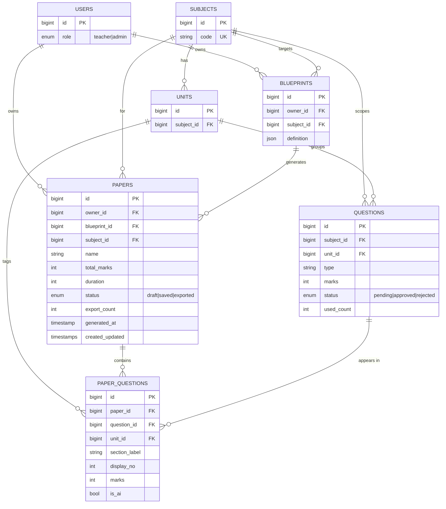
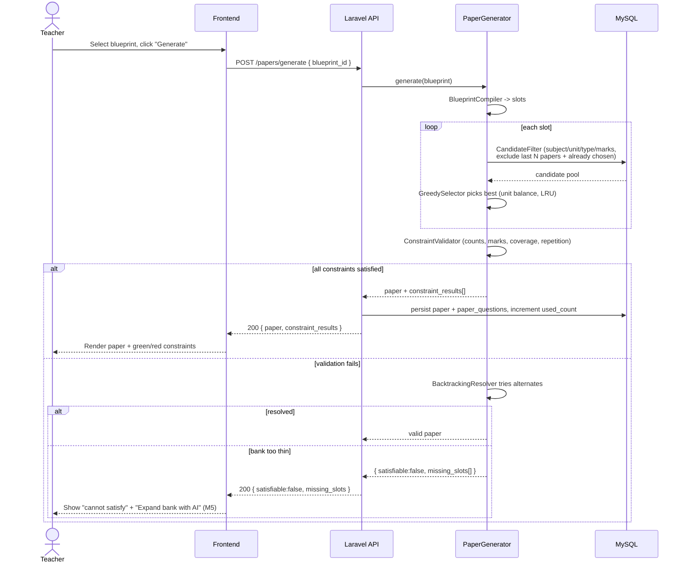
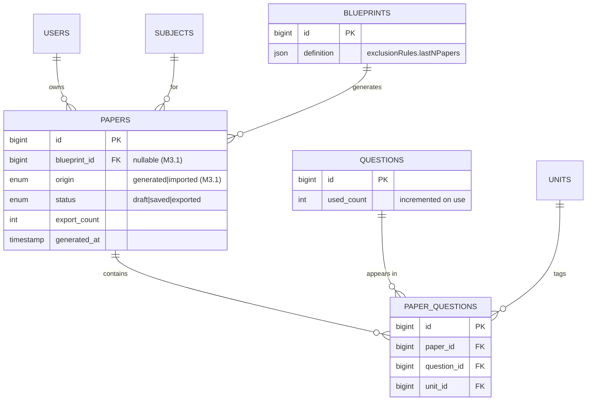
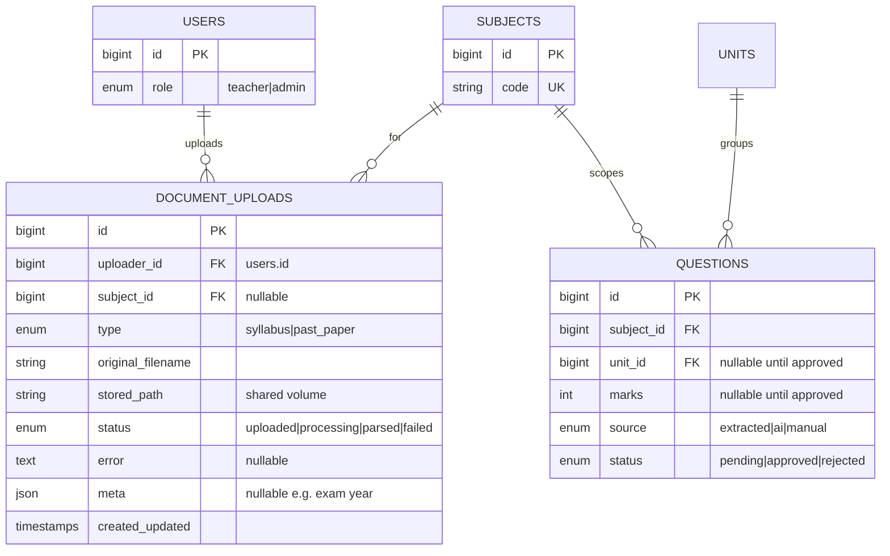
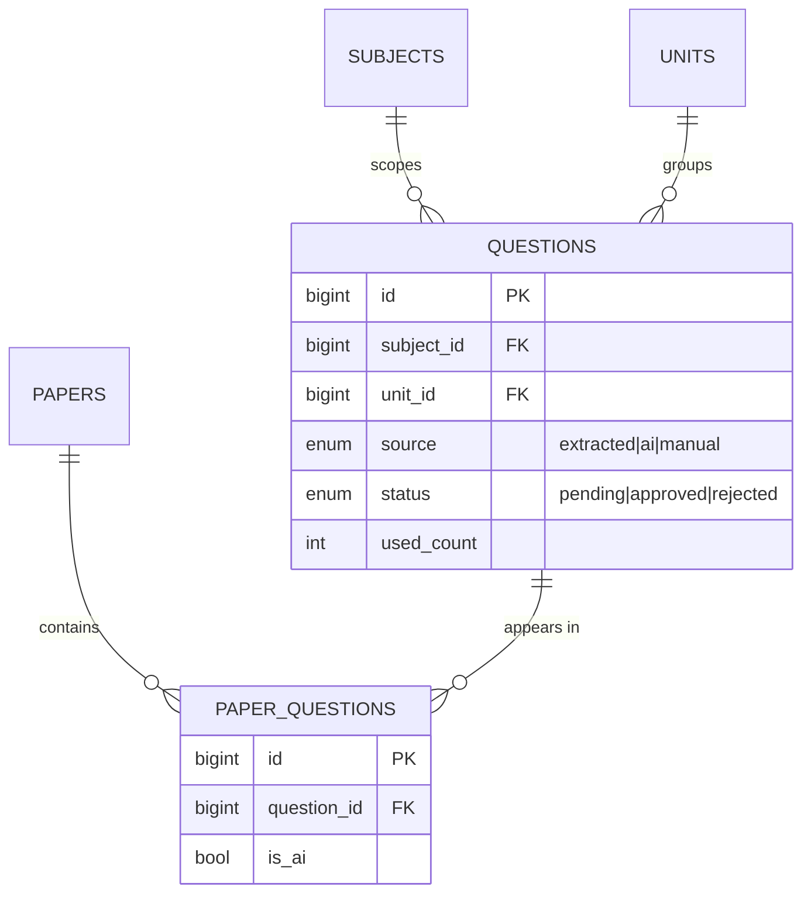

# QForge — Milestones

A milestone-by-milestone build plan for **QForge: Smart Question Paper Generator**.
It is the demo/teaching companion to [`../PLAN.md`](../PLAN.md): PLAN.md holds the design
decisions and architecture; this file slices the work into independently **shippable, demoable**
milestones and shows the **database growing step by step**.

## How to read this

- Milestones are **algorithm-first**: the constraint-based generation engine (the academic
  centerpiece) is built and proven early (M2), against seeded data, before the messier PDF/AI
  pipeline.
- Each milestone ends with a **displayable product** — a real frontend screen working end-to-end
  against the live backend (the existing Vue screens get their Pinia mock data swapped for live
  calls through [`../frontend/src/api/client/axios.ts`](../frontend/src/api/client/axios.ts)).
- Each milestone shows the **cumulative database schema** after that milestone, with newly-added
  tables called out. Diagram sources also live standalone in [`diagrams/`](diagrams/) for reuse in
  the report.

**ER legend.** Each ER diagram is the *full* schema as it exists after that milestone. Tables
introduced in the milestone are named in a `%% NEW in Mx` comment at the top of the diagram and in
the section's "New tables" line. Milestones that add no tables say so explicitly. (Mermaid `erDiagram`
has no per-entity fill colour, so "new" is marked textually rather than by shading.)

---

## Progress

> **Keep this current.** When a milestone (or a meaningful slice) is finished, update the `Status`
> here **and** the `Status:` line in that milestone's section. Status values: `Not started` →
> `In progress` → `Done`. Note partial work in the Notes column.

| Milestone | Status | Notes |
|---|---|---|
| M1 — Domain foundation | Done | Migrations/models/CRUD + role gating, demo seeder, PythonService, frontend wired to live API. 20 feature tests green. |
| M2 — The algorithm (centerpiece) | Done | Greedy+backtracking engine in `app/Services/PaperGeneration/`, `POST /papers/generate`, papers/paper_questions persistence, constraint_results + missing_slots. 29 tests green (5 unit incl. backtracking-recovery + 4 feature). Generate/Paper screens wired to live API. |
| M3 — Papers lifecycle + export | Done | Cross-paper repetition (exclude last-N papers, owner+subject) wired into `PaperGenerator`; `used_count` bumped on persist; `apiResource papers` (index/show/update/destroy) + `analytics` + `export?format=pdf\|docx` from one shared `PaperViewModel` (dompdf + PhpWord). CS301 bank expanded for two disjoint papers. 36 tests green (new: engine exclusion unit test + double-generate/export feature suite). Paper View / Export / History wired to live API. |
| M3.1 — Imported past papers | Done | Real exams recorded as `papers` rows (`origin=imported`, nullable `blueprint_id`) via admin-only `POST /subjects/{subject}/past-papers` → `ImportedPaperService`. `PaperGenerator::lastNExclusion` window is now subject-wide (`owner_id = me OR origin = imported`), pure rolling. History/analytics filtered to `origin=generated`. 46 tests green (+10). See [`adr/0001-imported-past-papers.md`](adr/0001-imported-past-papers.md). |
| M4 — PDF pipeline | Done | Python `POST /extract` (pdfplumber + per-page Tesseract OCR fallback + heuristic parser) in `python-service/app/`; `document_uploads` + `ProcessDocumentUpload` on Redis/Horizon; `POST/GET/DELETE /uploads`; review queue (`approve`/`reject` + bulk) gated so a candidate missing a unit or marks cannot be approved. `questions.unit_id`/`marks` now nullable. 89 Laravel tests (+43) and 51 pytest tests green. Upload + Review Queue screens wired to the live API. |
| M4.1 — Syllabus import | Done | Python `services/syllabus.py` parses a syllabus into courses + units (`number`, `name`, `hours`, markdown `content`) and returns them as `courses[]` from `/extract`; staged in `document_uploads.meta.courses`; admin confirms at `/admin/syllabus/:uploadId`; transactional `POST /uploads/{id}/import` → `SyllabusImporter`. New `units.hours` + `units.content`; `subjects.syllabus` now holds the course as markdown (M5's corpus). Import is additive and idempotent — it never deletes a unit, because `questions.unit_id` cascades. 112 Laravel tests (+23) and 97 pytest (+30) green. See [`adr/0002-syllabus-import.md`](adr/0002-syllabus-import.md). |
| M5 — AI bank expansion | Done | `qforge_ollama` (Ollama, `qwen2.5:3b-instruct`, auto-pull entrypoint) on `local`; Python `POST /generate-questions` + `LLMProvider` (`OllamaProvider` default + `StubProvider`, env-selected). Laravel **`POST /blueprints/{id}/expand-bank`** (owner-scoped; re-derives `missing_slots` server-side) → `Bus::batch(ExpandQuestionBank)` → `{ jobId }`; poll `GET /jobs/{batchId}`. Job grounds each slot (`units.content`/`subjects.syllabus` + ≤3 approved exemplars), calls Python for `need+2`, stamps `type`/`marks` from the slot, resolves `unit_id`, stores `source=ai, status=approved`. `MissingSlot` enriched with server-set `unitId` (UnitResolver not used — it parses "Unit N" headings, not names). Tests green (stub provider). Generate screen "Expand bank with AI" wired. |

---

## System architecture

Communication always flows **Frontend → Laravel → Python → Laravel → Frontend**. Laravel owns the
database, the business logic, and the generation algorithm; Python only processes documents and
generates text; the frontend never talks to Python directly.

Source: [`diagrams/architecture.mmd`](diagrams/architecture.mmd)



---

## M1 — Domain foundation

**Status:** Done

**Goal:** Stand up the core data model and CRUD so subjects, units, questions, and blueprints can
be managed through the real UI.

**Scope / deliverables**
- *Backend:* migrations + Eloquent models + relationships for `subjects`, `units`, `questions`,
  `blueprints` (atop existing `users`). Admin CRUD for subjects/units/questions; teacher CRUD for
  blueprints (owner-scoped). `QForgeDemoSeeder` seeding 1–2 subjects + units + a pool of approved
  questions. Move Python URL to `config/services.php`; add `PythonService` wrapper.
- *Frontend wiring:* Admin → Subjects & Units, Subject Detail, Question Bank; Teacher → Blueprint
  Builder/Editor — Pinia stores (`catalog.ts`, `blueprints.ts`) call the live API.

**Database after M1** — New tables: `subjects`, `units`, `questions`, `blueprints`.
Source: [`diagrams/m1-schema.mmd`](diagrams/m1-schema.mmd)



**API endpoints added**
- `apiResource subjects` (route key `code`) + nested `units`
- `apiResource questions` + `GET /questions?subject=&unit=&type=&difficulty=&status=`
- `apiResource blueprints` (owner-scoped)

**Displayable product:** Log in as admin → create subject `CS302` with units → add questions to a
unit → see them in the Question Bank. Log in as teacher → build a blueprint (Group A 3×10, Group B
5×5) and save it. All persisted in MySQL, no mock data.

**Acceptance / verification**
- Feature tests: CRUD for each resource with Sanctum tokens + role gating (admin vs teacher).
- `php artisan migrate:fresh --seed` produces a usable demo dataset.
- The four screens above read/write live data.

---

## M2 — The algorithm (centerpiece)

**Status:** Done

**Goal:** Generate a valid question paper from a blueprint using the deterministic
greedy + backtracking engine, and report exactly why generation fails when the bank is too thin.

**Algorithm write-up:** step-by-step description + control-flow flowchart in
[`Algorithm.md`](Algorithm.md) (source: [`diagrams/algorithm-m2.mmd`](diagrams/algorithm-m2.mmd)).

**Implementation notes / deltas from the original design**
- **Slot model:** `sections` are authoritative for paper structure (flattened → ordered slots by
  `BlueprintCompiler`). `unitRules` is both the hard candidate filter *and* the unit-coverage rule;
  `unitAllocations` is a **soft** balancing hint only in M2 (so the seed's 42-vs-50 allocation/section
  mismatch is harmless).
- **Coverage is a hard constraint** and is what `BacktrackingResolver` solves for: the greedy pass is
  deliberately unit-agnostic (LRU only), so it can starve a unit even when a covering assignment
  exists — backtracking then recovers it (the headline unit test).
- **Delta from PLAN.md / `seq-generate.mmd`:** on success the paper is persisted as `status=draft`
  but `questions.used_count` is **not** incremented at generate time — that (and last-N repetition
  counting *saved* papers only) moves to Save in M3. The infeasible result returns a **best-effort
  partial** paper + `missing_slots[]` (not all-or-nothing); a partial result is not persisted.

**Scope / deliverables**
- *Backend:* `app/Services/PaperGeneration/` — `BlueprintCompiler`, `CandidateFilter`,
  `GreedySelector`, `ConstraintValidator`, `BacktrackingResolver`, `PaperGenerator` (facade).
  `POST /papers/generate`; persist `papers` + `paper_questions`; return `constraint_results[]` or
  `{ satisfiable:false, missing_slots[] }`. Full unit-test suite (the proof of the contribution).
- *Frontend wiring:* Teacher → Generate Question Paper (`papers.ts` store) renders the produced
  paper, per-constraint pass/fail, and the `missing_slots` message.

**Database after M2** — New tables: `papers`, `paper_questions`.
Source: [`diagrams/m2-schema.mmd`](diagrams/m2-schema.mmd)



**Generation flow** — Source: [`diagrams/seq-generate.mmd`](diagrams/seq-generate.mmd)



**API endpoints added**
- `POST /papers/generate` → full paper + `constraint_results[]`, or `{ satisfiable:false, missing_slots[] }`

**Displayable product:** Teacher picks a seeded blueprint → clicks Generate → sees a real paper
(sections, numbered questions, marks) with a constraint checklist all green. Then picks a blueprint
the seeded bank can't satisfy → sees the precise shortfall ("need 2× 10-mark from Unit 3").

**Acceptance / verification** ✅
- `php artisan test` — 29 passing (Unit: feasible→valid; unit-coverage enforced; in-paper repetition
  excluded; infeasible→correct `missing_slots`; backtracking recovers a greedy-fails case. Feature:
  draft persisted without bumping `used_count`; infeasible persists nothing; teacher-only + owner
  gating).
- Seeded demo: CS301 "Standard Midterm" generates a full all-green paper; CS303 "Comprehensive Final
  (needs a bigger bank)" returns the precise shortfall (`3× 10-mark long`). Generate screen shows it
  live end-to-end.

---

## M3 — Papers lifecycle + export

**Status:** Done

**Goal:** Preview, save, and export generated papers, and prove repetition control across papers.

**Implementation notes / deltas from the original design**
- **Repetition basis:** *all* persisted papers count (drafts included) — generation persists a draft,
  so a second generate naturally excludes the first; no separate Save-gate is required. The window is
  the most recent `lastNPapers` for the **same owner + subject** (any blueprint), ordered by
  `generated_at`. Built once per run in `PaperGenerator` and applied to **both** the greedy and the
  backtracking candidate pools (so backtracking can't reintroduce an excluded question).
- **`used_count`:** now incremented on generate-persist (M2 had deferred it). Repetition control
  itself is derived from `paper_questions`, not this column — it remains a display/LRU counter.
- **Save:** the Paper View *Save* button sets `status=saved` via `PATCH /papers/{id}`.
- **Shared view-model:** `PaperViewModel` (built from the persisted paper, header from
  `config/qforge.php`) feeds the JSON resource, the Blade→PDF template, and the PhpWord→DOCX builder.
- **Export download:** the frontend pulls the file as an axios blob (Bearer token can't ride a plain
  `<a href>`) and triggers a client-side download; the `txt` tile was dropped (pdf/docx only).

**Scope / deliverables**
- *Backend:* repetition control wired into `CandidateFilter` (exclude questions used in the last N
  papers, derived from `paper_questions`); paper history endpoints; PDF export via
  `barryvdh/laravel-dompdf` (Blade view) and DOCX via `phpoffice/phpword`, from one shared
  view-model; increment `export_count` / set `status=exported`.
- *Frontend wiring:* Teacher → Paper View (preview), Export buttons (PDF/DOCX), History & Analytics.

**Database after M3** — **Schema unchanged since M2.** M3 adds behavior only: repetition is derived
from `paper_questions`, export uses existing `papers` columns.
Source: [`diagrams/m3-schema.mmd`](diagrams/m3-schema.mmd)



**API endpoints added**
- `apiResource papers` (owner-scoped) + `GET /papers/{id}`
- `GET /papers/{id}/export?format=pdf|docx`

**Displayable product:** Generate → open Paper View → export a PDF and a DOCX (files download).
Generate a second paper from the same blueprint and confirm previously-used questions are excluded.
History screen lists past papers with status.

**Acceptance / verification** ✅
- `php artisan test` — 36 passing. New: an engine unit test (last-N excluded ids never reappear in
  selections) and a feature suite (double-generate → disjoint question sets; `export?format=pdf` →
  `%PDF` + `export_count=1`/`status=exported`; `?format=docx` → valid zip + `export_count=2`;
  owner-scoped history + 403 on another owner's paper; analytics shape).
- Seeded demo (live API): CS301 "Standard Midterm" generates twice with **zero** question overlap;
  PDF (`StandardMidterm.pdf`) and DOCX (`StandardMidterm.docx`) export and open correctly; History
  lists both papers with status, and analytics report real usage aggregates.

---

## M3.1 — Imported past papers (repetition source)

**Status:** Done — see [`adr/0001-imported-past-papers.md`](adr/0001-imported-past-papers.md)

**Goal:** Let real, historical exams influence repetition control, closing the gap where M3's
"exclude last N papers" only ever saw QForge-generated papers. A recorded past exam becomes a
first-class `papers` row (`origin=imported`) whose questions the engine then avoids — subject-wide.

**Why a separate milestone:** it re-opens the schema that M3 froze (one `papers` column + a
nullability change) and introduces a new semantic (institution-wide, historical repetition), so it
is tracked and diagram-updated on its own rather than folded silently into M3 or M4.

**Scope / deliverables** *(delivered)*
- *Schema:* `papers.blueprint_id` → **nullable**; add `papers.origin` enum `('generated','imported')`
  default `generated`. No change to `paper_questions`. M2/M3 ER diagrams updated to match.
- *Engine:* one query change in `PaperGenerator::lastNExclusion()` — the rolling last-N window
  becomes `where subject_id AND (owner_id = me OR origin = 'imported')`, ordered by `generated_at`.
  Pure rolling (imported exams age out normally); nothing else in the algorithm changes.
- *Service:* `ImportedPaperService::record(subject, name, exam_date, existing_question_ids,
  new_questions, uploader)` — links existing bank questions **and** creates inline new ones
  (`status=approved`), writes the `imported` paper + `paper_questions`, bumps `used_count`.
- *API:* `POST /subjects/{subject}/past-papers` (**admin-only**); `owner_id` = uploading admin,
  `generated_at` = `exam_date`. The future M4 upload job calls the **same service**.

**Database after M3.1** — `papers` gains `origin` (`generated|imported`, default `generated`) and a
nullable `blueprint_id`; no new tables. M2/M3 ER diagrams updated to match.

**Out of scope:** imported papers do not show in teacher History/analytics (owner-scoped on
`origin=generated`); no PDF parsing (that is M4 — the upload job will call the same service); no
"always-exclude/pinned" imported papers.

**Acceptance / verification** *(met)*
- Feature test: a generated paper excludes questions from an `imported` past exam, **cross-teacher**
  (admin-recorded exam suppresses for teacher A and B).
- Imported papers absent from `GET /papers` history + analytics; rolling — an imported exam ages out
  once `lastNPapers` newer papers exist (engine test).
- 46 tests green (was 36; +10: service unit, rolling-age-out engine test, and the past-paper API
  suite covering admin-only/validation/cross-teacher/isolation).

---

## M4 — PDF pipeline

**Status:** Done

**Goal:** Turn uploaded past-paper PDFs into reviewable question candidates via the async Python
service, with Redis+Horizon online.

**Scope / deliverables**
- *Infra:* `QUEUE_CONNECTION=redis`, install `laravel/horizon` + `predis`, worker runs
  `php artisan horizon`, `/horizon` gated to admins.
- *Python:* `POST /extract` — pdfplumber/pypdf text extraction with per-page Tesseract OCR fallback,
  heuristic parser splitting into candidates (detect `marks`/`type`/`unit?`); returns structured
  JSON, no DB access.
- *Backend:* `POST /uploads` (multipart) + `GET /uploads/{id}`; `ProcessDocumentUpload` job calls
  Python and stores candidates as `questions` (`source=extracted`, `status=pending`); review
  approve/reject endpoints.
- *Frontend wiring:* Admin → Upload, Extraction Review Queue.

**Database after M4** — New table: `document_uploads`. (Framework `jobs`/`failed_jobs`/`job_batches`
also present for the queue.) **Changed:** `questions.unit_id` and `questions.marks` are now
**nullable** — the extractor yields only a unit *hint*, and papers often omit marks. Approval
requires both, and the generator selects `approved` rows only, so it never sees a null.
Source: [`diagrams/m4-schema.mmd`](diagrams/m4-schema.mmd)



**Extraction flow** — Source: [`diagrams/seq-extract.mmd`](diagrams/seq-extract.mmd)

```mermaid
sequenceDiagram
    actor A as Admin
    participant FE as Frontend
    participant API as Laravel API
    participant Q as Redis/Horizon
    participant JOB as ProcessDocumentUpload
    participant PY as Python /extract
    participant DB as MySQL

    A->>FE: Upload past-paper PDF (+ subject, type)
    FE->>API: POST /uploads (multipart)
    API->>DB: create document_uploads (status=uploaded)
    API->>Q: dispatch ProcessDocumentUpload
    API-->>FE: 202 { id, status }
    loop poll
        FE->>API: GET /uploads/{id}
        API-->>FE: { status, progress }
    end
    Q->>JOB: process
    JOB->>PY: POST /extract { stored_path, type }
    PY->>PY: text extract; OCR fallback if needed; heuristic parse
    PY-->>JOB: { status, data: candidates[] }
    JOB->>DB: insert QUESTIONS (source=extracted, status=pending); status=parsed
    A->>FE: Open Extraction Review Queue
    FE->>API: GET /questions?status=pending
    A->>FE: Approve / reject
    FE->>API: POST /questions/{id}/approve
    API->>DB: status=approved (now usable by generator)
```

**API endpoints added**
- `POST /uploads`, `GET /uploads`, `GET /uploads/{id}`, `DELETE /uploads/{id}` (all admin)
- `GET /questions?status=pending` (also `?upload={id}` to scope the queue to one document)
- `POST /questions/{id}/approve`, `POST /questions/{id}/reject`
- `POST /questions/bulk-approve`, `POST /questions/bulk-reject` — bulk approve is partial:
  it returns `{approved: [...], skipped: [{id, reason}]}` so a queue of forty is not blocked by
  the two the parser could not tag.

**Displayable product:** Admin uploads a past-paper PDF → watches the job run in `/horizon` →
candidates appear in the Review Queue → approves them → they immediately become eligible in the
generator (re-run M2 generation to see them used).

**Acceptance / verification** — all green.
- Python pytest (67): `/extract` on a digital PDF and a scanned PDF (OCR path, real Tesseract);
  parser unit tests including the compound-marks and repeating-header forms found in real papers.
- Laravel (89, +43): upload dispatches the job; approval flips status to `approved`; a candidate
  missing a unit or marks is refused.
- End-to-end: uploaded a scanned paper → Horizon processed `ProcessDocumentUpload` in 24s
  (`ocr_pages=1`) → 7 candidates in the queue → approved → a blueprint whose profiles only
  extracted questions could satisfy generated a full paper from them.

**Known limitations** (see follow-ups)
- Unit tagging depends on the paper printing `Unit N` headings **and on the subject already having
  units** — import them from the syllabus first (M4.1). Papers that divide by `Section A`/`Group B`
  instead yield unlinked candidates for a human to assign — deliberately, since a section is not a
  syllabus unit.
- One upload maps to one subject. A combined PDF (e.g. the TU B.Sc. CSIT model questions, whose
  13 pages are 13 different subjects) imports every question under the subject chosen at upload.

---

## M4.1 — Syllabus import (subjects + units from a PDF)

**Status:** Done — see [`adr/0002-syllabus-import.md`](adr/0002-syllabus-import.md)

**Goal:** Turn an uploaded syllabus PDF into a subject and its units, reviewed by an admin before
anything is written — and store the syllabus as markdown so M5 has a corpus to ground on.

**Why:** M4 accepted a syllabus upload and then discarded everything it extracted. That left units
to be typed in by hand, and the M4 review queue depends on units existing: `UnitResolver` maps a
past paper's `Unit 3` hint onto a unit that is already there. A real TU past paper produced
**12 of 12 unassigned** questions for want of units.

**Scope / deliverables**
- *Python:* `services/syllabus.py` — splits on `Course Title:`, reads `Course No:`, description, and
  `Unit N: Name (H Hrs.)` headings. Renders each unit's body as **markdown**, rejoining the PDF's
  mid-sentence line wraps and turning `N.N Name: …` sub-topics into bullets. A unit the syllabus
  leaves unnamed (`Unit 1: (3 hrs)`) is named after its first sub-topic and flagged `name_guessed`.
  Returned from `POST /extract` as `courses[]`.
- *Backend:* `units.hours` + `units.content` (markdown); the proposal staged in
  `document_uploads.meta.courses`; transactional `POST /uploads/{id}/import` → `SyllabusImporter`;
  `subjects.syllabus` filled with the course as one markdown document.
- *Frontend:* `/admin/syllabus/:uploadId` — course picker (multi-course PDFs), editable subject
  fields, editable unit table with `+ will add` / `✓ exists` per row, blocked while any name is blank.

**The rule that shapes the whole feature:** `questions.unit_id → units` is `ON DELETE CASCADE`, so
deleting a unit deletes its questions. An import therefore **only adds the units that are missing**
(matched on a normalized name) and never deletes, renames or reorders an existing one. That makes
re-import idempotent and safe, so it is allowed rather than locked.

**Database after M4.1** — No new tables. Changed: `units` gains `hours` (int, nullable) and
`content` (text, nullable, markdown). `subjects.syllabus` (long-existing, unused) now holds the
course document.

**API endpoints added**
- `POST /uploads/{id}/import` (admin) → `{subject_id, created_subject, units_created, units_skipped}`
- `GET /uploads/{id}` now returns `courses[]` and `imported_subject_id` for syllabus uploads.

**Displayable product:** Admin uploads a syllabus PDF → picks the course → checks the unit names and
hours → imports → the subject and its units appear in the catalog, and a past paper uploaded against
that subject now tags itself instead of landing in *Unassigned*.

**Acceptance / verification** — all green.
- pytest (97, +30): course/unit parsing, derived names for unnamed units, `4hrs` with no space,
  multi-course documents, a document with units but no course header, markdown rendering
  (rejoined paragraphs, labelled bullets, normalized quotes).
- Laravel (112, +23): import creates subject + units with positions/hours/content; importing onto an
  existing subject adds only missing units and **deletes none** (its questions survive); an existing
  unit's content is not overwritten; duplicate or blank unit names → 422; re-import is idempotent;
  teacher → 403; a `past_paper` upload → 422.
- End-to-end on the real 23-page TU syllabus: 11 courses detected, `ocr_pages=0`. Imported CSC365 —
  all four units named from their sub-topics (`Compiler Structure`, `Lexical Analysis`,
  `Symbol Table Design`, `Intermediate Code Generator`), hours `3, 22, 4, 16`. Re-import →
  `units_created: 0`. Imported CSC367, then uploaded a past paper with `Unit 1/2/3` headings against
  it: **`questions_unlinked: 0`** — every hint resolved.

**Follow-ups**
- Re-import does not refresh an existing unit's `content`; units predating this change keep
  `content = null` until a backfill command exists.
- Semester, credit hours and full/pass marks are parsed away, not stored.
- Lab work, textbook lists and course objectives are not carried into `subjects.syllabus`.

---

## M5 — AI bank expansion

**Status:** Done

**Goal:** When the bank can't satisfy a blueprint, top it up with the local LLM and regenerate —
AI as a supportive component under the algorithm's control.

> **Reconciled with the post-M2–M4 code (three corrections to earlier drafts):**
> 1. **Blueprint-keyed, not paper-keyed.** An infeasible `generate` persists *nothing*
>    (`PaperController::generate` returns an id-less partial on the `!satisfiable` branch), so there
>    is no `paper.id` to target. The endpoint is **`POST /blueprints/{id}/expand-bank`**. It
>    re-derives `missing_slots` server-side by re-running the generator (side-effect-free), never
>    trusting client state.
> 2. **AI questions are stored `status=approved`, not `pending`.** `CandidateFilter` selects
>    `where('status','approved')`; a `pending` question is invisible to the generator, so the
>    regenerate demo would silently still fail. AI questions are stored `source=ai, status=approved`
>    — immediately usable, and *audited* by filtering `?source=ai` (not via the M4 pending queue).
> 3. **`MissingSlot` carries a server-set `unitId`; `UnitResolver` is not used here.** `UnitResolver`
>    only parses printed headings ("Unit 3", "Unit-III") — but a `MissingSlot` carries either a unit
>    *name* (coverage branch) or `null` (supply-deficit branch), neither of which it can resolve. The
>    generator already knows the unit id, so `computeMissingSlots` sets `unitId` directly. On a
>    unit-restricted blueprint the supply-deficit branch emits one slot per **least-populated allowed
>    unit** so every AI question lands on an allowed `unit_id` (else it stays invisible to the filter).

**Scope / deliverables**
- *Infra:* add `qforge_ollama` container (`ollama/ollama`, default `qwen2.5:3b-instruct`), a named
  model-weights volume, on the `local` network; an entrypoint that `serve`s then pulls the model
  once. `OLLAMA_URL`/`OLLAMA_MODEL` + a `LLM_PROVIDER` toggle to the Python service.
- *Python:* `POST /generate-questions` + `LLMProvider` interface (`OllamaProvider` default +
  `StubProvider`, env-selected), returns `{status, data, errors}` with the valid subset in `data`
  and malformed items in `errors`.
- *Backend:* **`POST /blueprints/{id}/expand-bank`** (owner-scoped) re-derives the shortfall and, if
  still infeasible, dispatches `ExpandQuestionBank` inside a `Bus::batch` → `{ jobId }`. The job
  grounds each missing slot (`units.content` + `subjects.syllabus` + ≤3 approved exemplars), calls
  Python for `need + buffer`, validates + stamps `type`/`marks` from the slot, resolves `unit_id`,
  and stores survivors `source=ai, status=approved`. `GET /jobs/{batchId}` exposes batch status.
- *Frontend wiring:* the "Expand bank with AI" action on the Generate screen + status feedback.

**Database after M5** — **Schema unchanged since M4.** AI questions are ordinary `questions` rows
with `source=ai`; async top-up is tracked via Horizon job batches, not a new domain table.
Source: [`diagrams/m5-schema.mmd`](diagrams/m5-schema.mmd)



**API endpoints added**
- `POST /blueprints/{id}/expand-bank` → `{ satisfiable, jobId? }` (re-derives the shortfall; when
  already satisfiable returns `satisfiable:true` and no job; otherwise dispatches the batch and
  returns its `jobId` — poll, then re-`generate`)
- `GET /jobs/{batchId}` → batch status `{ id, status, progress, total, pending, failed }`

**Displayable product:** Teacher hits an infeasible blueprint → clicks "Expand bank with AI" →
job runs (Horizon) → new questions appear in the bank flagged AI → re-generate now succeeds, with
AI-sourced questions marked in the paper.

**Acceptance / verification**
- Python pytest with the stub provider: `/generate-questions` returns valid structured questions; a
  malformed item lands in `errors`, not `data`.
- Feature test: `POST /blueprints/{id}/expand-bank` dispatches the batch; the job inserts
  `source=ai, status=approved` questions with a resolved `unit_id` + `marks`; a previously infeasible
  blueprint becomes satisfiable on re-`generate`; another owner's blueprint → 403.
- End-to-end with `qforge_ollama` up: infeasible → "Expand bank with AI" → job runs in `/horizon` →
  regenerate succeeds, AI-sourced questions marked in the paper.

---

## Verification (whole system)

- **Unit:** `php artisan test --testsuite=Unit` — algorithm correctness (M2 is the gate).
- **Feature:** PHPUnit API tests with Sanctum tokens (CRUD, generate, export, uploads, approve).
- **Python:** `pytest` for `/extract` (digital + scanned) and the parser; stub provider for `/generate-questions`.
- **Health:** `curl http://localhost:8000/health`; `curl http://localhost:8040/api/health`; Horizon at `/horizon`.
- **End-to-end UI:** at `http://localhost:5173` — login → (upload/seed) → blueprint → generate → export.
- **Containers:** `make up`; confirm `qforge_ollama` pulls its model and `qforge_worker` processes jobs in Horizon.
