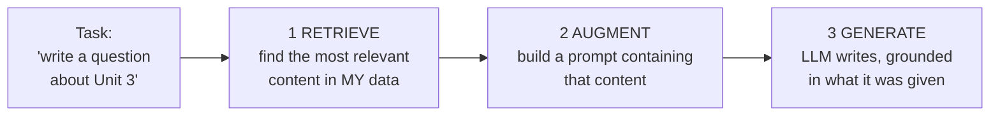
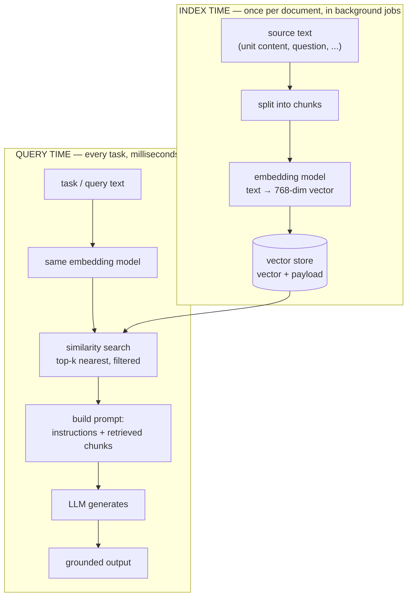
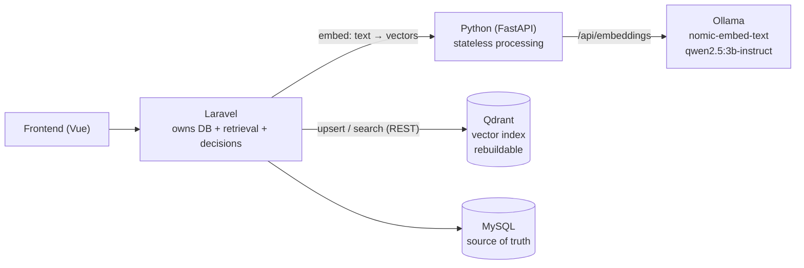

# RAG in QForge — a from-zero guide

This document teaches RAG (Retrieval-Augmented Generation) from scratch **and** documents how
QForge implements it, side by side. Part 1 is pure concepts — no QForge code. Part 2 grows one
section per implementation phase, each pointing at the real files, so "what we built" is always
next to "why it works".

> **Where this fits in the docs:** design decisions live in [`../PLAN.md`](../PLAN.md), milestone
> tracking in [`MILESTONES.md`](MILESTONES.md) (RAG is **M6**). This file is the teaching
> companion for the RAG work specifically.

---

# Part 1 — The concepts

## 1. The problem RAG solves

A language model (like the `qwen2.5:3b-instruct` model QForge runs in Ollama) knows only two
things:

1. What it learned during training — general knowledge, frozen at training time.
2. What you put in the prompt — the *context*.

It has never seen your database. Ask it "write a 5-mark question about Unit 3 of Computer
Networks" with no context and it will invent something *plausible* — for some generic networks
course, not **your** syllabus. This failure mode is called **hallucination**: fluent, confident,
wrong.

The fix is conceptually simple: **put the relevant facts in the prompt**. Give the model your
unit's actual syllabus content and real exemplar questions, and it stops inventing and starts
*grounding* its output in what you provided.

QForge already does this (since M5): `GroundingBuilder` pastes the syllabus, the unit content,
and up to 3 example questions into every generation prompt. That works — but it selects the
material with plain SQL (*"give me this unit's content by ID"*). Two limits appear as the corpus
grows:

- **The prompt has a size budget.** You can't paste a whole textbook. Something must choose the
  *most relevant few paragraphs* — and "relevant" is about meaning, not IDs.
- **Some questions need search, not lookup.** "Which existing question is most similar to this
  new one?" has no SQL answer — `WHERE text LIKE ...` matches characters, not meaning.

**RAG = Retrieval-Augmented Generation**: before asking the model to generate, *retrieve* the
most relevant pieces of your own data — by meaning — and put those in the prompt.



The generation step is unchanged. All the new machinery lives in **retrieval** — and retrieval
by meaning needs one core idea: the *embedding*.

## 2. Embeddings — turning meaning into numbers

An **embedding model** is a small neural network that reads a piece of text and outputs a fixed-
length list of numbers — a **vector**. QForge's model (`nomic-embed-text`) outputs 768 numbers
for any input, whether it's three words or three paragraphs:

```text
"Explain TCP congestion control"  →  [0.021, -0.117, 0.093, ..., 0.048]   (768 numbers)
```

The single property that makes this useful:

> **Texts with similar meaning get vectors that are close together.**

Think of it as a *map of meaning*. Every text gets coordinates — not 2 like a road map, but 768,
which is what lets the map hold many independent shades of meaning at once. On this map:

- "Explain TCP congestion control" and "Describe how TCP avoids congestion" land **very close**
  — different words, same meaning.
- "Explain TCP congestion control" and "What is a binary search tree?" land **far apart**.
- Crucially, closeness does *not* come from shared words. "How do routers pick the best path?"
  lands near "Explain link-state routing protocols" — zero important words in common. This is
  what `LIKE '%...%'` can never do.

Where do the coordinates come from? The embedding model was trained on enormous amounts of text
with a simple objective: *push texts that appear in similar contexts toward the same region,
pull unrelated texts apart*. Meaning-as-position is learned, not programmed.

Two properties matter for everything downstream:

- **Deterministic**: the same text always produces the same vector. So you can embed a question
  *once*, store the vector, and reuse it forever.
- **Cheap**: producing a vector is a single forward pass — milliseconds — unlike LLM
  *generation*, which produces output token by token over many seconds. Same hardware, ~1000×
  faster. This asymmetry is why RAG is practical at all.

## 3. Comparing vectors — cosine similarity

Once texts are points on the meaning-map, "how similar are these two texts?" becomes "how close
are these two points?" — a geometry question with a standard answer: **cosine similarity**, the
angle between the two vectors.

For two vectors **A** and **B** (each 768 numbers):

```text
cosine(A, B) = (A · B) / (|A| × |B|)

A · B  = A₁B₁ + A₂B₂ + ... + A₇₆₈B₇₆₈     (dot product: multiply pairwise, sum)
|A|    = √(A₁² + A₂² + ... + A₇₆₈²)        (length of the vector)
```

Dividing by the lengths means only *direction* counts — so a one-line question and a whole
paragraph about the same topic can still score as near-identical. The score reads as:

| cosine score | meaning (rule of thumb for text embeddings) |
|---|---|
| ≈ 1.0 | same meaning (near-duplicates) |
| 0.8 – 0.95 | strongly related / paraphrases |
| 0.5 – 0.8 | same broad topic |
| < 0.5 | unrelated |

In practice these bands vary by model, so real thresholds (like QForge's dedup cutoff) are
**tuned empirically, and kept in config** — never hardcoded as gospel.

That's the whole trick. Every RAG feature in QForge is this one operation in different clothes:

- **Duplicate detection** — is any existing question's vector ≥ 0.90 to this new one?
- **Retrieval for generation** — which content chunks' vectors are closest to this slot's?
- **Unit suggestion** — which unit's content vector is closest to this extracted question's?

## 4. Vector databases — searching a million points fast

Comparing two vectors is microseconds. But retrieval means comparing one query vector against
**every** stored vector and taking the top-k — brute force is `O(n)`, fine at thousands, painful
at millions. A **vector database** is a store purpose-built for this:

- **ANN indexes** (Approximate Nearest Neighbour, typically the HNSW graph algorithm) that find
  near-neighbours *without* touching every vector — logarithmic-ish instead of linear, trading a
  sliver of exactness for orders-of-magnitude speed.
- **Payload filtering**: each vector carries a JSON payload (e.g. `{subject_id: 3,
  status: "approved"}`), and the search can filter on it — "nearest neighbours *among approved
  questions of subject 3*" is one call.

QForge uses **Qdrant** — open-source, one Docker container, a clean REST API (important: PHP has
no first-class client, so Laravel talks plain HTTP), and payload filters that map directly onto
"same subject / approved only" scoping.

An honest engineering note: at QForge's current scale (thousands of vectors), brute-force cosine
in PHP would work fine. Qdrant buys ANN headroom, payload filtering for free, and — for the
report — hands-on experience with the real tool used at production scale.

### Who owns what — the source-of-truth rule

One principle keeps a vector DB from becoming a liability:

> **Qdrant is an index, not a database.** MySQL remains the single source of truth. Every
> vector in Qdrant is derived (text → embedding); if Qdrant is lost, corrupted, or the
> embedding model changes, a re-index command rebuilds it from MySQL. Nothing lives *only*
> in Qdrant.

This mirrors how you already treat Redis: losing it is an inconvenience, never data loss.

## 5. Chunking — the unit of retrieval

Embedding models have a context limit, and more importantly a *dilution* problem: one vector for
a whole 3,000-word unit is a blurry average of everything in it. A query about one specific
topic won't match strongly against a vector that also encodes ten other topics.

So long documents are split into **chunks** — pieces of a few hundred words, each embedded
separately. The retrieval question becomes "which *chunks* are most relevant?", and you paste
only those into the prompt.

The tension chunk size controls:

- **Too big** → dilution: the vector is vague, retrieval matches poorly, and each retrieved
  chunk wastes prompt budget on irrelevant text.
- **Too small** → context loss: "It uses a three-way handshake" embeds to near-noise when
  severed from the sentence saying what "it" is.

Practical mitigations, all used in QForge Phase 2:

- Split on **natural boundaries** (markdown headings, paragraphs), not fixed character counts —
  `units.content` is markdown, so structure is free.
- **Prefix each chunk with its context path** ("Computer Networks > Unit 3: Transport Layer")
  before embedding, so even a short chunk knows what it belongs to.
- Store chunks in MySQL (source of truth) with a pointer to their unit; their embeddings go to
  Qdrant like everything else.

## 6. The full RAG loop

Everything so far, assembled — with the two moments in time that matter:



Three rules the diagram encodes:

1. **Index once, query forever.** Embedding is done when content changes (create/approve/import)
   — never repeated at query time for stored content. Only the *query* is embedded live.
2. **Same model on both sides.** Vectors from different embedding models live on different maps;
   comparing them is meaningless. (This is why the model name is stored alongside vectors — a
   model swap must trigger a full re-index, and stale vectors must be detectable.)
3. **Retrieval feeds generation; it never replaces it.** And in QForge, some features are
   retrieval-*only* — dedup and unit suggestion stop after the similarity search. No LLM call at
   all, which is exactly why they're fast.

---

# Part 2 — RAG in QForge

The concepts above map onto the existing architecture without bending it: **Laravel keeps owning
retrieval** (it already did — `GroundingBuilder` is SQL retrieval), **Python stays a stateless
processor** (it gains `/embed`, which is text-in/vectors-out processing, not retrieval), and
**Qdrant joins as infrastructure** on the Docker network, spoken to only by Laravel — exactly
like Redis.



Decisions made up front (the why is in Part 1):

| Decision | Choice |
|---|---|
| Embedding model | `nomic-embed-text` (768-dim), served by the existing Ollama container |
| Vector store | Qdrant container; **index, not source of truth**; rebuildable from MySQL |
| Who talks to Qdrant | Laravel only, over REST (Python does no retrieval — see `python-service/app/services/llm/base.py`) |
| Dedup policy | Auto-drop AI-generated near-duplicates; flag-only (human decides) in the extraction review queue |
| Grounding retrieval | Budget-based hybrid: whole content when it fits the prompt budget, top-k chunks when it doesn't |
| Unit suggestions | Suggest-only with scores; unit tags stay human-assigned (per Post-M5 decision) |
| Similarity thresholds | Config-tunable, never hardcoded |

Build order — each phase lands demoable and green before the next:

| Phase | What | Status |
|---|---|---|
| 0 | Infrastructure: Qdrant container, `nomic-embed-text` pull, Python `/embed`, Laravel `QdrantClient`, re-index command | **Done** |
| 1 | Dedup: embed questions on write, drop AI near-dupes, flag review-queue lookalikes | **Done** |
| 2 | Grounding retrieval: chunk + index content, budget-based hybrid in `GroundingBuilder`, semantic exemplars | **Done** |
| 3 | Unit auto-suggest in the extraction review queue | **Done** |

## Phase 0 — the embedding pipeline (infrastructure)

Phase 0 builds the pipeline every later feature rides on: **text → vector → stored → searchable**.
No product behavior changes yet — this is the plumbing, verified end to end.

### What went where

**Infrastructure** (`docker-compose.yml`, `build/ollama/entrypoint.sh`):

- New `qforge_qdrant` service (with its own named volume, like MySQL and Ollama). Its
  dashboard — a genuinely useful learning tool, you can *see* collections and points — is at
  <http://localhost:6333/dashboard>.
- The Ollama entrypoint now auto-pulls **two** models: the generation LLM (M5) and
  `nomic-embed-text` (274 MB, first boot only). One server, two very different jobs — §2's
  cheap-embedding / expensive-generation asymmetry, live on your machine.

**Python** — the *embed* step (`python-service/app/`):

- [`services/embedding/`](../python-service/app/services/embedding/__init__.py) mirrors the
  existing `services/llm/` provider pattern exactly: a
  [`base.py`](../python-service/app/services/embedding/base.py) contract, the real
  [`OllamaEmbedder`](../python-service/app/services/embedding/ollama.py) (one batched call to
  Ollama's `/api/embed`), and a deterministic
  [`StubEmbedder`](../python-service/app/services/embedding/stub.py) so pytest never needs a
  running Ollama. The same `LLM_PROVIDER=stub` switch selects both stubs.
- [`main.py`](../python-service/app/main.py) gains `POST /embed`: texts in, vectors out, in the
  standard `{status, data, errors}` envelope. Note what it does **not** do: no storing, no
  searching, no DB. Embedding is *processing*, so it belongs in Python; retrieval is
  *decision-making over data*, so it belongs in Laravel. That one sentence is the whole
  architecture ruling for M6.

**Laravel** — storage and (soon) search (`code/app/`):

- [`PythonService::embed()`](../code/app/Services/PythonService.php) — the only door to
  `/embed`, next to `extract()` and `generateQuestions()`. It returns `model` + `dimensions`
  along with the vectors, which callers will stamp next to everything they store (§6 rule 2:
  vectors from different models are incomparable).
- [`Services/Rag/QdrantClient.php`](../code/app/Services/Rag/QdrantClient.php) — a thin REST
  wrapper (PHP has no first-class Qdrant client; plain HTTP is fine). Two collections, declared
  as constants: `questions` (Phase 1) and `chunks` (Phase 2), both 768-dim / cosine. Point ids
  are MySQL row ids — the permanent link back to the source of truth. `search()` takes a payload
  filter, so "nearest neighbours *within subject 3, approved only*" is one call.
- [`Console/Commands/RagReindex.php`](../code/app/Console/Commands/RagReindex.php) —
  `artisan qforge:rag:reindex [--fresh]`. Phase 0 ships the frame (collection setup); each later
  phase plugs its re-embedding step in. This command is the *proof* of the index-not-database
  rule (§4): as long as it can rebuild Qdrant from MySQL, Qdrant can never hold hostage data.
- `config/services.php` gains a `qdrant` block — URL, vector size, model name, and the Phase 1
  duplicate threshold (0.90), all env-tunable because similarity thresholds are empirical (§3).

**Tests** — the stub keeps both suites offline-green:
[`tests/test_embed.py`](../python-service/tests/test_embed.py) (pytest: 153 passing, +6) pins the
endpoint contract; [`RagInfrastructureTest`](../code/tests/Feature/RagInfrastructureTest.php)
(Laravel: 170 passing, +9) fakes Python and Qdrant with `Http::fake` and pins Laravel's side of
both contracts — request shapes, response parsing, and the re-index command's behavior.

### Seen working

Measured on this machine at the end of Phase 0, via a real `/embed` call:

```text
cosine("Explain TCP congestion control", "Describe how TCP avoids congestion") = 0.851
cosine("Explain TCP congestion control", "What is a binary search tree?")      = 0.343
```

Different words, same meaning → 0.851. Same field, different topic → 0.343. That gap is the
entire mechanism §§2–3 promised, and every phase from here on just puts it to work. Reproduce it
yourself:

```bash
curl -s -X POST http://localhost:8000/embed \
  -H 'Content-Type: application/json' \
  -d '{"texts": ["Explain TCP congestion control", "Describe how TCP avoids congestion"]}'
```

## Phase 1 — duplicate detection

Phase 1 puts the pipeline to work: every approved question now lives in the index, and two
features consume it. It is retrieval-*only* RAG — no LLM call anywhere in this phase, which is
why every check costs milliseconds (§6 rule 3).

### Keeping the index in sync — the write path

The index is only useful if it always mirrors the bank. Rather than sprinkling "update Qdrant"
calls across every controller, one **observer** watches the model itself:

- [`Observers/QuestionObserver.php`](../code/app/Observers/QuestionObserver.php) — hooks every
  `Question` save/delete (registered via `#[ObservedBy]` on the
  [model](../code/app/Models/Question.php)). It answers exactly one question — *did anything
  index-relevant change?* — and queues a sync if so. Create, review-approve, edit, reject, AI
  expansion, seeding: all funnel through here automatically.
- [`Jobs/SyncQuestionEmbedding.php`](../code/app/Jobs/SyncQuestionEmbedding.php) — the queued
  worker (heavy-ish I/O → queue, per house rules). Deliberately *self-deciding*: it reloads the
  question and derives the action from current state — approved ⇒ embed + upsert, anything else
  (rejected, back-to-pending, deleted) ⇒ delete the point. Idempotent, so retries and stale
  queue entries always converge on the truth.
- [`Services/Rag/QuestionPoints.php`](../code/app/Services/Rag/QuestionPoints.php) — the single
  definition of what a question's Qdrant point contains (vector + payload: `subject_id`,
  `unit_ids`, `type`, `marks`, `source`, `embedding_model`), shared with the bulk
  [re-index](../code/app/Console/Commands/RagReindex.php) so live sync and rebuild can't drift.

Only **approved** questions are indexed — they're the one pool dedup and (Phase 2) exemplar
searches run against. And everything sits behind one switch, `RAG_ENABLED`
(`services.qdrant.enabled`): off in the wider test suite, and every consumer **fails open** —
if Python or Qdrant is down, features degrade (dedup falls back to exact-text matching, flags
are skipped) but no upload, expansion, or approval ever fails because the index is sick.

### Consumer 1 — AI expansion auto-drop

`ExpandQuestionBank` already had *exact-text* dedup (normalize, compare strings). That catches
verbatim repeats but not **paraphrases** — and a small local model paraphrases itself
constantly. The job now layers semantic dedup on top
([`ExpandQuestionBank::storeSurvivors`](../code/app/Jobs/ExpandQuestionBank.php)), via
[`Services/Rag/DuplicateDetector.php`](../code/app/Services/Rag/DuplicateDetector.php):

1. One batched `/embed` call for the whole candidate round (§2: embedding is cheap; batching
   makes it cheaper).
2. Per candidate, a Qdrant top-1 search **filtered to the same subject** — the payload filter
   from §4 doing real work.
3. Per candidate, an in-memory cosine sweep (`VectorMath::cosine` — the §3 formula, ~40 lines of
   PHP) against candidates *accepted earlier in this same run*, because their queued index jobs
   haven't run yet. This is the two-pools idea: the bank lives in Qdrant, the batch lives in RAM.
4. Score ≥ `RAG_DUPLICATE_THRESHOLD` (0.90, env-tunable — §3: thresholds are empirical) ⇒ the
   candidate is dropped and logged.

Auto-drop is safe *here specifically* because this is an automated pipeline that over-asks
(`BUFFER`): losing a duplicate candidate costs nothing. Which leads to the deliberate contrast:

### Consumer 2 — review-queue flags (never drops)

Extracted candidates came from a real exam paper a human chose to upload, and embedding
similarity has false positives ("Define TCP" vs "Define UDP" score high). So
[`Services/Rag/SimilarQuestionFinder.php`](../code/app/Services/Rag/SimilarQuestionFinder.php)
only **annotates**: at extraction time
([`CandidateImporter`](../code/app/Services/Extraction/CandidateImporter.php) calls it after the
import transaction commits), each pending candidate is embedded and searched against the
approved bank; a hit ≥ threshold writes `attributes.similar = {question_id, score}` (with a
sibling `rag_checked_at` timestamp).
The review screen ([`AdminExtractionView.vue`](../frontend/src/views/admin/AdminExtractionView.vue))
renders it as a warning badge — *≈ Q#321 (93% similar)* — and the human decides. Approval is
never blocked.

One policy, two postures: **automated pipeline → drop; human pipeline → flag.** That asymmetry
is the phase's most important design decision.

### Seen working

After `qforge:rag:reindex --fresh` indexed the seeded bank (156 approved questions), a
paraphrase of a real bank question — *"Define organizational goals…"* reworded as *"Give the
definition of organizational goals…"* — was embedded and searched:

```text
Q#1   score=0.989   ← its original: caught, far above the 0.90 threshold
Q#3   score=0.765   ← same subject, different question: correctly below
Q#35  score=0.699
```

Verified by [`RagDedupTest`](../code/tests/Feature/RagDedupTest.php) (14 tests: observer
routing, job upsert/delete, all four expansion outcomes including RAG-down, flag/no-flag,
reindex scoping, cosine geometry). Suites: 184 Laravel / 153 pytest green.

## Phase 2 — retrieval-augmented grounding

The flagship: generation prompts are now *retrieval-augmented* — the full RAG loop from §6,
index time and query time, wired into the M5 expansion pipeline.

### Index time — building the retrieval corpus

- **New table `content_chunks`** (ER: [`diagrams/m6-schema.mmd`](diagrams/m6-schema.mmd)):
  `units.content` and `subjects.syllabus` split into retrievable pieces. Derived data —
  wholesale-replaced on every re-chunk, nothing foreign-keys into it. MySQL keeps the chunk
  *text* (source of truth); Qdrant's `chunks` collection keeps the vector under the same row id.
- [`Services/Rag/ContentChunker.php`](../code/app/Services/Rag/ContentChunker.php) — §5 made
  code. Splits on markdown headings (natural topic boundaries — the corpus is markdown by
  construction since M4.1), packs oversized sections by paragraph (~1600 chars ≈ 400 tokens,
  never severing a paragraph), merges runts (< 200 chars) into a neighbour, and stamps every
  chunk with its context path (`MGT411 syllabus > Unit 5: Planning and Decision Making`) which
  is prefixed into the embedding — so a short chunk still knows what it belongs to.
- [`Services/Rag/ContentIndexer.php`](../code/app/Services/Rag/ContentIndexer.php) — one
  subject's rebuild: delete rows + points (points by *payload filter*, since row ids don't
  survive a re-chunk — see `QdrantClient::deleteByFilter`), re-chunk, insert, one batched embed,
  upsert.
- [`Observers/ContentObserver.php`](../code/app/Observers/ContentObserver.php) on **both**
  `Subject` (syllabus) and `Unit` (content) queues
  [`Jobs/SyncSubjectChunks.php`](../code/app/Jobs/SyncSubjectChunks.php) when corpus text
  changes. The job is `ShouldBeUnique` per subject — that's the debounce: a syllabus import
  saves every unit in quick succession, and the burst collapses into one queued rebuild.
  (Bug worth remembering: `wasRecentlyCreated` stays `true` on a model instance for its whole
  lifetime, so the observers use separate `created`/`updated` hooks, never one `saved`.)

### Query time — the budget-based hybrid

[`GroundingBuilder`](../code/app/Services/AiExpansion/GroundingBuilder.php) (the M5 class,
upgraded in place) now works in three moves per slot:

1. **Embed the slot query** — a natural-language description of what's needed: *"A 10-mark long
   exam question about Planning and Decision Making in Principles of Management."* One embed
   call serves both retrieval and exemplar search.
2. **Content: fast path or retrieval.** Assemble the full M5 block (whole syllabus + target
   units' content). At/under the budget (`RAG_GROUNDING_BUDGET_CHARS`, default 6000 ≈ 1500
   tokens) → send it whole: *for a small corpus, complete context beats top-k excerpts of it*.
   Over budget → search the `chunks` collection (subject-filtered, unit-filtered when the slot
   targets units) and build the block from the top-k chunks under their context-path headings.
   The `notes` array records which path ran, so expansion logs always show it.
3. **Exemplars: semantic top-3.** The nearest approved same-type questions to the slot query
   (Qdrant `questions` search, tag-aware unit filter), replacing M5's "first three by id" — the
   model now sees the most *relevant* style guide, in similarity order.

Everything fails open, twice over: RAG disabled or `/embed` down → the exact M5 behaviour (full
content, SQL exemplars); over budget but nothing indexed yet → oversized full content still
beats nothing. A generation prompt is never lost to a sick index.

### Seen working

After reindex (`156 questions + 36 chunks` from the seeded data), the loop by hand:

```text
slot query: "A 10-mark long exam question about organizational planning and decision making."

chunk#15  score=0.696  ← Unit 5's content body
chunk#5   score=0.694  ← syllabus chunk "MGT411 > Unit 5: Planning and Decision Making (5 Hrs.)"
chunk#1   score=0.654  ← syllabus chunk "Unit 1: The Nature of Organizations"
```

The query never mentions "Unit 5" — retrieval found it by meaning alone, exactly the §2 promise.

Verified by [`RagGroundingTest`](../code/tests/Feature/RagGroundingTest.php) (11 tests: chunker
splitting/packing/runt rules, indexer rebuild + point payloads, observer routing + burst
collapse, both hybrid paths, retrieval fallbacks, exemplar ordering, RAG-down degradation,
reindex counts). Suites: 195 Laravel / 153 pytest green.

## Phase 3 — unit auto-suggest

The closing phase, and the smallest — because it's *pure reuse*: no new table, no new
collection, no new job. The chunk index built for Phase 2's grounding turns out to answer a
second question for free: **"which unit is this question about?"** is just "which unit's content
chunks are nearest this question's vector?" — the same one operation from §3, pointed at a new
target.

### How it works

[`SimilarQuestionFinder`](../code/app/Services/Rag/SimilarQuestionFinder.php) (Phase 1's
annotator, extended — the two hints share one embedding pass) adds
`attributes.suggested_units` to each extracted candidate:

1. Search the candidate's vector against the `chunks` collection (same subject, top-8).
2. Keep each unit's **best** chunk score; skip subject-level syllabus chunks (they describe the
   course, not one unit).
3. Keep units clearing `RAG_UNIT_SUGGESTION_MIN_SCORE` (0.50 — deliberately far below the 0.90
   duplicate threshold: *"about the same topic"* is a much looser bar than *"the same
   question"*), rank, store the top 3 as `{unit_id, score}`.

In the review queue ([`AdminExtractionView.vue`](../frontend/src/views/admin/AdminExtractionView.vue)),
untagged candidates show clickable chips — `💡 Planning and Decision Making · 75%` — and opening
the edit form pre-selects the top suggestion. **Suggest-only, by project decision** (Post-M5:
unit tags are human-assigned): a click applies the suggestion to the form, approval still
requires the human. A unit with no indexed content can never be suggested — expected; the
dropdown still lists every unit.

### Seen working

A synthetic extracted candidate — *"Describe the SWOT analysis technique and explain how
managers use environmental scanning when formulating strategic plans."* — annotated against the
live index:

```text
suggested: Planning and Decision Making   0.751   ← correct (its content covers SWOT + scanning)
           Evolution of Management Thought 0.607
           Global Context of Management    0.594
```

The candidate never says "planning"; retrieval matched it to the right unit by meaning. Verified
by [`RagUnitSuggestTest`](../code/tests/Feature/RagUnitSuggestTest.php) (ranking/max-per-unit,
floor, syllabus-chunk exclusion, one-pass annotation with the similar flag). Suites: 198 Laravel
/ 153 pytest green.

---

# M6 complete — what got built, in one paragraph

QForge's retrieval went from *lookup by id* to *search by meaning*. One embedding model
(`nomic-embed-text` on the existing Ollama), one new infrastructure container (Qdrant, treated
as a rebuildable index — MySQL never stopped being the source of truth), one new table
(`content_chunks`), and one switch (`RAG_ENABLED`) behind which every feature fails open. On top
of that base: **dedup** (auto-drop for the automated AI pipeline, flag-only for the human review
queue), **retrieval-augmented grounding** (budget-based hybrid — whole corpus when it fits,
top-k chunks when it doesn't — plus semantic exemplars), and **unit auto-suggest** (the chunk
index reused as a classifier). The generation *algorithm* — the deterministic centerpiece —
never ceded a decision: RAG curates what enters the bank and what enters the prompt, never what
lands on a paper.
