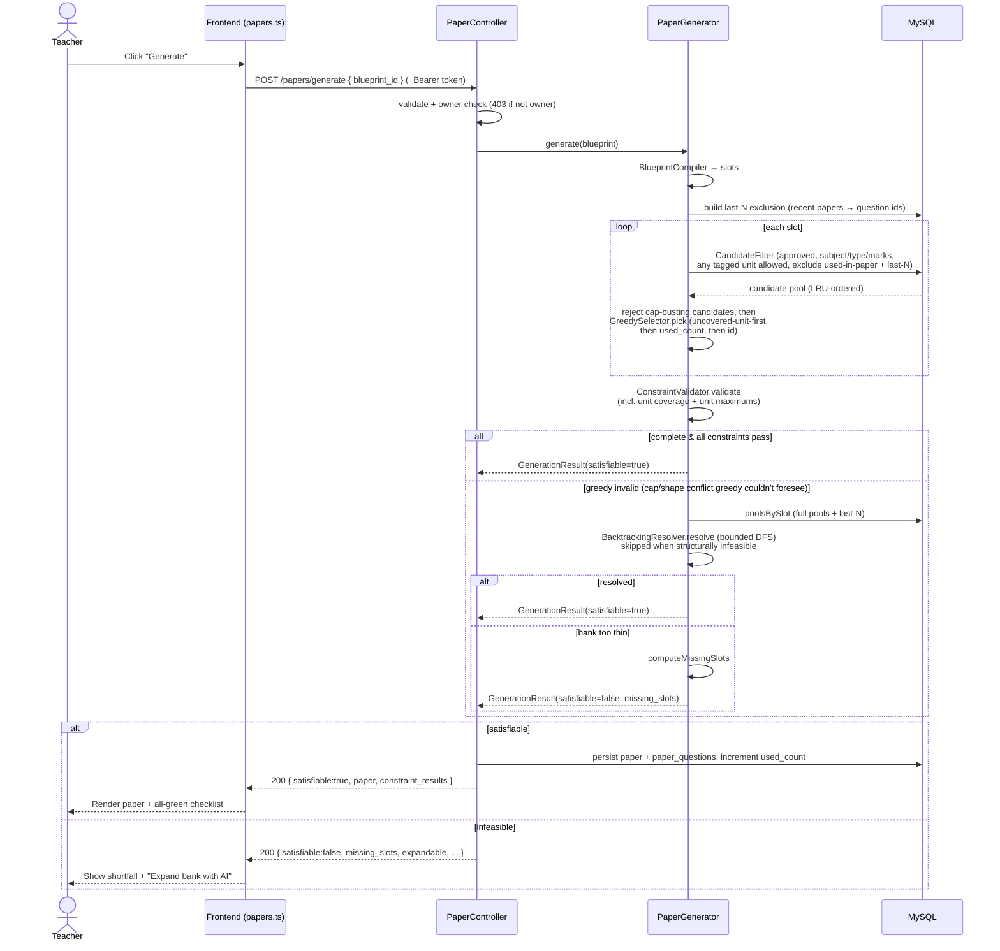
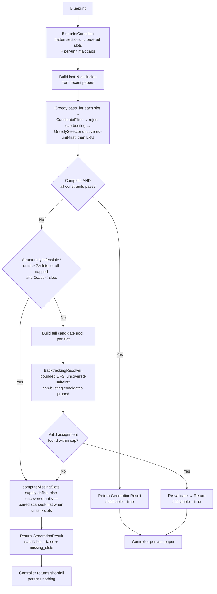
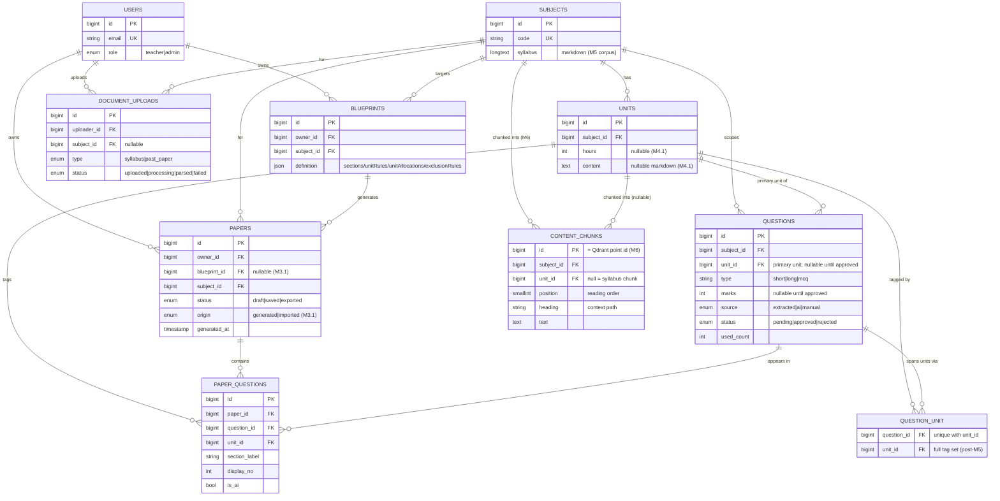

# QForge — Viva Defense Guide

> A study companion for defending QForge in front of a supervisor and external examiners.
> Written in plain language. Every claim is grounded in the actual code; where a doc and the
> code disagree, the **code wins** and the difference is called out. Anything I could not
> fully verify is marked `[verify]`.

**How to use this:** read sections 1–6.5 to understand the system, drill sections 7–9 the night
before, and keep section 10 open during the viva.

---

## 1. One-paragraph elevator pitch

**QForge is a smart question-paper generator for university courses.** A teacher describes the
*shape* of an exam once — "Section A: three 10-mark long questions; Section B: five 5-mark short
questions; cover every unit; don't repeat questions from the last 3 papers" — and QForge assembles
a real, valid paper from a bank of approved questions, automatically. The heart of the system is a
**deterministic constraint-solving algorithm** (written from scratch in PHP, no external solver)
that treats paper generation as a puzzle: fill every slot with a question that satisfies the hard
rules (right type, right marks, allowed unit, no repeats) while balancing soft preferences. When the
question bank is too thin to satisfy a blueprint, QForge can call a **local AI model** to *top up*
the bank — but the AI only writes candidate questions; the algorithm always decides the final paper.
Since M6 the AI pipeline is **retrieval-augmented (RAG)**: course material and questions are indexed
as embeddings in a vector database, so generation prompts are built from the *most relevant* content,
AI near-duplicates are auto-dropped before they enter the bank, and extracted questions get unit
suggestions — all behind the algorithm, never above it. This matters because it saves teachers hours
of manual work while guaranteeing the exam obeys the rules, and it stays **explainable**: for any
paper it can tell you exactly which constraints passed, and for any failure it names exactly what the
bank was missing.

**Jargon defined once:**
- **Blueprint** = the reusable template describing an exam's structure and rules.
- **Question bank** = the pool of stored, approved questions the algorithm draws from.
- **Slot** = one position in the paper that must be filled by exactly one question.
- **Constraint** = a rule the finished paper must obey (hard = must hold; soft = preferred).
- **Deterministic** = same inputs always produce the same output (no randomness) — crucial for a
  system you must be able to defend and reproduce.

---

## 2. A-to-Z request flow — "generate a paper"

This traces one click of **Generate** from the browser all the way to the database and back. File
and method names are real.

### The hops

1. **Frontend (Vue 3 + Pinia).** The teacher clicks Generate on the Generate screen. The Pinia
   store [`frontend/src/stores/papers.ts`](../frontend/src/stores/papers.ts) method `generate(blueprintId)`
   sends `POST /papers/generate { blueprint_id }` through the shared axios client
   [`frontend/src/api/client/axios.ts`](../frontend/src/api/client/axios.ts). That client's request
   interceptor attaches the Sanctum bearer token from `localStorage`. *(Pinia = Vue's official state
   store; Sanctum = Laravel's API-token auth.)*

2. **Laravel routing + auth.** [`code/routes/api.php`](../code/routes/api.php) maps the route inside
   the `auth:sanctum` + `role:teacher` middleware group to
   [`PaperController::generate`](../code/app/Http/Controllers/Api/PaperController.php).

3. **Controller guards.** `PaperController::generate` validates that `blueprint_id` exists, loads the
   `Blueprint` with its `subject`, and does an **ownership check** — `abort_unless($blueprint->owner_id
   === $request->user()->id, 403)`. A teacher cannot generate from someone else's blueprint.

4. **The algorithm runs.** The controller calls
   [`PaperGenerator::generate($blueprint)`](../code/app/Services/PaperGeneration/PaperGenerator.php).
   This is the centerpiece (fully explained in §3). It:
   - compiles the blueprint JSON into ordered **slots** + per-unit **max caps** (`BlueprintCompiler`),
   - builds the cross-paper repetition exclusion (`lastNExclusion`),
   - does a **coverage-aware** greedy first pass (`greedyFill` → `CandidateFilter` +
     `GreedySelector`, uncovered-unit-first, cap-busting candidates rejected),
   - validates (`ConstraintValidator`),
   - and if that isn't fully valid, runs the `BacktrackingResolver` to repair it — unless the
     blueprint is *structurally* infeasible (see §3 stage 4), in which case the doomed search is
     skipped entirely.
   It returns a `GenerationResult` value object.

5. **Python? Only on demand — not in this flow.** A plain generate does **not** call Python. Python
   is only involved if the bank can't satisfy the blueprint *and* the teacher then clicks "Expand
   bank with AI" (§6). So the normal generate path is pure Laravel + MySQL.

6. **Persist (on success).** If `result->satisfiable` is true, `PaperController::persist()` writes a
   `papers` row (`status=draft`) and one `paper_questions` row per chosen question inside a DB
   transaction, then increments `used_count` on the chosen questions.

7. **Response → Frontend.** The controller returns JSON: either
   `{ satisfiable:true, paper, constraint_results }`, or on failure
   `{ satisfiable:false, expandable, shortfall_reason, paper (partial), missing_slots, constraint_results }`.
   The `papers.ts` store renders the paper, the green/red constraint checklist, and — on failure —
   the shortfall panel with an "Expand bank with AI" button.

> **Discrepancy to know (code vs. comment):** the docblock above `PaperController::generate` says
> `used_count` is *not* incremented at generate time ("deferred to Save in M3"). The **actual code**
> in `persist()` *does* `Question::whereIn('id', $pickedIds)->increment('used_count')`. The code is
> authoritative and matches the M3 milestone note ("`used_count` now incremented on generate-persist");
> the docblock is a stale M2-era comment. If an examiner asks, say: *"the comment is out of date — we
> increment on persist; repetition control itself doesn't rely on that column anyway, it's derived
> from `paper_questions`."*

### Sequence diagram



---

## 3. The algorithm, deeply explained (the centerpiece)

The engine lives in [`code/app/Services/PaperGeneration/`](../code/app/Services/PaperGeneration/).
It is deliberately **framework-light** (plain classes + value objects) so it can be unit-tested in
isolation, and it is **pure with respect to writes** — it only *reads* the question bank; saving is
the controller's job. The orchestrator is `PaperGenerator`; it wires five stages together.

**The five stages, in order:**

| Stage | Class | One-line job |
|---|---|---|
| 1. Compile | `BlueprintCompiler` | Turn the blueprint's JSON into ordered slots + rules + per-unit max caps |
| 2. Filter | `CandidateFilter` | For one slot, fetch the questions that legally fit it |
| 3. Select | `GreedySelector` | Pick the single best candidate (coverage-first, then LRU) |
| 4. Repair | `BacktrackingResolver` | If greedy produced an invalid paper, search for a valid one |
| 5. Validate | `ConstraintValidator` | Score the finished set against every constraint |

The **Support/** folder holds the value objects passed between stages: `CompiledBlueprint`, `Slot`,
`GenerationResult`, `MissingSlot`, `ConstraintResult`, `PaperViewModel`.

### Stage 1 — Blueprint compile (`BlueprintCompiler`)

**Problem in plain English:** the blueprint is stored as free-form JSON shaped like the frontend
form. The engine needs a clean, ordered to-do list. Compilation flattens the human structure into a
list of single-question **slots**.

**Inputs / outputs:**
- **Input:** a `Blueprint` model. Its `definition` JSON has `sections` (each: `name`, `type`,
  `marksEach`, `count`), `unitRules` (`{ unitName: true|false }`), `unitAllocations` (per-unit
  **max** cap rows), and `exclusionRules.lastNPapers`.
- **Output:** a `CompiledBlueprint` value object holding: `slots` (a `Slot[]`, one per question),
  `allowedUnitIds` (the hard unit filter *and* the coverage rule), `unitNames` (id→name for
  reporting), `unitCaps` (`unitId => max questions` — only capped allowed units present), and
  `lastNPapers`. It also carries the **structural-feasibility predicates** used by stage 4 and the
  AI-expansion guard: `coverageCapacityDeficit()` (coverage impossible when
  `units > MAX_AI_UNITS_PER_QUESTION(2) × slots`) and `capDeficit()` (all units capped and
  `Σcaps < slots`).

A `Slot` (see [`Support/Slot.php`](../code/app/Services/PaperGeneration/Support/Slot.php)) carries
`index`, `sectionLabel`, `type`, `marks`, `displayNo`. A section of `count: 3` becomes **3 slots**.

**Key design decision:** `sections` are *authoritative* for structure; `unitRules` is both the hard
candidate filter and the coverage requirement; `unitAllocations.count` is enforced as a per-unit
**maximum** (post-M5.1 — it was a dead soft hint before that). A unit with no allocation rows is
**uncapped**, and the `marks` column in those rows stays display-only. So caps bound unit dominance
without dictating an exact per-unit distribution — every enabled unit is still guaranteed ≥ 1
question by the coverage rule.

### Stage 2 — Candidate filter (`CandidateFilter`)

**Problem:** given one slot, which stored questions are even *legal* to put there?

**Inputs / outputs:**
- **Input:** a `Slot`, the `CompiledBlueprint`, the ids already used in *this* paper, and an optional
  "last-N papers" exclusion closure.
- **Output:** a `Collection<Question>` — the candidate pool, ordered least-recently-used first.

**The exact query** (from the code): `subject_id` matches, `status = 'approved'`, `type` matches the
slot, `marks` matches the slot, and — *if* the blueprint restricts units — an **any-overlap** check
via the `question_unit` pivot: `whereHas('units', whereIn('units.id', allowedUnitIds))`, so a
multi-unit question qualifies when *at least one* of its tagged units is allowed. Then
`whereNotIn('id', ...)` for questions already chosen in this paper, the injected last-N closure,
finally `orderBy('used_count')->orderBy('id')`. The pivot tags are eager-loaded (`with('units')`)
so downstream coverage checks don't N+1.

**Two things worth saying out loud in a viva:**
1. `status = 'approved'` is why AI-generated questions are stored as `approved` (not `pending`) — a
   pending question is *invisible* here, so the AI top-up would silently fail (see §6).
2. The `whereNotIn` (in-paper) and the last-N closure (cross-paper) are the two repetition guards.
   The last-N rule is injected as a closure so it plugs in without changing this class — it's a
   no-op when the blueprint sets `lastNPapers <= 0`.

### Stage 3 — Greedy select (`GreedySelector`)

**Problem:** from a legal pool, pick one.

**"Greedy" defined:** a greedy algorithm makes the choice that looks best *right now*, without
looking ahead. Here "best" is a two-level rank (post-M5.1): **coverage first** — a question tagged
with a *still-uncovered allowed unit* beats one that isn't — then **least-recently-used (LRU)**:
lowest `used_count`, ties broken by `id` (so it's deterministic). *(LRU = the question used the
fewest times gets picked first, which spreads usage across the bank over time.)*

**Inputs / outputs:** input is the candidate `Collection` plus the set of uncovered allowed unit
ids (threaded through the slot loop by `PaperGenerator::greedyFill`, which also rejects candidates
that would bust a per-unit cap before the pick); output is one `Question` (or `null` if the pool is
empty). With no unit rules the rank degenerates to the original pure LRU — byte-identical
behaviour.

**The evolution to narrate (it's a good story):** in M2 the greedy was *deliberately*
unit-agnostic — coverage was a validated constraint only, so a naive pass could starve a unit and
the backtracking stage demonstrably repaired it (the headline unit test still proves that naive-LRU
case by driving `pick()` without the coverage argument). Post-M5.1 promotes the backtracker's own
uncovered-unit-first rank into the greedy, so most papers now cover all units on the **first**
pass. Greedy is still **myopic** — it cannot foresee cap exhaustion or marks-shape conflicts in
later slots — which is exactly what backtracking still repairs. One deliberate *non*-decision worth
stating: a proposed additive score (`coverage×weight + difficulty + frequency − overload`) was
rejected — each term became a hard rule instead (coverage → rank, repetition → last-N exclusion,
overload → caps), because a weighted score can be outbid and still miss a unit, and it would break
determinism-by-inspection.

### Stage 4 — Backtracking (`BacktrackingResolver`)

**Problem:** the greedy paper failed validation (usually because a required unit wasn't covered). Is
there *any* assignment that fills every slot with distinct questions **and** covers every allowed
unit? Find it.

**"Backtracking" defined:** a systematic trial-and-error search. You place a choice, move forward; if
you hit a dead end, you *undo* (backtrack) the last choice and try the next option. It explores a
tree of possibilities depth-first but prunes as soon as a branch can't work.

**How this one works (from the code):**
- **Structural short-circuit first** (post-M5.1): `PaperGenerator` never even starts the DFS when
  `CompiledBlueprint::structurallyInfeasible()` holds — the coverage rule demands more units than
  the paper can ever reach (`units > 2 × slots`, since a question spans at most two units), or
  every allowed unit is capped and the caps sum below the slot count. No assignment can exist, so
  running the search would only burn the 50k-iteration budget.
- A bounded **depth-first search** (`search()`), one recursion level per slot.
- At each slot it orders candidates **uncovered-unit-first**, then by `used_count`, then `id` — i.e.
  it prefers a question whose unit isn't covered yet, to drive toward full coverage. A multi-unit
  question ranks uncovered-first when *any* of its tagged units is still uncovered.
- It skips any question already used (distinctness) and **prunes** any candidate that would push a
  tagged capped unit past its maximum on this path (a multi-unit question counts against *every*
  tagged capped unit).
- **Base case:** when every slot is filled, accept the assignment *only if* it covers all allowed
  units (`coversAllUnits`); otherwise reject and backtrack. (Caps need no re-check here — every
  node on the path already pruned violations.)
- **Safety cap:** `MAX_ITERATIONS = 50000`. If the search blows the cap, it returns `null` and the
  caller falls back to a best-effort partial result. This guarantees the algorithm always
  terminates.

**Inputs / outputs:** input is the `CompiledBlueprint` + a full candidate pool per slot; output is
`array<slotIndex, Question>` (a valid assignment) or `null`.

### Stage 5 — Constraint validation (`ConstraintValidator`)

**Problem:** prove (or disprove) that a set of selections is a valid paper, and produce a
human-readable checklist.

**Inputs / outputs:** input is the `CompiledBlueprint` + the selections; output is a
`ConstraintResult[]` — one `{ label, expected, got, pass }` line per rule. This array is returned to
the frontend as the green/red checklist.

**The constraints it checks:**
1. **Per-section count** — did each section get exactly the number of questions it asked for?
2. **Total marks** — do the marks sum to the blueprint's `total_marks`?
3. **Unit coverage** — (only if the blueprint restricts units) are all allowed units represented?
   Union semantics: a multi-unit question covers *every* allowed unit it is tagged with.
4. **Unit maximums** — (only if caps exist) is every capped unit tagged by at most its max
   questions? Violations are reported per unit, e.g. `"Trees 3/2"`.
5. **No repeated questions** — no question appears twice in the paper.

`allPass()` returns true only if every line passed. `PaperGenerator` accepts the greedy result only
when it is both *complete* (every slot filled) and `allPass`.

### Why greedy + backtracking (and not the alternatives)?

This is a classic viva question — here is the defense:

| Alternative | Why not |
|---|---|
| **Pure random** | Not reproducible, can't guarantee constraints, can't explain a failure. QForge must be defensible and deterministic. |
| **Brute force** (try every combination) | Combinatorial explosion — with dozens of questions per slot it's astronomically large. Wasteful when a greedy pass usually succeeds outright. |
| **ILP / constraint solver** (e.g. an external LP/CP solver) | Powerful, but adds a heavy external dependency, is a "black box" that's hard to explain to examiners, and is overkill for this scale. A locked design decision (PLAN.md) was *"from scratch, no external solver."* |
| **Greedy + backtracking (chosen)** | Greedy is fast and solves the common case in one linear pass. Backtracking is a *correctness safety net*: it guarantees that if a valid paper exists (within the iteration cap), it will be found. Deterministic, explainable, self-contained, unit-testable. |

The design is essentially **"fast path + guaranteed fallback"**: greedy for speed, backtracking for
completeness.

### Time / space behavior (intuitive)

- **Greedy pass:** roughly linear in (number of slots × pool size) — one DB query + one pick per slot.
  Fast; this is the common path.
- **Backtracking:** worst case exponential (it's a search over combinations), which is *why* the hard
  `MAX_ITERATIONS = 50000` cap exists. In practice the uncovered-unit-first ordering steers it to a
  solution quickly, and real papers have small slot counts (a handful to a few dozen).
- **Space:** the candidate pools per slot are held in memory; recursion depth equals the number of
  slots (small).
- **Where it can fail / degrade:** a genuinely huge bank with many slots and tight coverage rules
  could, in theory, approach the iteration cap and return a "best-effort partial + missing_slots"
  even though a solution exists far down the search tree. For this project's scale that doesn't
  happen, but it's the honest limit (see §8).

### Worked example (fake data): a fill, a dead-end, a backtrack

**Blueprint:** two sections, coverage of two units required.
- Section A: **1 long** question, 10 marks.
- Section B: **1 short** question, 5 marks.
- `unitRules`: Unit A ✅ and Unit B ✅ → **both units must be covered.**

So there are **2 slots**: `slot0` = long/10, `slot1` = short/5.

**Bank (all approved):**

| id | type | marks | unit | used_count |
|----|------|-------|------|-----------|
| L1 | long | 10 | Unit A | 0 |
| L2 | long | 10 | Unit B | 2 |
| S1 | short | 5 | Unit A | 0 |

Note: **no short question exists for Unit B.** Only the long slot can cover Unit B.

**Pass 1 — greedy (coverage-aware, post-M5.1):**
- `slot0` (long/10) pool = {L1, L2}. Both units are still uncovered, so **both rank
  coverage-equal**; LRU breaks the tie → **picks L1** (used_count 0, Unit A).
- `slot1` (short/5) pool = {S1}. Uncovered = {B}, but S1 is Unit A (coverage rank 1) — it's the
  only candidate → **picks S1**.
- Selections: {L1 (A), S1 (A)}. `ConstraintValidator` → Unit coverage: **1 of 2 units** ❌ (Unit B
  missing). Greedy result is invalid.

**Pass 2 — backtracking** (full pools: slot0 = {L1, L2}, slot1 = {S1}):
- **depth 0 (slot0):** uncovered = {A, B}. Order by (uncovered-first, used_count, id): L1(0), L2(2).
  **Try L1 (Unit A).**
  - **depth 1 (slot1):** covered = {A}, uncovered = {B}. Pool = {S1}. S1 is Unit A (doesn't help
    coverage). **Try S1.**
    - **depth 2 (base case):** all slots filled. `coversAllUnits`? covered = {A} only → **fail.**
      Return null.
  - slot1 has no other candidate → **dead end.** Return null.
  - **Backtrack:** `unset` L1 at slot0.
  - **Try L2 (Unit B).**
  - **depth 1 (slot1):** covered = {B}, uncovered = {A}. Pool = {S1}. S1 is Unit A → helps! **Try S1.**
    - **depth 2 (base case):** covered = {A, B} → **coversAllUnits ✅.** Return {L2, S1}.
- Result: **{slot0 = L2 (Unit B), slot1 = S1 (Unit A)}** — a valid, fully-covering paper.

This single example shows all three phenomena the examiners will look for: a **slot getting filled**
(L1, then S1), a **dead-end** (S1 can't cover Unit B under the L1 branch), and a **backtrack** (undo
L1, try L2, succeed). It also shows *why even the coverage-aware greedy fails here*: at `slot0` both
candidates looked equally coverage-useful, and greedy is **myopic** — it can't foresee that no short
question exists for Unit B, so the long slot was Unit B's only chance. Only the look-ahead of
backtracking can discover that. (Under the old pure-LRU greedy the trace is identical; the
coverage-aware rank just fails *less often*, not never.)

### Algorithm flowchart



---

## 4. Data model (the real tables)

Taken from the migrations in [`code/database/migrations/`](../code/database/migrations/). Laravel
(MySQL) owns all of these.

| Table | Purpose | Key columns (real) |
|---|---|---|
| **users** | Accounts (admin-provisioned, no public signup) | `id`, `name`, `email` (unique), `role` (teacher/admin), `password` |
| **subjects** | A course | `id`, `code` (unique, route key e.g. CS302), `name`, `description`, `syllabus` (longtext markdown) |
| **units** | Chapters within a subject | `id`, `subject_id` (FK), `name`, `position`, `hours` (nullable, M4.1), `content` (nullable markdown, M4.1) |
| **questions** | The question bank | `id`, `subject_id` (FK), `unit_id` (FK, **nullable** since M4 — the **primary** unit since post-M5), `type`, `marks` (**nullable** since M4), `difficulty` (nullable), `text`, `source` (extracted/ai/manual), `status` (pending/approved/rejected), `attributes` (JSON), `used_count`. Composite index on `(subject_id, unit_id, type, marks, status)` for fast filtering. |
| **question_unit** | Multi-unit tags (post-M5): which units a question spans | `question_id` (FK), `unit_id` (FK), unique pair. Backfilled from `questions.unit_id`; the primary always appears here too. `Question::taggedUnitIds()` reads it (falls back to `[unit_id]`). |
| **blueprints** | Exam templates | `id`, `owner_id` (FK users), `subject_id` (FK), `name`, `total_marks`, `duration`, `ai_assist` (bool), `definition` (JSON), `last_used_at` |
| **papers** | A generated or imported paper | `id`, `owner_id` (FK), `blueprint_id` (FK, **nullable** since M3.1), `subject_id` (FK), `name`, `total_marks`, `duration`, `status` (draft/saved/exported), `export_count`, `generated_at`, `origin` (generated/imported, M3.1) |
| **paper_questions** | Snapshot of which questions are in a paper (source of truth for repetition) | `id`, `paper_id` (FK), `question_id` (FK), `unit_id` (FK), `section_label`, `display_no`, `marks`, `is_ai` (bool) |
| **document_uploads** | Tracks async PDF extraction jobs (M4) | `id`, `uploader_id` (FK), `subject_id` (FK, nullable), `type` (syllabus/past_paper), `original_filename`, `stored_path`, `status` (uploaded/processing/parsed/failed), `error`, `meta` (JSON) |
| **content_chunks** | The RAG retrieval corpus (M6): `units.content` + `subjects.syllabus` split into retrievable pieces | `id` (doubles as the Qdrant point id), `subject_id` (FK), `unit_id` (FK, **null = subject-level syllabus chunk**), `position`, `heading` (context path, e.g. "CS301 > Unit 3"), `text`. **Derived data** — wholesale-replaced on re-chunk, nothing FKs into it; the vector twin lives in Qdrant (infrastructure, not schema). |

**Important schema facts to defend:**
- `questions.unit_id` and `questions.marks` started **NOT NULL** and were made **nullable** by
  migration `2026_06_10_000002_relax_questions_for_extracted_candidates.php` — because the PDF
  extractor only produces a unit *hint* and papers often omit marks. But **approval requires both**,
  and the generator only ever selects `status = 'approved'` rows, so the algorithm never sees a null.
- **Repetition control is derived from `paper_questions`**, not from `used_count`. `used_count` is a
  denormalized display/tie-break counter only.
- **`questions.unit_id` = primary unit; `question_unit` = the full tag set** (post-M5). The engine's
  coverage logic reads the pivot (union semantics — one question can cover several allowed units);
  the primary is what the question is listed under and what the paper snapshot prefers. A question
  tagged Units 2+3 is selectable on a Unit-3-only blueprint and prints as Unit 3.
- All foreign keys `cascadeOnDelete` (e.g. deleting a unit deletes its questions) — this is *why*
  syllabus re-import only *adds* missing units and never deletes (M4.1 note).

### ER diagram (current, full schema)



---

## 5. Service boundaries (why the architecture is shaped this way)

QForge is a monorepo of three services with one golden rule of communication:
**Frontend → Laravel → Python → Laravel → Frontend.** Each boundary buys a concrete benefit.

| Rule | Where it's enforced | Concrete benefit |
|---|---|---|
| **Laravel is the single source of truth / orchestrator** | Owns MySQL, auth, all business logic, the algorithm | One place to reason about data integrity, permissions, and workflow. The algorithm sits next to the data it needs. |
| **Python is a stateless processor — no DB, no business logic** | `python-service/app/main.py`: `/extract` and `/generate-questions` explicitly *"no DB access"*; they take input and return structured JSON | Python can be restarted, scaled, or swapped without touching data. Testable in isolation. It can never corrupt the database because it can't reach it. |
| **Frontend talks only to Laravel, never to Python** | `frontend/src/api/client/axios.ts` has base URL `/api` (Laravel) only | Security (the browser never holds Python/Ollama credentials), and a single stable API contract. Python internals can change freely. |
| **No hardcoded Python URLs** | `PythonService` uses `Http::baseUrl(config('services.python.base_url'))` | Environment-portable; the URL lives in config, per CLAUDE.md. |
| **Heavy work goes on a queue** | `ProcessDocumentUpload` and `ExpandQuestionBank` are `ShouldQueue` jobs on Redis/Horizon | OCR and LLM calls take minutes; queuing keeps the API responsive and gives retries + monitoring. |

**Say it in one line:** *"Laravel decides; Python computes; the frontend displays. Python never sees
the database and the browser never sees Python — so responsibilities never leak across boundaries."*

The Laravel↔Python contract is a thin wrapper: [`PythonService.php`](../code/app/Services/PythonService.php)
exposes `extract()` and `generateQuestions()`, both returning structured `{status, data, errors}`
envelopes. Python reports parse failures *in-band with HTTP 200* so the calling job can record the
reason instead of blindly retrying a file that will never parse.

---

## 5.5. Syllabus → Subject extraction & import (the other pipeline)

There are two document pipelines: *past-paper* extraction (PDF → candidate questions → review queue, detailed in §5.6) and the *syllabus* pipeline covered here (PDF → a subject's units), because an examiner may ask "how do you turn a syllabus PDF into units?" and it has different mechanics.

### The flow

1. **Upload.** Admin drops a syllabus PDF (`type=syllabus`) — either on the general
   [`/admin/upload`](../frontend/src/views/admin/AdminUploadView.vue) page, or directly from a
   subject's **Syllabus → Upload** tab
   ([`AdminSubjectDetailView.vue`](../frontend/src/views/admin/AdminSubjectDetailView.vue)). Both hit
   `POST /uploads`; the file is stored on the shared disk and `ProcessDocumentUpload` is queued.
2. **Parse (Python, stateless).** The job calls `PythonService::extract`, which routes syllabus
   documents to [`syllabus.py::parse_courses`](../python-service/app/services/syllabus.py). The parser
   handles **two TU document families** with shared machinery — one file per PDF may hold many courses:
   - **CSIT/BIT template** (the original): splits into **courses** on each `Course Title:` line, reads
     the code from `Course No:` / `Course Number:` / `Course Code:` (spaced codes like `BIT 201` are
     de-spaced to `BIT201`), and detects unit headings `Unit N: <name> (<hrs>)`.
   - **Faculty-of-Management / BIM template** (added later): these PDFs have *no* `Course Title:`
     header, pack **many courses per file**, and give hours as `LH 4` / `4 LHs` (and, glued by
     pdfplumber, `LH4` / `Unit1:`). When there is no `Course Title:`, a sibling boundary-finder splits
     instead on **`DEPT ###:` code headings** (`IT 229:` → `IT229`, name after the colon; en-dashes
     like `ITC – 211:` normalised) **or** a bare title anchored by its `Credits:` / `Lecture Hours:`
     block — with cover pages, `BIM Nth Semester` banners, and the `(Elective)` line all handled, and a
     **unit-number restart** used as a last-resort split for a genuinely header-less section. Hours also
     accept **Roman-numeral** units (`I. … 8 LHs`).
   - Either way it **reflows** each unit's hard-wrapped body into markdown (numbered / lettered / dash
     sub-topics → bullets). That per-unit text doubles as the **AI grounding** context in M5 (§6).
   - The proven `Course Title:` path is untouched by the BIM work — the BIM branch is only reached when
     no `Course Title:` marker exists — so the original template can't regress.
   The parsed `courses[]` land in `document_uploads.meta.courses`; **nothing is written to a subject yet.**
3. **Confirm & import.** The admin reviews on
   [`AdminSyllabusImportView.vue`](../frontend/src/views/admin/AdminSyllabusImportView.vue) — editing
   unit names, hours, and **descriptions** — then `POST /uploads/{id}/import` runs
   [`SyllabusImporter`](../code/app/Services/Extraction/SyllabusImporter.php). Nothing is stored until
   this step.

### How it's stored — **DB text, not a `.md` file**

- The whole course, rendered by `render_markdown`, is stored on **`subjects.syllabus`** (longtext,
  markdown *string* — not a file on disk).
- Each unit's description is stored on **`units.content`** (nullable markdown text).
- The uploaded **PDF** itself lives on the shared disk; the *extracted* syllabus is the DB text above.

### Importing into an existing subject (idempotent, additive)

`SyllabusImporter` finds-or-creates the subject by `code`, then `syncUnits` matches parsed units to
existing ones by a **normalized-name fingerprint** and **only appends the missing ones** — existing
units are never renamed, reordered, or deleted (FKs cascade-delete, so additive-only is the safe
choice). The subject's **syllabus corpus** (`subjects.syllabus`) is **refreshed on every import** —
uploading a syllabus is the act of setting it — while its **name and description** (catalog identity)
change **only if** the admin ticks "Also update this subject's…" (`update_existing`). Re-running the
same import is therefore safe.
When launched from a subject's page, the target code is **pinned** (passed as `?subject=<code>` and
locked in the form) so the import always lands in that subject; on success the admin is returned to it.

### Honest weaknesses (say these before you're asked)

- **Heuristic/regex parser, tuned to the two TU templates** (CSIT/BIT and Faculty-of-Management/BIM).
  It reliably reads unit numbers, names, and hours, the course title/code, and stops at back matter
  ("Laboratory Works", "References", "Text Book"). A radically different layout yields a
  code-less/name-less course for the admin to fill in — degraded, not broken.
- **Codeless BIM courses need a code at import.** Several BIM courses (e.g. Business Communications)
  print no course code at all; the parser keeps `code=null` and the admin supplies it on the review
  screen (the importer keys subjects by `code`). This is expected, not a failure.
- **A truly header-less section becomes an anonymous course.** A BIM section with no code heading *and*
  no `Credits:` block (e.g. 1st-sem "Digital Logic Design", whose title floats a few lines above its
  first unit) is recovered only by its unit numbering restarting — its units group correctly but its
  name/code are blank for the admin to fill. Best-effort by design.
- **Table-column bleed.** When units sit in a table (description | methodology | hours), pdfplumber
  interleaves the columns, so a unit's `content` can pick up "Lecture/Lab" fragments. Mitigation:
  the description is **editable in the review screen**, and *nothing is stored until the admin
  presses Import* — so a human always cleans it first. *(A related limit was removed 2026-07-17:
  a Word-style page frame used to be mistaken for a data table — the CSC376 syllabus parsed zero
  units because every line got wrapped in markdown pipes; `pdf.py::_is_data_table` now rejects
  grids that fill only one column. Glued sub-topic numbers, `1.1Compiler Structure`, are also
  handled now.)*
- **Combined syllabus + model-question PDFs, or a cover-page course list,** produce spurious 0-unit
  "courses". The review screen **hides any 0-unit course**, since it could never be imported anyway.

*(All of this is grounded in real TU documents: the parser is calibrated against the actual
BIM 1st/2nd/8th-semester PDFs, and `python-service/tests/test_syllabus.py` pins both templates —
the CSIT fixtures act as a regression fence so the BIM work can't break the original path.)*

**One-line defense:** *"Python parses the PDF into a proposed course + units; Laravel stores nothing
until the admin confirms on a review screen where every field is editable; and importing into an
existing subject only ever adds missing units, so it's safe to re-run."*

---

## 5.6. Past paper → question extraction (how questions, units, and marks are auto-detected)

The past-paper pipeline: upload (`type=past_paper`) → `ProcessDocumentUpload` job →
`PythonService::extract` → [`pdf.py::extract_pages`](../python-service/app/services/pdf.py) →
[`parser.py::parse_pages`](../python-service/app/services/parser.py) → candidates back to Laravel →
[`CandidateImporter`](../code/app/Services/Extraction/CandidateImporter.php) stores them as
`questions` rows with `source=extracted`, `status=pending`. Nothing reaches the generator until an
admin approves it in the review queue.

### The OCR stack — packages and what each one does

Four libraries cooperate in [`pdf.py`](../python-service/app/services/pdf.py) /
[`ocr.py`](../python-service/app/services/ocr.py):

| Package | Role |
|---|---|
| **pdfplumber** (on pdfminer.six) | Reads the PDF's *embedded text layer* — the characters a born-digital PDF carries natively. Also exposes page geometry: size and the bounding boxes of embedded **images**, which is how we detect scans (below). |
| **pypdfium2** | Rasterises a page to a bitmap (`page.to_image(resolution=300)`) when OCR is needed — no ImageMagick/Ghostscript dependency. |
| **Pillow (PIL)** | Carries that bitmap between pdfium and Tesseract. |
| **pytesseract → Tesseract** | The actual OCR engine: takes the 300-DPI page image, returns plain text. 300 DPI is the sweet spot — lower loses small print, higher costs time for no accuracy gain. |

So there are **two possible sources of a page's text**: the embedded layer (free, perfect for
born-digital PDFs) or a fresh Tesseract pass (slow, needed for scans). The whole game is deciding
*per page* which source to trust.

### When OCR triggers — two rules, not one

The decision is **per page**, because real TU papers are routinely mixed (a digital cover sheet in
front of photocopied question pages). A page is treated as scanned when **either**:

1. **The text layer is near-empty** (`ocr_char_threshold`, default 40 chars) — a pure image scan
   with no text layer at all. This was the original rule.
2. **Embedded images cover ≥ 80 % of the page area** (`ocr_image_coverage`, default 0.8) — added
   after testing against 29 real TU papers. The 2079–2083 scans carry a text layer *baked in by the
   scanner's own OCR*, and it is garbage — `"PrinciJrles of Ulanagement"`, `"Carrdidate.s ure
   recluirecl"` — yet long enough to sail past any character count, so rule 1 alone happily trusted
   gibberish. The structural check is decisive: on all 29 test papers, scans measured **1.00**
   coverage (one full-page image) and born-digital pages **0.00–0.29** (small logos only). An image
   page's text layer is never trusted; Tesseract at 300 DPI beats scanner OCR every time.

Every candidate records which page it came from and whether OCR was used (`page`, `ocr`
provenance) — the review UI can show "this came from OCR, read it twice".

### Page segmentation — why `--psm 4` matters

Tesseract doesn't just read characters; it first *segments* the page into blocks, and the wrong
segmentation scrambles line order. Its default mode (`--psm 3`, fully automatic) saw the question
**number gutter as a separate column** — it returned `1.` `2.` `3.` `4.` as one block and the four
question texts as another, detaching every number from its question, so the splitter found one giant
"question 1". We run **`--psm 4` — "assume a single column of text of variable sizes"** — which
matches the physical shape of an exam paper and keeps `1. Define management…` together on one line.
That single flag took several papers from 2–5 mangled candidates to a complete, correctly numbered
set. Configurable as `ocr_psm`.

### OCR-tolerant question numbering (parser side)

Even good OCR misreads the *numbering itself*: `1.` comes out as `l,` / `I.` / `|.`, and `11.` as
`1 1.`. The splitter therefore uses **two start patterns** — the strict one (`1.`, `1)`, `Q3.`) on
digital pages, and a looser one on OCR pages only that additionally accepts `I/l/|` as `1`, a comma
as the terminator, and a space inside the number. Guard rail: a comma terminator must **not** be
followed by a digit, so the `40,000` in a cash-flow table can never become "question 40". The
misread shapes are folded back (`I→1`, `1 1→11`) before the number is stored. Digital pages never
see the loose pattern — a born-digital PDF simply doesn't print `l,` — so this can't cause
regressions where OCR isn't involved.

Two more OCR-page tolerances came from the 6th-semester run (27 papers, 2026-07-17): **a stray
glyph before an intact number is forgiven** (pen ticks in the margin OCR as `.4,` / `- 12.` — the
number and terminator must still both be present), and **the first question may lack a terminator
entirely** (the NCC 2076 paper prints `1 Answer the following…` with no dot). The second allowance
applies *only* while no question is open yet — before question 1 everything is filtered preamble,
so a lone `1` can start nothing else; mid-paper, a bare `8 What…` stays with the open question
rather than risking splits on prose like `5 GB of RAM` (*prefer missing over wrong*).

Two more parser fixes came out of the earlier 29-paper test run:

- **A number alone on its own line keeps its question.** pdfplumber renders many TU papers as `5.`
  on one line and the text below it; the splitter used to treat the following text as droppable
  preamble because the question's buffer was still empty — silently losing questions 1–9 of the
  MGT411 2079 paper. An open question now claims following lines even when its number stood alone.
- **Unit headings tolerate OCR residue** — `Group A ;` still matches as a heading.

### Measured result (the two PDF benchmarks)

Tested against 29 real TU past papers (SPM, Data Mining, Principles of Management, Advanced Java,
years 2069–2083 — a mix of born-digital PDFs and photocopied scans):

| Metric | Before | After (2026-07-17) |
|---|---|---|
| Total candidates extracted | 241 | **368** |
| Candidates missing marks | 44 | **14** |
| Papers yielding their complete question set | 13 / 29 | **26 / 29** |

A second corpus of 27 6th-semester papers (Software Engineering, Compiler Design, E-Governance,
E-Commerce, NET Centric Computing; 2074–2082) was added on 2026-07-17 and drove the directive and
numbering fixes above: **288 candidates, 22/27 complete papers, 25 candidates without marks** — of
which 22 are *correct* nulls (the E-Governance 2074 and SE 2079 Group B print no per-question marks
anywhere). Future runs must stay at or above both corpora's numbers.

The stragglers are honest limits, not bugs: heavily pen-marked scans lose numerals (`2.` OCRs as
`KR` or vanishes — unrecoverable), and a paper that prints no per-question marks anywhere correctly
sends `marks=null` to the reviewer *(prefer missing over wrong)*.

**One-line defense:** *"OCR is a per-page decision with two triggers — an empty text layer, or a
page that is structurally one big image, because scanners bake in their own garbage OCR layer that a
character count can't catch. We rasterise at 300 DPI, run Tesseract in single-column mode so the
number gutter isn't split off as a separate column, and let the splitter accept OCR-shaped numbering
only on OCR pages. Benchmarked on 56 real TU papers across two corpora: 368 + 288 candidates,
48 of 56 papers yield their complete question set."*

### Ruled tables become markdown (digital pages)

Many questions *are* tables — EVA activity tables, cash-flow rows, CPM networks. Naive
`extract_text()` flattens a row `A | 5 | (empty) | 200` to `"A 5 200"`, silently dropping the empty
cell so you can no longer tell which column the 200 belonged to. On **digital pages**,
`_extract_text_with_tables` therefore lifts ruled tables out first (`pdfplumber.find_tables()`,
line strategy, ≥ 2×2), reads the prose from *outside* their boxes, and splices each table back in
**as a markdown table at its vertical position**:

```
| Activity | Duration(days) | precedence | Cost/day (Rs) |
|---|---|---|---|
| A | 8 | | 200 |
```

The question text stays a plain string end to end (DB, API, embeddings) — but every surface that
shows it re-renders the markdown block as a real table: the Vue views via the shared
[`QFQuestionText`](../frontend/src/components/qf/QFQuestionText.vue) component, and both exports via
[`QuestionTextSegments`](../code/app/Services/Export/QuestionTextSegments.php) (an HTML `<table>` in
the dompdf Blade template, a bordered `addTable()` in the PhpWord DOCX builder). The parser treats
`|`-prefixed lines as content, never noise — otherwise the all-punctuation `|---|` separator would
be eaten by the rubbish-line filter.

**Guard against layout frames** (added 2026-07-17): pdfplumber's line strategy also "finds" a table
in an ordinary Word-style page frame — the TU CSC376 syllabus yielded a 26-row, 2-column grid whose
second column was empty in all but 3 rows, and wrapping the whole page in pipes hid every heading
from the anchored parsers (the syllabus parsed **zero units**). `_is_data_table` now requires **at
least half the detected rows to fill two or more cells** — a real data table distributes content
across columns; a layout artifact fills one. The EVA-style tables all pass; the frame is rejected
and the page reads as plain lines.

**Limit (say it before asked):** this is **digital-only**. On a scan the table exists solely in the
bitmap; Tesseract has no notion of cells, so scanned tables still come out as flattened text rows
inside the question (and a faint photocopied grid can lose rows entirely — the 2079 EVA table kept
only its header). Real scanned-table reconstruction needs image line-detection (OpenCV et al.) —
deliberately out of scope; the review queue absorbs it.

### How questions are detected (splitting)

The parser is a deliberately **conservative heuristic splitter** — better to hand the reviewer one
over-long block than to shred one question into five. Line by line:
- A **top-level number** starts a question: `1.`, `1)`, `Q3.`, `Q. 4`. Lettered parts (`(a)`, `b)`)
  are *never* starts — they're sub-parts or MCQ options and stay with their question.
- **Letterhead/rubric noise** is dropped (university names, "Full Marks:", "Time:", "Candidates are
  required…", page numbers) — these repeat on every page of a multi-paper file, so they must not be
  swallowed into whichever question is open when the page turns.
- Text before the first numbered question is preamble — dropped.

### How the unit/section hint is detected

A line that is *only* a heading — `Unit 3`, `Unit-III`, `Group B`, `Section A` — becomes the
`unit_hint` carried by every following question (across page breaks) until the next heading. A
heading fused with its own directive (`Section B [6x5=30]`, the E-Commerce 2075/2076 shape) counts
too, and supplies the section's per-question marks default at the same time — before this was
understood, the line fell into the open question above it, where its bracket was summed into that
question's marks (10 became 40). Laravel's
`UnitResolver` later matches that free-text hint against the subject's real units; a "Section A" hint
that matches no unit simply leaves the question **unlinked for the admin to assign** — deliberate,
not a failure.

### How marks are auto-detected (four signals, in priority order)

1. **Bracketed expressions on the question**: `[5]`, `[2+8]`, `[2.5+2.5]`, `[2 x 2.5=5]` — the
   bracket contents are evaluated as a tiny arithmetic expression (sum / product / trust the printed
   `=total`), because TU papers print compound forms for split questions. Non-arithmetic brackets
   (`[Fig. 2]`, `[i]`) are rejected. Multiple tokens in one block (`a) … [5] b) … [5]`) are summed.
2. **The word itself**: `(10 marks)`, `12 Marks`. A bare `(5)` mid-text is *not* trusted — it's too
   often a list marker or citation.
3. **A wordless paren at the very end of the question** — the TU 2079 CSC410 style `… algorithm. (2+8)`:
   accepted when it contains an operator; a bare trailing `(5)` only when it **agrees with the section
   directive** (signal 4). Accepted tokens are stripped from the stored question text.
4. **The section directive** — the decisive one for papers that print marks nowhere else (the whole
   MGT411 set): `Attempt any TEN questions. [10 × 5 = 50]` sets a **per-question default of 5** for
   every following question without printed marks. The printed total must agree with `count × per`
   (a mismatch means OCR mangled a digit → rejected). The default **resets on every new
   Section/Group/Unit heading** — if a section's own directive is lost to OCR, its questions get
   `marks=null` rather than inheriting the previous section's value (*prefer missing over wrong*).
   Two layout variants are recognised (2026-07-17): the expression pushed onto its **own line below
   the directive** (`Attempt any Ten questions.` / `(10x6=60)` — both pdfplumber and Tesseract split
   it when the gap is wide), and the directive **fused onto the section heading** (`Section B
   [6x5=30]`). A standalone expression with no directive line above it sets nothing.
   A question's own printed marks always beat the default.

**OCR digit folding:** inside a marks token only, `I/l/| → 1` and `o → 0`, and only when the token
already contains a real digit — so the scanned `[I + 4]` (2078 paper) reads as 5, while a
roman-numeral citation `[ii]` stays rejected.

**Type classification** then uses the resolved marks: ≥3 option lines → `mcq`; marks ≥ 8 or an essay
verb (explain/discuss/derive/…) → `long`; otherwise `short`. So detecting the directive also fixes
classification — a 10-mark MGT question is `long`, not `short`.

### Where it lands (Laravel side)

`CandidateImporter` **dedups by normalized text fingerprint** (papers repeat across years;
re-importing the same PDF must not double the bank), resolves the unit hint, and stores everything as
`pending` with `marks`/`unit_id` **nullable** (see §4's migration note). Approval requires both to be
filled — the generator only ever sees `approved` rows, so a wrong parser guess costs the admin a
click, never data integrity.

**One-line defense:** *"Extraction is a conservative heuristic: split on top-level numbering, carry
section headings as unit hints, and read marks from four printed signals — per-question brackets,
the word 'marks', trailing parens, and the section directive '[10 × 5 = 50]' — with explicit marks
always beating the inferred default. Everything lands as pending; the admin review queue is the
safety net, so a wrong guess costs a click, not data."*

---

## 6. AI-assisted bank expansion (M5) — AI helps, the algorithm decides

**The scenario:** a teacher's blueprint is infeasible — the bank simply doesn't have enough questions
of some (type, marks, unit). Rather than dead-ending, QForge can ask a **local LLM** (Large Language
Model — an AI that writes text) to author fresh candidate questions to fill the gap, then regenerate.

**The flow (all real):**
1. Generate returns `satisfiable:false` + `missing_slots`. The frontend shows "Expand bank with AI".
2. Teacher clicks it → `POST /blueprints/{id}/expand-bank` →
   [`BankExpansionController::expand`](../code/app/Http/Controllers/Api/BankExpansionController.php).
3. The controller **re-derives the shortfall server-side** by re-running the (side-effect-free)
   generator — it never trusts the client's claim of what's missing.
4. If it's structurally impossible (`GenerationResult::coverageStructurallyInfeasible()`), it
   refuses and explains why. Post-M5.1 this guard is **multi-unit-aware**: coverage is only
   impossible when the units demanded exceed `2 × slots` (an AI question spans at most **two**
   units — `CompiledBlueprint::MAX_AI_UNITS_PER_QUESTION`), or when every allowed unit is capped
   and the caps sum below the slot count. *AI adds questions, not slots or cap headroom, so it
   genuinely cannot help there.* (Before this fix the guard wrongly declared any `units > slots`
   blueprint hopeless — "a question can cover just one unit" — which multi-unit questions had made
   false.)
5. Otherwise it dispatches [`ExpandQuestionBank`](../code/app/Jobs/ExpandQuestionBank.php) inside a
   `Bus::batch` and returns a `jobId`. The frontend polls `GET /jobs/{batchId}`.
6. The job, per missing slot: builds a **grounding block** once with
   [`GroundingBuilder`](../code/app/Services/AiExpansion/GroundingBuilder.php). Since M6 this is a
   **budget-based hybrid** (see §6.5): full syllabus + target-unit content when it fits the prompt
   budget, the top-k semantically-retrieved chunks when it doesn't — plus the 3 approved exemplars
   picked **by similarity** (was: first three by id). A slot may target **one or two units**
   (`MissingSlot.unitIds`, scarcest first):
   with two, the block adds an explicit directive — *"every question must span BOTH units above"* —
   and Python's prompt demands questions that *"genuinely integrate material from BOTH units"*.
   Then it **retries**: `fillSlot` calls
   `PythonService::generateQuestions(grounding, type, marks, remaining + 2, unitNames)` up to
   `MAX_ATTEMPTS_PER_SLOT = 3` times, requesting only the *remaining* shortfall each round, until the
   slot is filled — or a round adds nothing new (the model has run out of distinct questions), which
   stops the loop early. *(This is deliberate: a small local model routinely under-delivers — asked
   for 12, it hands back 6 — so a single call rarely closes a deficit. Without the retry, the teacher
   would have to click "Expand" several times.)*
7. Python (`/generate-questions`) runs the `LLMProvider` (default `OllamaProvider` → the
   `qforge_ollama` container running `qwen2.5:3b-instruct`; a `StubProvider` is used in tests). It
   returns valid questions in `data` and malformed ones in `errors` — one bad item never sinks the
   batch. The request's `units` list (≤ 2 names) only shapes the **prompt**; the response schema
   doesn't echo units — Laravel stays authoritative.
8. Back in the job, survivors are stored as ordinary `questions` rows with **`source=ai`,
   `status=approved`**, with `type` and `marks` **stamped from the slot** (not from the model), the
   **primary unit = the slot's first (scarcest) target**, and **every target unit tagged** on the
   `question_unit` pivot via `syncUnitLinks`. `storeSurvivors` dedups in **two layers** (M6):
   **normalized text** (lowercased, whitespace-collapsed — catches verbatim repeats) and **embedding
   similarity ≥ 0.90** via `DuplicateDetector` (catches *paraphrases*, against the indexed bank and
   this run's own earlier survivors) — so a model that repeats itself across retries can't spam
   near-identical rows. Important because the "no repeated questions" rule checks by *id*, so
   duplicate wording would otherwise slip through into a paper.
9. The teacher regenerates; the new questions are now selectable and the paper succeeds. When the
   blueprint mandates **more units than it has slots** (the supervisor's 12-units/10-questions
   case), `computeMissingSlots` pairs the `2 × (units − slots)` **scarcest** units into two-unit
   requests — so one expand round produces the spanning questions coverage needs, instead of
   single-unit questions that mathematically never could.

**Exactly what the AI DOES decide:**
- The *wording* of candidate questions (and, for MCQs, the option strings + which is correct).

**Exactly what the AI does NOT decide:**
- ❌ It does **not** choose which questions go in the paper — the algorithm does, on regenerate.
- ❌ It does **not** set `type` or `marks` — the job stamps those from the slot (the code even logs a
  warning if the model *echoes* a mismatched value, then overrides it).
- ❌ It does **not** pick the units — Laravel resolves them from `MissingSlot.unitIds` (primary =
  first target; the full set is tagged on the pivot). The prompt *tells* the model which units to
  write about; nothing about units is ever parsed back from its output.
- ❌ It does **not** touch the database — Python has no DB access; Laravel validates and persists.
- ❌ It does **not** do retrieval — ~~the "RAG" here is deterministic SQL by primary key~~ **since
  M6 the retrieval is real RAG** (embeddings + Qdrant, §6.5) — but it is still *Laravel* that
  retrieves; Python only embeds text and writes questions, exactly as before.

**The one-line defense:** *"AI is a supportive content generator behind the algorithm. It fills the
bank's gaps with grounded candidate text; Laravel stamps the hard fields, and the deterministic
algorithm still makes every selection decision. If the AI is unavailable or produces junk, the system
degrades to 'bank too thin' — it never produces an invalid paper."*

---

## 6.5. RAG (M6) — retrieval by meaning, behind the algorithm

*(Full teaching companion with concepts from zero: [`RAG-GUIDE.md`](RAG-GUIDE.md). This section is
the viva-sized version.)*

**The idea in one line:** M6 upgraded retrieval from *lookup by id* to *search by meaning*. An
**embedding model** (`nomic-embed-text`, served by the same Ollama container) turns any text into a
768-number vector where **similar meaning ⇒ nearby vectors**; **cosine similarity** measures that
nearness; **Qdrant** (a vector database, one new container) stores the vectors and answers
"top-k nearest, filtered by subject/unit/type" in milliseconds.

**The architecture ruling (say this verbatim if asked):** *"Embedding is processing, so it lives in
Python (`POST /embed`); retrieval is decision-making over data, so it lives in Laravel. Qdrant is an
**index, not a database** — MySQL stays the single source of truth, every vector is derived from a
MySQL row, and `artisan qforge:rag:reindex` rebuilds the whole index from scratch. Only Laravel
talks to Qdrant, like Redis."*

**What stays in sync automatically (the write path):**
- [`QuestionObserver`](../code/app/Observers/QuestionObserver.php) on every `Question` save/delete →
  queued [`SyncQuestionEmbedding`](../code/app/Jobs/SyncQuestionEmbedding.php): approved ⇒ embed +
  upsert; rejected/deleted ⇒ remove the vector. Idempotent — the job re-reads DB state and converges.
- [`ContentObserver`](../code/app/Observers/ContentObserver.php) on `Subject.syllabus` /
  `Unit.content` changes → [`SyncSubjectChunks`](../code/app/Jobs/SyncSubjectChunks.php)
  (`ShouldBeUnique` per subject = a syllabus import's burst of unit saves collapses into **one**
  rebuild) → [`ContentIndexer`](../code/app/Services/Rag/ContentIndexer.php): re-chunk
  ([`ContentChunker`](../code/app/Services/Rag/ContentChunker.php) — markdown-heading splits,
  ~1600-char paragraph packing, runt merging, context-path prefixes), replace `content_chunks`
  rows, batch-embed, upsert.

**The three consumers:**

1. **Semantic dedup in AI expansion** (auto-drop).
   [`DuplicateDetector`](../code/app/Services/Rag/DuplicateDetector.php) inside
   `ExpandQuestionBank::storeSurvivors`: one batched embed per candidate round, then per candidate a
   Qdrant top-1 search (same subject) **plus** an in-memory cosine sweep against candidates accepted
   earlier in the same run (their index jobs haven't run yet). Score ≥ `RAG_DUPLICATE_THRESHOLD`
   (0.90, env-tunable) ⇒ dropped and logged. *Seen live:* the model regenerated its own data-cube
   and Apriori questions at **0.9979 / 0.9788** — both refused; M5 would have stored both.
2. **Hybrid grounding** (better prompts).
   `GroundingBuilder` embeds a natural-language *slot query* ("A 10-mark long exam question about X
   in Y"), then: full material when it fits `RAG_GROUNDING_BUDGET_CHARS` (default 6000 ≈ 1500
   tokens — *for a small corpus, complete context beats top-k excerpts of it*), else the top-k
   chunks nearest the slot query, under their context-path headings. Exemplars are always the
   semantic top-3 (similarity order). The `notes` array records which path ran. *Measured:* the
   same slot's grounding went 4,071 → 1,616 chars on the retrieval path, containing only the target
   unit's material.
3. **Unit auto-suggest + auto-assign in the review queue**.
   [`SimilarQuestionFinder`](../code/app/Services/Rag/SimilarQuestionFinder.php) annotates extracted
   candidates in one embedding pass: `attributes.similar` (nearest approved lookalike ≥ 0.90 —
   warning badge, human decides) and `attributes.suggested_units` (each unit's best chunk score,
   floor 0.50, top 3 — clickable 💡 chips that pre-fill the form). When the parser found no unit
   heading and the top suggestion clears `RAG_UNIT_AUTO_ASSIGN_THRESHOLD` (0.50), the candidate is
   pre-tagged with that unit as primary — badged `auto-assigned · N%`, still pending, still the
   human's call at approval (an explicit human unit choice clears the badge). *Seen live:* a
   SWOT/environmental-scanning question suggested "Planning and Decision Making" at 0.751 without
   the word "planning" appearing in it.

**Two postures, one deliberate asymmetry:** the *automated* pipeline (AI expansion, which over-asks)
**auto-drops** duplicates — losing a candidate costs nothing; the *human* pipeline (review queue)
only **flags** — embedding similarity has false positives ("Define TCP" vs "Define UDP" score
high), and past papers legitimately repeat questions, so a human eats those calls.

**Everything fails open.** One switch (`RAG_ENABLED`, off in the test suite) and try/catch at every
seam: if Python or Qdrant is down, expansion degrades to exact-text dedup + M5 grounding, extraction
skips annotations, and **no upload, expansion, or approval ever fails because the index is sick**.

**What RAG does NOT do (the boundary, same spirit as §6):**
- ❌ It never selects paper questions — the greedy/backtracking engine is untouched; "no repeats"
  on papers stays by-id. RAG curates what enters the *bank* and the *prompt*, never the paper.
- ⚠️ It may *pre-tag* an untagged candidate's unit (top suggestion ≥ threshold) — but only as a
  pending, badged, fully-editable default; approval remains the human's decision (this supersedes
  the Post-M5 suggest-only rule).
- ❌ It never blocks a human — review-queue flags are advisory; approval is never gated on a score.

**The one-line defense:** *"The LLM may repeat itself; the bank won't — up to the similarity
threshold, whenever the index is healthy. And retrieval feeds the prompt and the bank, never the
paper: the deterministic algorithm still makes every selection decision."*

---

## 7. Strong points to emphasize (spoken talking points)

1. *"The core is a **deterministic, explainable algorithm** I wrote from scratch — no external
   solver. The same blueprint and bank always produce the same paper, and for any result I can show a
   per-constraint pass/fail checklist."*
2. *"It's a **hybrid greedy + backtracking** design: greedy handles the common case in a fast linear
   pass, and backtracking is a **correctness safety net** that guarantees a valid paper is found if
   one exists within the iteration cap."*
3. *"The greedy selector **evolved deliberately**: in M2 it was unit-agnostic — coverage was a
   validated constraint, and my headline unit test proves backtracking recovers a starved unit. In
   post-M5.1 I promoted the backtracker's own uncovered-unit-first rank into the greedy, so most
   papers cover every unit on the first pass — but greedy is still myopic about caps and
   marks-shape conflicts, which is exactly what backtracking still repairs. Both states are
   tested."*
4. *"**Clean service separation**: Laravel orchestrates and owns the data, Python is a stateless
   processor with no DB access, and the frontend only ever talks to Laravel. Each boundary is a real
   security and maintainability win."*
5. *"**AI is supportive, not authoritative.** The local LLM only writes candidate question text;
   Laravel stamps type/marks/unit and the algorithm makes every selection. The system can't be
   tricked by the model into producing an invalid paper."*
6. *"The system is **honest about failure**: an infeasible blueprint returns exactly what's missing —
   'need 1× 5-mark short, Trees + Graphs' — instead of a vague error, and it distinguishes an
   expandable bank shortfall from a structurally-impossible rule (more units than 2× the slots, or
   unit maximums that can't fill the paper). When more units are mandated than the paper has slots,
   it even names the **unit pairs** the AI should span — that's how a 12-unit / 10-question
   blueprint becomes solvable."*
7. *"**Repetition control is data-driven**: 'don't reuse questions from the last N papers' is derived
   from the `paper_questions` snapshot table, and it's subject-wide — it even respects imported real
   past exams (M3.1), so generated papers avoid what students have actually seen."*
8. *"**Heavy work is queued** on Redis + Horizon (OCR extraction, AI expansion), so the API stays
   responsive and jobs get retries and monitoring."*
9. *"The engine is **unit-tested in isolation** because it's pure with respect to writes — it reads
   the bank and returns a value object; the controller persists. Those tests *are* the proof of the
   academic contribution."* *(29 tests green at M2; 198 Laravel + 153 pytest across the project per
   the milestone log.)*
10. *"It's a **realistic pipeline end to end**: upload a real past-paper PDF → OCR + heuristic parse →
    admin review → into the bank → used in generation → export to PDF/DOCX from one shared
    view-model."*
11. *"M6 adds **real RAG, with engineering judgment**: embeddings + a vector DB (Qdrant) for semantic
    dedup, retrieval-augmented grounding, and unit suggestions — but as a **budget-based hybrid**
    (small corpus → send it whole; big corpus → retrieve top-k), **failing open** to exact M5
    behaviour if the index is down, and **never voting on the paper** — Qdrant is a rebuildable
    index, MySQL stays the source of truth, and the deterministic algorithm keeps every selection
    decision. I can show it catching the LLM repeating itself at 99.8% similarity in the logs."*

---

## 8. Honest weak points + how to answer

Being candid here reads as maturity. Each weakness is paired with a mitigation or "future work"
framing.

1. **Backtracking is worst-case exponential.**
   *Answer:* "It's bounded by a hard `MAX_ITERATIONS = 50000` cap so it always terminates; for
   real papers (small slot counts) the uncovered-first ordering finds a solution fast. Future work:
   swap in a smarter heuristic or a proper CP solver behind the same interface if scale demands it."

2. **The AI top-up assumes a question spans at most two units, and the pairing is a heuristic.**
   *Answer:* "The structural bound `units ≤ 2 × slots` matches what the prompt asks for
   (`MAX_AI_UNITS_PER_QUESTION = 2` — a question genuinely integrating three-plus units stops being
   a fair exam question), and pairing the scarcest units greedily isn't a provably optimal set
   cover — but the loop is self-correcting: if one expand round doesn't close coverage, the next
   regenerate re-derives what's still missing and targets exactly that. A hand-tagged 3-unit bank
   question can still beat the bound; the guard only fires *after* generation has already failed,
   so it's conservative, not blocking."

3. **Single-LLM dependency (one local Ollama model).**
   *Answer:* "It's behind an `LLMProvider` abstraction with a `StubProvider` already in place, so the
   model is swappable by env var without touching call sites. And the whole AI path is optional —
   the system works fully without it."

4. **AI question quality isn't guaranteed / no human re-review of AI questions.**
   *Answer:* "AI questions are grounded on the real syllabus + exemplars, and malformed items are
   filtered into `errors`. But they're stored `approved` for the demo loop; a production system would
   route them through the same admin review queue that extracted questions use."

5. **No distributed queue / single-node.**
   *Answer:* "Redis + Horizon is single-node here, which is fine for a college deployment. Horizon
   scales to multiple workers, and Redis can be clustered — it's a config change, not a redesign."

6. **Test-coverage gaps (feature/integration breadth).**
   *Answer:* "The algorithm core is well unit-tested (the academic centerpiece), and there are feature
   tests for CRUD/generate/export/upload. Broader end-to-end and Python coverage — especially messy
   real-world PDFs — is the honest gap and the next area to grow."

7. **Heuristic PDF parsing is brittle on unusual layouts.**
   *Answer:* "It's regex/heuristic by design (a locked decision: no LLM for extraction in v1), with a
   mandatory admin review step so nothing bad enters the bank silently. Papers split by 'Section A'
   instead of 'Unit N' yield unassigned candidates for a human — deliberately."

8. **Stale docblock in `PaperController::generate`** (says `used_count` isn't incremented; the code
   increments it). *Answer:* "A leftover comment from M2; the behavior is correct and matches M3.
   Repetition control doesn't depend on that column anyway — it's derived from `paper_questions`."

9. **Semantic dedup is threshold-based, not a guarantee (M6).**
   *Answer:* "Cosine ≥ 0.90 is an empirical net: paraphrases usually score 0.93+, but a heavy-enough
   rewording at 0.87 slips through, and lowering the bar starts rejecting legitimately different
   questions on the same topic ('Define TCP' vs 'Define UDP' territory). The threshold is env-tunable
   (`RAG_DUPLICATE_THRESHOLD`), the drops are logged with their scores for audit, and the safety
   asymmetry is deliberate — auto-drop only in the automated pipeline, flag-only where a human
   reviews. Also honest: RAG **fails open** — if Qdrant or the embedder is down, expansion degrades
   to exact-text dedup, so a paraphrase *could* enter during an outage; `qforge:rag:reindex` and the
   review of `source=ai` questions is the recovery path."

10. **The embedding model is fixed and English-only, and Qdrant is extra infrastructure.**
    *Answer:* "`nomic-embed-text` was a deliberate pick for an English CS corpus; the model name is
    stamped on every stored vector, so a swap (e.g. multilingual `bge-m3`) is detectable and handled
    by one `--fresh` re-index — vectors from different models are incomparable by design, and the
    system knows it. On Qdrant: at current scale brute-force cosine in PHP would have worked, and I
    can defend that trade — I chose the real tool for payload-filtered search and headroom, but it's
    an *index*, rebuildable from MySQL in one command, so it adds an operational dependency without
    adding a source of truth."

---

## 9. Likely viva questions with model answers

### Algorithm (10)

**Q1. Walk me through what happens from clicking Generate to seeing a paper.**
The frontend `papers.ts` store POSTs `/papers/generate` to `PaperController::generate`, which checks
ownership and calls `PaperGenerator::generate`. That compiles the blueprint into slots, runs a greedy
LRU fill, validates; if invalid it runs the backtracking resolver; on success the controller persists
a draft paper and returns it with a constraint checklist. See §2.

**Q2. Why greedy AND backtracking — isn't one enough?**
Greedy alone is fast but myopic: even the coverage-aware rank (post-M5.1) picks per-slot without
look-ahead, so it can exhaust a unit cap or spend the only slot that could have covered a unit
(see the §3 worked example). Backtracking alone would be slower on the common case. Together:
greedy solves the typical paper in one linear pass — usually covering every unit outright — and
backtracking guarantees correctness: it finds a valid, coverage- and cap-satisfying assignment if
one exists within the iteration budget.

**Q3. What exactly is a "slot"?**
One position in the paper for exactly one question, produced by `BlueprintCompiler` flattening
`sections`. A section with `count: 3` becomes three `Slot` objects, each carrying its `type`, `marks`,
`sectionLabel`, and `displayNo` (see `Support/Slot.php`).

**Q4. How does the backtracking actually decide what to try first?**
In `BacktrackingResolver::search`, candidates for a slot are ordered **uncovered-unit-first**, then by
`used_count`, then `id`. This drives the search toward covering all units quickly. It skips
already-used questions, **prunes** any candidate that would push a capped unit past its maximum on
this path, and only accepts a full assignment if `coversAllUnits` passes.

**Q5. What stops backtracking from running forever?**
A hard `MAX_ITERATIONS = 50000` counter in `BacktrackingResolver`. If exceeded, `search` returns
`null` and `PaperGenerator` falls back to a best-effort partial + `missing_slots`. So it always
terminates.

**Q6. How does it enforce "no repeated questions across recent papers"?**
`PaperGenerator::lastNExclusion` gathers the question ids used in the most recent `lastNPapers` papers
for that subject (owner's generated papers **or** imported exams, M3.1) from `paper_questions`, and
injects a `whereNotIn` closure into `CandidateFilter`. It's applied to both the greedy and
backtracking pools so backtracking can't sneak an excluded question back in.

**Q7. What does the algorithm output when it fails, and how is that computed?**
A `GenerationResult` with `satisfiable=false` and `missing_slots`. `computeMissingSlots` first checks
raw **supply** per (section, type, marks) group — deficit = required − available. If supply is fine
everywhere but coverage still fails, it names the **uncovered units** — as singles when the paper
has a slot apiece, or as **pairs of the scarcest units** when the blueprint mandates more units
than slots (only unit-spanning questions can close that gap). Each `MissingSlot` carries a
server-set, scarcest-first `unitIds[]` so the M5 AI job knows exactly which unit(s) each new
question must target (`unit_id` = the first, kept for back-compat).

**Q8. Is the algorithm deterministic? Prove it.**
Yes. Every ordering has a deterministic tie-break by `id`: `CandidateFilter` orders by
`used_count, id`; `GreedySelector` and `BacktrackingResolver` both sort by
`[uncovered-rank, used_count, id]`. No randomness anywhere — same inputs → same paper. This is
also *why* the doc-proposed weighted scoring formula was rejected: hard lexicographic ranks stay
provably deterministic and explainable, with no magic weights to tune or defend.

**Q8b. Your blueprint mandates 12 units but has only 10 questions. How can that ever be satisfied?**
With **multi-unit questions** (post-M5): a question tagged Units 3+4 covers *both* under union
semantics, so 10 questions can cover up to 20 units. The engine handles this end-to-end: the
candidate filter matches on any tagged unit, greedy and backtracking both count every tag toward
coverage, and if the bank lacks spanning questions, `computeMissingSlots` requests **pairs of the
scarcest units** and the AI top-up authors questions that genuinely integrate both (primary = the
first target, both tagged). The structural guard only refuses when `units > 2 × slots` — beyond
what two-unit questions can reach. This exact scenario is the post-M5.1 headline: a 3-units/2-slots
blueprint goes from "AI can't fix this" to a valid covering paper in one expand + regenerate.

**Q8c. What are "unit maximums" and why maximums instead of exact per-unit quotas?**
`unitAllocations.count` caps how many of the paper's questions may tag a unit (a multi-unit
question counts against every tagged capped unit). Maximums keep the blueprint *flexible*: every
enabled unit is guaranteed ≥ 1 by the coverage rule, capped units can't dominate, and uncapped
units absorb the rest — whereas exact quotas over-constrain (they made the editor demand a perfect
partition and frequently produced infeasible blueprints). Enforced in three places: greedy pool
rejection, backtracker pruning, and a "Unit maximums" validator line; structurally impossible cap
configurations (`Σcaps < slots` with every unit capped) are refused up front with a plain-language
message.

### Architecture (5)

**Q9. Why is Laravel the orchestrator instead of, say, Python?**
Laravel owns the database, auth, and the business rules, and the algorithm needs tight, transactional
access to that data. Keeping orchestration next to the data avoids chatty cross-service calls and
keeps one authority for integrity and permissions (CLAUDE.md architecture principle #1).

**Q10. Why can't the frontend call Python directly?**
Security and contract stability. The browser never holds Python/Ollama credentials, and Python's
internals can change without breaking the frontend, which only knows the Laravel `/api` contract
(`axios.ts` base URL is `/api`). Correct flow is Frontend → Laravel → Python → Laravel → Frontend.

**Q11. Why are OCR and AI on a queue instead of inline in the request?**
They take minutes. `ProcessDocumentUpload` and `ExpandQuestionBank` are `ShouldQueue` jobs on
Redis/Horizon, so the HTTP request returns immediately and the work runs in the background with
retries, timeouts (600–900s), and Horizon monitoring.

**Q12. How does Laravel avoid hardcoding the Python URL?**
`PythonService` uses `Http::baseUrl(config('services.python.base_url'))`. The URL lives in
`config/services.php` from an env var, so it's portable across environments (a CLAUDE.md rule).

**Q13. How is authorization handled on generate/expand?**
Routes are behind `auth:sanctum` + `role:teacher`. Controllers add an ownership check
(`abort_unless($blueprint->owner_id === $request->user()->id, 403)`). For AI job polling,
`BankExpansionController` bakes the owner id into the batch **name** and re-checks it in `jobStatus`,
so no extra table is needed to authorize the poll.

### Database & extraction (5)

**Q14. Why is repetition derived from `paper_questions` and not from `used_count`?**
`paper_questions` is a precise per-paper snapshot — it records *which* questions were on *which*
papers, so "used in the last N papers" is an exact join. `used_count` is just a denormalized counter
for display and LRU tie-breaking; it can't tell you *which* papers a question appeared in.

**Q15. Why did `questions.unit_id` and `marks` become nullable?**
Migration `2026_06_10_000002` relaxed them because the PDF extractor only yields a unit *hint* and
many past papers don't print marks. Approval requires both to be filled, and the generator only
selects `approved` rows, so a null never reaches the algorithm.

**Q16. What is the `origin` column on `papers` for?**
Added in M3.1. `generated` = a paper QForge produced; `imported` = a real historical exam recorded so
its questions feed repetition control subject-wide. History and analytics filter to
`origin=generated`, but the last-N exclusion window includes imported papers.

**Q16b. How does the extractor auto-detect marks (and units) on a past paper?**
Marks come from four printed signals, priority-ordered (§5.6): bracketed arithmetic on the question
(`[2+8]` → 10), the word "marks", a wordless trailing paren (`(2+8)`; a bare `(5)` only when it
agrees with the section directive), and the **section directive** `Attempt any TEN questions
[10 × 5 = 50]` → a per-question default of 5 for questions with no printed marks — reset on every new
section heading, and always beaten by explicit marks. The directive is also recognised when its
expression lands on the next line, or fused onto the heading itself (`Section B [6x5=30]`). OCR digit confusion (`[I + 4]`) is folded only
inside marks tokens that already contain a digit. Units: a standalone `Unit 3` / `Section A` /
`Group B` heading becomes a free-text `unit_hint`; Laravel resolves it against real units and leaves
unresolvable ones unlinked for the admin. Everything lands `pending` — the review queue absorbs any
wrong guess.

**Q16c. How does OCR work, and when does it run?**
Two text sources per page: pdfplumber reads the embedded text layer; pytesseract/Tesseract OCRs a
300-DPI raster (pypdfium2) when the page is a scan. "Scan" is decided **per page** by two rules
(§5.6): the text layer is near-empty (< 40 chars), **or embedded images cover ≥ 80 % of the page**
— the second rule exists because photocopied TU papers carry a garbage text layer baked in by the
scanner's own OCR ("PrinciJrles of Ulanagement") that passes any character count. Tesseract runs in
`--psm 4` (single-column) so the question-number gutter isn't segmented off as a separate column,
and the splitter accepts OCR-shaped numbering (`l,` `I.` `1 1.`, a pen-tick glyph before an intact
number, a terminator-less first question) *only* on OCR pages. Benchmarked on two corpora — 29 TU
papers (241 → 368 candidates, 26/29 complete) and 27 6th-semester papers (288 candidates, 22/27
complete); the stragglers are pen-defaced numerals Tesseract cannot recover.

### AI / Python (3)

**Q17. Is this RAG? Where are the embeddings?**
Since M6, yes — real RAG. Embeddings come from `nomic-embed-text` (768 dims, served by the same
Ollama container) via Python's `POST /embed`; the vectors live in **Qdrant** (two collections:
`questions` and `chunks`, cosine distance, point id = MySQL row id). `GroundingBuilder` embeds a
natural-language *slot query* and retrieves by similarity — but with a **budget-based hybrid**:
when the whole corpus fits ~1500 tokens it's sent whole (complete context beats excerpts of a small
corpus), over that it's the top-k nearest chunks. Retrieval stays in **Laravel**; Python only
embeds and generates. *(Before M6 the honest answer was "no — SQL by primary key"; if the examiner
read an old draft, own the evolution: M5 grounding was the scaffold, M6 made it semantic.)*

**Q18. What if the LLM returns garbage or is down?**
`OllamaProvider._coerce_items` tolerantly parses the JSON (a garbled response degrades to "generated
nothing"), and `/generate-questions` routes each invalid item to `errors` rather than failing the
batch. If Python is unreachable, `PythonService` throws and the job logs it and moves on. The worst
case is "bank still too thin" — never an invalid paper.

**Q18b. The model returns fewer questions than you ask for — doesn't that break the one-click expand?**
No. `ExpandQuestionBank::fillSlot` **retries** per slot (up to `MAX_ATTEMPTS_PER_SLOT = 3`),
re-asking for only the *remaining* shortfall each round, so one under-delivering response no longer
leaves the bank short. It stops early when a round adds nothing new, and `storeSurvivors` **dedups by
normalized text** so retries can't inflate the count with repeated wording. A pure supply gap is now
closed in a single click, and a units-beyond-slots coverage gap is closed by **pair-targeted**
requests (each new question spans two scarce units); a residual shortfall just re-derives on the
next regenerate and targets exactly what's still missing.

**Q19. How do you stop the AI from deciding marks or units?**
`ExpandQuestionBank::storeSurvivors` **stamps** `type` and `marks` from the slot, not the model (and
logs a warning if the model echoed a mismatch). Units come from `MissingSlot.unitIds` — primary =
the first (scarcest) target, the full set tagged via `syncUnitLinks`; the Python response schema
has no unit field at all, so there is nothing to parse back. The model's output is treated as
*text only*.

### RAG / M6 (5)

**Q19a. What is an embedding, in one sentence, and why cosine similarity?**
A fixed-length vector (768 numbers here) a small neural model produces from text, trained so that
**similar meaning lands close together** — a "map of meaning". Cosine measures the *angle* between
two vectors, ignoring length, so a one-line question and a paragraph on the same topic still score
as near — that one operation powers dedup ("is any bank question ≥ 0.90 to this?"), grounding
retrieval ("which chunks are nearest this slot?"), and unit suggestion ("which unit's content is
nearest this question?").

**Q19b. Why Qdrant and not pgvector / MySQL / brute force?**
MySQL has no usable vector index, and at current scale brute-force cosine in PHP would actually
work — I say that openly. Qdrant buys payload-filtered ANN search ("nearest *within subject 3,
approved only*" in one call) and scale headroom, at the cost of one container. The discipline that
makes it safe: **Qdrant is an index, not a database** — every vector derives from a MySQL row, and
`artisan qforge:rag:reindex --fresh` rebuilds it from scratch, so it can never hold hostage data.

**Q19c. Why doesn't the paper generator use similarity — two similar questions could land on one paper?**
Deliberate layering: RAG is **bank hygiene** (AI near-dupes never enter; extracted lookalikes are
flagged for the reviewer), and the paper generator stays deterministic with by-id repeat checks. If
duplicates can't get *into* the bank, the algorithm doesn't need to dodge them — fix the disease,
not the symptom. Two *human-approved* similar questions can still co-occur; a paper-level semantic
diversity constraint is cheap future work (the vectors already exist) but it would change the
centerpiece algorithm's semantics, so it's out of scope by choice.

**Q19d. The LLM will still generate duplicates though — right?**
Yes — the model has no memory of the bank; we filter *after* generation, not prevent. Two layers in
`storeSurvivors`: normalized-text (verbatim repeats) then embedding similarity ≥ 0.90 against the
indexed bank *and* this run's earlier survivors. Live evidence in the logs: the model regenerated
its own data-cube and Apriori questions at **0.9979 / 0.9788** — both dropped. The one-liner: *the
LLM may repeat itself; the bank won't* — up to the threshold, while the index is healthy.

**Q19e. What happens to all of this when Qdrant or the embedding model is down?**
Everything **fails open** behind one switch (`RAG_ENABLED`) and try/catch at each seam: expansion
falls back to exact-text dedup and M5-style full-content grounding (the grounding `notes` log why),
extraction skips its annotations, and no upload/expansion/approval ever errors because the index is
sick. Recovery is one command: `qforge:rag:reindex`.

### General / "why did you build it this way" (3)

**Q20. Why build the algorithm from scratch instead of using an existing solver?**
It was a locked design decision (PLAN.md): a from-scratch, deterministic, unit-tested engine is the
academic contribution, is fully explainable to examiners, and avoids a heavy external dependency.
Greedy + backtracking is the right complexity for this scale.

**Q21. Why algorithm-first milestones (M2 before the PDF/AI pipeline)?**
The algorithm is the centerpiece, so it was built and proven early against *seeded* data before the
messier PDF/AI work. That de-risked the project: the thing being graded works and is tested before
anything depends on it.

**Q22. What would you do differently / next?**
Route AI questions through admin review, broaden Python + end-to-end tests on real-world PDFs, and
make the queue multi-worker. (The coverage-aware greedy pass that used to sit on this list shipped
in post-M5.1.) None require a redesign — they build on the existing seams (the `LLMProvider`
abstraction, the queue, the review queue).

---

## 10. Rapid-fire cheat sheet (memorize the night before)

| # | Fact | Answer |
|---|---|---|
| 1 | Main algorithm folder | `code/app/Services/PaperGeneration/` |
| 2 | Orchestrator / facade class | `PaperGenerator` (`generate()` returns a `GenerationResult`) |
| 3 | The five stages | Compile → Filter → Greedy select → Backtrack → Validate |
| 4 | Five stage classes | `BlueprintCompiler`, `CandidateFilter`, `GreedySelector`, `BacktrackingResolver`, `ConstraintValidator` |
| 5 | Greedy policy | Coverage-first (uncovered-unit rank), then LRU: lowest `used_count`, tie-break `id` (deterministic; pure LRU when no unit rules) |
| 6 | Backtracking type + cap | Bounded depth-first search, `MAX_ITERATIONS = 50000`, uncovered-unit-first ordering, cap-busting candidates pruned; skipped entirely when structurally infeasible |
| 7 | Hard constraints | approved status, subject, type, marks, allowed unit (any tag), unit coverage (union), unit maximums, no repeats |
| 7b | Structural infeasibility | `units > 2×slots` (AI spans ≤ 2 units) or every unit capped with `Σcaps < slots` — refused with a plain-language reason, AI expansion blocked |
| 7c | Multi-unit questions | `question_unit` pivot; `unit_id` = primary; union coverage; AI top-up can author 2-unit spanning questions when units > slots (pairs the scarcest) |
| 8 | Repetition source of truth | `paper_questions` table (not `used_count`); subject-wide, last-N |
| 9 | Generate endpoint | `POST /papers/generate` (teacher, owner-scoped) → `PaperController::generate` |
| 10 | Three services | Laravel (orchestrator+DB+algorithm), Vue 3 + Pinia (UI), FastAPI Python (stateless processing) |
| 11 | Communication rule | Frontend → Laravel → Python → Laravel → Frontend (browser never calls Python) |
| 12 | AI model + provider | Ollama `qwen2.5:3b-instruct` via `LLMProvider` (`OllamaProvider` + `StubProvider`) |
| 13 | What AI decides / doesn't | Decides: question *text*. Doesn't: type, marks, units (told in the prompt, never parsed back), selection, or DB writes |
| 14 | Queue stack | Redis + Horizon; jobs `ProcessDocumentUpload`, `ExpandQuestionBank`, `SyncQuestionEmbedding`, `SyncSubjectChunks` (M6) |
| 15 | Milestone status | M1–M6 (incl. M3.1, M4.1, Post-M5, Post-M5.1) all **Done**; 198 Laravel tests, 153 pytest green per the milestone log |
| 16 | Past-paper marks signals (priority) | Brackets `[2+8]` → word "marks" → trailing paren `(2+8)` → section directive `[10×5=50]` per-question default (explicit wins; default resets each section; OCR `I→1` fold inside tokens) |
| 16b | OCR stack + triggers | pdfplumber (text layer) → pypdfium2 raster @300 DPI → pytesseract/Tesseract `--psm 4` (single column). Per-page triggers: text < 40 chars **or** image coverage ≥ 0.8 (scanner's baked-in OCR layer is garbage). Loose numbering (`l,` `I.` `1 1.`, stray pen-tick glyph before the number, bare first `1`) on OCR pages only. Benchmarks: 29 TU papers 241 → 368 candidates (26/29 complete); 27 6th-sem papers 288 candidates (22/27 complete) |
| 16c | Tables in questions | Digital pages: `find_tables()` → markdown inside the question text (empty cells preserved); re-rendered as real tables by `QFQuestionText.vue` (UI), `QuestionTextSegments` (PDF `<table>` + DOCX `addTable()`). Scans: still flattened rows — Tesseract has no cell concept |
| 17 | RAG stack (M6) | Embeddings: `nomic-embed-text` (768-dim) via Python `POST /embed`; vector DB: **Qdrant** (collections `questions` + `chunks`, cosine, point id = MySQL row id); Laravel-only access — an **index, not a database** |
| 18 | RAG's three uses | ① Semantic dedup in AI expansion (auto-drop ≥ 0.90, `DuplicateDetector`) ② hybrid grounding (`GroundingBuilder`: full ≤ 6000 chars, else top-k chunks + semantic top-3 exemplars) ③ review-queue hints (`similar` flag + 💡 unit suggestions, floor 0.50, suggest-only) |
| 19 | RAG folder + rebuild | `code/app/Services/Rag/`; rebuild everything: `artisan qforge:rag:reindex --fresh`; master switch `RAG_ENABLED` (fails open to M5 behavior) |
| 20 | RAG boundary (one line) | *"The LLM may repeat itself; the bank won't. Retrieval feeds the prompt and the bank — never the paper; selection stays deterministic."* |
| 21 | RAG live evidence | Model repeated its own questions at **0.9979 / 0.9788** → both auto-dropped (worker log); paraphrase of a bank question scored **0.989** vs next-best 0.765; SWOT question → "Planning and Decision Making" suggested at **0.751** |

---

*Generated as a study aid. Cross-check any figure marked from the milestone log against a fresh
`php artisan test` run before quoting exact numbers in the viva.*
