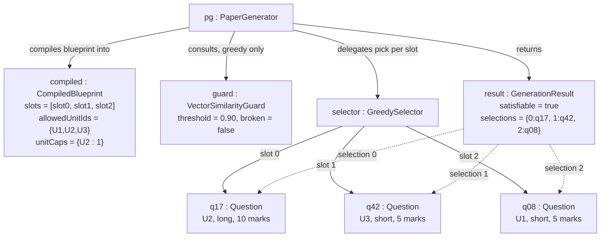
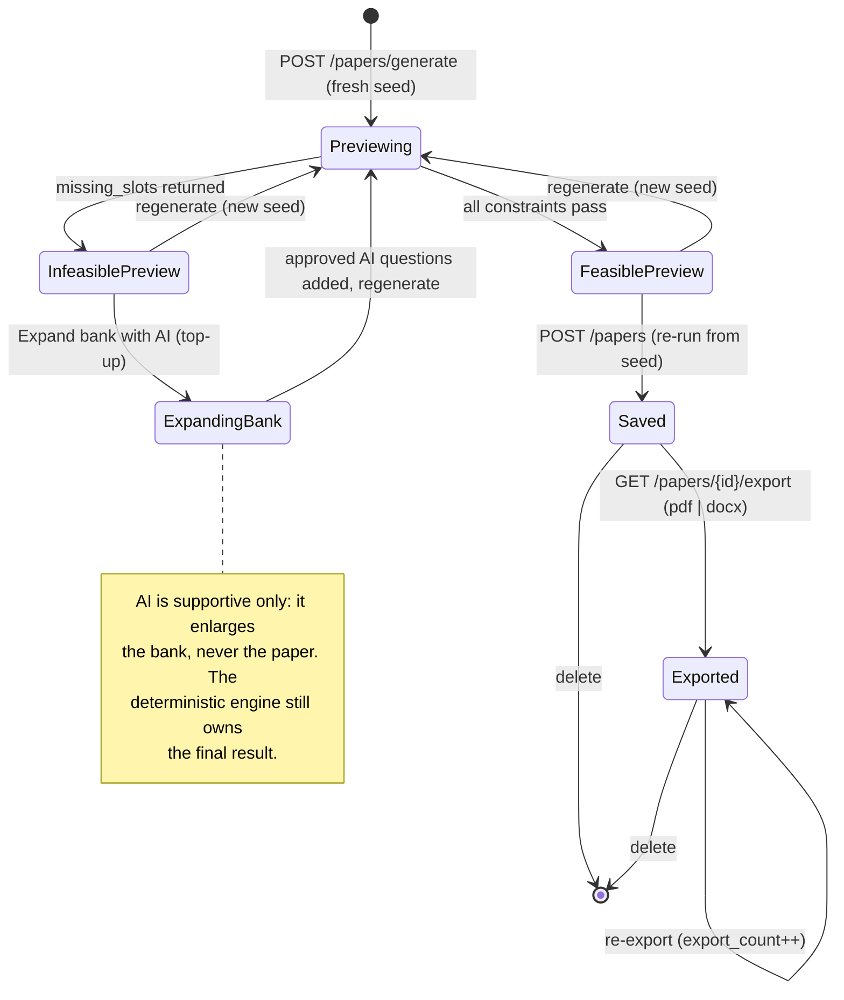
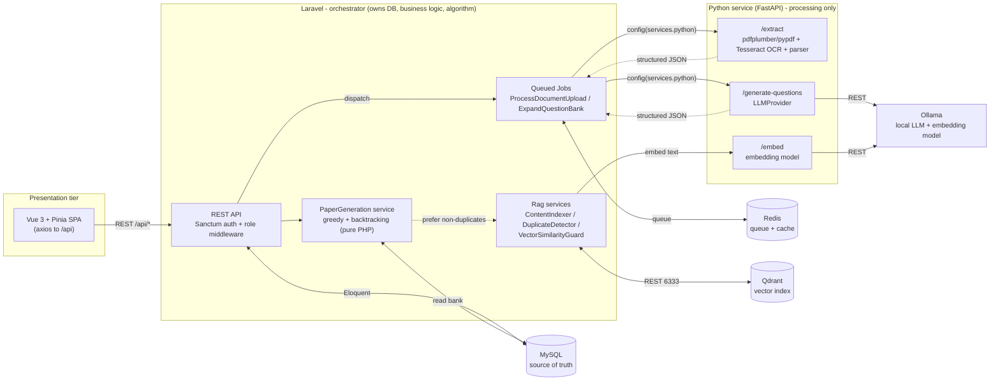
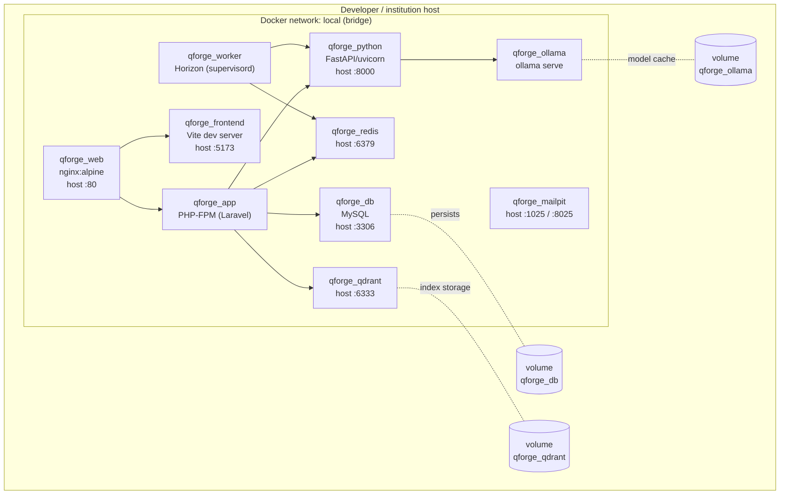
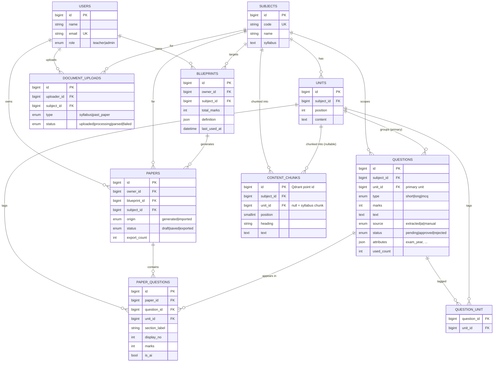

# Chapter 4: System Design

System design turns the *what* established in the previous chapter into the *how*: the same
object-oriented models are refined to the level at which they were actually implemented, and the
architecture, deployment topology, and persistence schema that support them are made explicit. The
chapter has two parts. Section 4.1 refines the analysis models — the class, object, state, sequence,
and activity diagrams — and adds the solution-level views that had no place in analysis: the component
architecture, the container deployment, and the relational schema treated as a persistence view beneath
the object design. Section 4.2 is the centre of gravity of the whole report: a full treatment of the
paper-generation algorithm, its five phases, its seed-parameterised determinism, its soft
semantic-duplicate guard, and its complexity. Throughout, one principle is kept in front: the
deterministic engine owns the final paper, and the artificial-intelligence component is supportive
only — it may enlarge the question bank, but it never selects, orders, or approves what appears on a
paper.

Every model in this chapter was reconciled against the delivered code before it was drawn, and the
class, method, and table names are reproduced exactly as they appear in the source.

## 4.1 Design

The analysis chapter modelled the *problem*; this section refines those models into the *solution* as
built. The refinement is a continuous progression rather than a fresh start — the domain classes of the
analysis carry through unchanged, and the design adds the internal service structure that realises the
behaviour, the runtime collaborations between those services, the concrete deployment, and the
persistence schema.

### Refined Class Diagram

The single most important refinement is the internal structure of the generation engine. In analysis
the engine was one conceptual responsibility; in design it is a small collaboration of
single-responsibility classes under the `App\Services\PaperGeneration` namespace, coordinated by a
facade. The facade, `PaperGenerator`, composes five collaborators — `BlueprintCompiler`,
`CandidateFilter`, `GreedySelector`, `ConstraintValidator`, and `BacktrackingResolver` — and consults a
`SimilarityGuard` during the greedy pass only. The guard is an interface with two implementations: the
default `NullSimilarityGuard`, a no-op that keeps the engine a pure function of the bank, and
`VectorSimilarityGuard`, which compares embedding vectors held in Qdrant. Candidate ordering ends in a
`TieBreaker` whose seeded key is the only source of run-to-run variation. The compiler produces a
`CompiledBlueprint` value object carrying the ordered `Slot` list, and the facade returns a
`GenerationResult` carrying either the selections and an all-pass `ConstraintResult` list or a partial
result plus a `MissingSlot` list. These service classes and their relationships are shown in Figure
4.1.

```mermaid
%% {{FIGURE: report/figures/fig-4.1-class-design.mmd — Figure 4.1}}
classDiagram
    class PaperGenerator {
        +generate(Blueprint, seed, guard) GenerationResult
        -greedyFill(compiled, exclusions, seed, guard) Question[]
        -computeMissingSlots(compiled, partial, pools) MissingSlot[]
    }
    class BlueprintCompiler {
        +compile(Blueprint) CompiledBlueprint
    }
    class CandidateFilter {
        +for(Slot, CompiledBlueprint, excludedIds, exclusion) Collection
    }
    class GreedySelector {
        +pick(candidates, uncoveredUnitIds, seed) Question
    }
    class ConstraintValidator {
        +validate(CompiledBlueprint, selections) ConstraintResult[]
        +allPass(results) bool
    }
    class BacktrackingResolver {
        -int MAX_ITERATIONS
        +resolve(CompiledBlueprint, candidatesBySlot, seed) Question[]
    }
    class SimilarityGuard {
        <<interface>>
        +prime(questions)
        +tooSimilar(candidate, chosen) bool
    }
    class NullSimilarityGuard {
        +tooSimilar(candidate, chosen) bool
    }
    class VectorSimilarityGuard {
        -broken bool
        +prime(questions)
        +tooSimilar(candidate, chosen) bool
    }
    class TieBreaker {
        +key(seed, id) int
    }
    class CompiledBlueprint {
        +slots Slot[]
        +allowedUnitIds int[]
        +unitCaps map
        +structurallyInfeasible() bool
    }
    class GenerationResult {
        +satisfiable bool
        +selections Question[]
        +constraintResults ConstraintResult[]
        +missingSlots MissingSlot[]
    }
    class Slot
    class ConstraintResult
    class MissingSlot

    PaperGenerator *-- BlueprintCompiler
    PaperGenerator *-- CandidateFilter
    PaperGenerator *-- GreedySelector
    PaperGenerator *-- ConstraintValidator
    PaperGenerator *-- BacktrackingResolver
    PaperGenerator ..> SimilarityGuard : consults (greedy only)
    SimilarityGuard <|.. NullSimilarityGuard
    SimilarityGuard <|.. VectorSimilarityGuard
    GreedySelector ..> TieBreaker
    BacktrackingResolver ..> TieBreaker
    BlueprintCompiler ..> CompiledBlueprint : builds
    PaperGenerator ..> GenerationResult : returns
    CompiledBlueprint *-- Slot
    GenerationResult *-- ConstraintResult
    GenerationResult *-- MissingSlot
    CandidateFilter ..> Question : queries approved bank
    VectorSimilarityGuard ..> QdrantClient : cosine over vectors
```



*Figure 4.1: Refined class diagram — the `PaperGeneration` service classes and their collaborations.*

The design deliberately keeps the engine free of persistence. `PaperGenerator` reads the question bank
but writes nothing; turning a preview into a saved paper is the controller's responsibility. Isolating
selection logic from database writes is what makes the engine unit-testable as a pure function and is
the reason the whole algorithm can be exercised deterministically against seeded fixtures.

### Refined Object Diagram

Carrying the instance-level view through to design, Figure 4.2 shows the objects that collaborate
during a single run of the refined engine. The `PaperGenerator` compiles the blueprint into one
`CompiledBlueprint` holding the ordered slots, the allowed units, and the per-unit caps; it consults a
`VectorSimilarityGuard` during the greedy pass; and it delegates the per-slot decision to a
`GreedySelector` that returns concrete approved `Question` instances. The run terminates in one
`GenerationResult` whose `selections` map each slot index to the chosen question. Compared with the
analysis-level object snapshot, this diagram exposes the engine's own runtime objects rather than only
the persisted domain entities.



*Figure 4.2: Refined object diagram — the collaborating objects of one generation run.*

### Refined State Diagram

The paper lifecycle is refined to expose the two possible outcomes of a preview and the
artificial-intelligence recovery path that connects an infeasible preview back to a feasible one.
As Figure 4.3 shows, a generate request enters the *Previewing* state and resolves either to a
*FeasiblePreview* (every constraint satisfied) or an *InfeasiblePreview* (the engine returned a
shortfall). From an infeasible preview the Teacher may regenerate with a fresh seed, or invoke the AI
**top-up**, which enlarges the bank with newly approved questions and returns to *Previewing* so the
engine can run again over the larger bank. Only a feasible preview may be saved, after which the paper
may be exported. This refinement makes the supportive role of AI explicit at the level of the state
machine: the top-up transition feeds the bank and loops back through generation; it never produces a
saved paper directly.



*Figure 4.3: Refined state diagram — generation outcomes and the AI top-up recovery path.*

### Refined Sequence Diagram

Figure 4.4 refines the generation interaction to include the two elements absent from the analysis
sequence: the semantic **similarity guard** consulted inside the greedy loop, and the AI top-up path
taken when the bank is too thin. During each slot's turn the engine primes the guard with the candidate
pool and asks whether a candidate is a near-duplicate of one already placed; the guard retrieves the
relevant question vectors from Qdrant and answers by cosine similarity, failing open — reporting "not
similar" — whenever the vector index is unavailable, so a soft preference can never break generation.
When neither the greedy pass nor backtracking can produce a valid paper, the response names the missing
slots, and the Teacher may dispatch the `ExpandQuestionBank` job. That job calls the Python
`/generate-questions` endpoint with a retrieval-grounded prompt, the local language model drafts
candidate questions, and they are inserted as approved AI questions before the Teacher regenerates. The
correct communication flow — frontend to Laravel to Python and back — is preserved throughout; the
frontend never contacts Python directly.

```mermaid
%% {{FIGURE: report/figures/fig-4.4-seq-generate-design.mmd — Figure 4.4}}
sequenceDiagram
    actor T as Teacher
    participant API as Laravel API
    participant PG as PaperGenerator
    participant SG as VectorSimilarityGuard
    participant QD as Qdrant
    participant DB as MySQL
    participant JOB as ExpandQuestionBank
    participant PY as Python /generate-questions
    participant OL as Ollama

    T->>API: POST /papers/generate { blueprint_id, seed? }
    API->>PG: generate(blueprint, seed, guard)
    PG->>PG: BlueprintCompiler -> CompiledBlueprint (slots, units, caps)
    loop each slot in order
        PG->>DB: CandidateFilter (approved; subject/type/marks; allowed units;<br/>exclude chosen + last-N papers + recent exam years)
        DB-->>PG: candidate pool
        PG->>SG: prime(pool); tooSimilar(candidate, chosen)?
        SG->>QD: retrieve question vectors (cosine >= threshold)
        QD-->>SG: vectors (fail-open when unavailable)
        PG->>PG: GreedySelector.pick (coverage, LRU, seeded tie-break)
    end
    PG->>PG: ConstraintValidator (counts, marks, coverage, maximums, repetition)
    alt all constraints pass
        PG-->>API: preview paper (id = null) + seed + constraint_results
        API-->>T: 200 preview
    else validation fails
        PG->>PG: BacktrackingResolver (bounded DFS, coverage must hold)
        alt valid assignment found
            PG-->>API: valid preview paper
            API-->>T: 200 preview
        else structurally / supply infeasible
            PG-->>API: satisfiable:false + missing_slots
            API-->>T: 200 shortfall + "Expand bank with AI"
            opt Teacher accepts top-up
                T->>API: request AI top-up { missing_slots }
                API->>JOB: dispatch ExpandQuestionBank
                JOB->>PY: POST /generate-questions (RAG-grounded prompt)
                PY->>OL: local LLM generate
                OL-->>PY: draft questions
                PY-->>JOB: candidate questions
                JOB->>DB: insert questions (source = ai, status = approved)
                T->>API: regenerate (engine re-runs over the enlarged bank)
            end
        end
    end
```

*Figure 4.4: Refined sequence diagram — generation with the RAG similarity guard and the AI top-up path.*

### Refined Activity Diagram

The control flow of the algorithm is refined from the analysis-level sketch into the full five-phase
process actually implemented, shown in Figure 4.5. The refinements are the structural-infeasibility
short-circuit that skips the backtracking search when no assignment can exist, the cap-busting rejection
and soft duplicate preference inside the candidate step, the seeded tie-break at the end of every
ordering, and the preview-then-save lifecycle. This diagram is the visual companion to the phase-by-phase
prose of Section 4.2; the two were reconciled against each other and against the source before drawing.

```mermaid
%% {{FIGURE: report/figures/fig-4.5-activity-generate-design.mmd — Figure 4.5}}
flowchart TD
    A([POST /papers/generate - blueprint_id - seed?]) --> B[Phase 0 BlueprintCompiler:<br/>sections to ordered slots,<br/>unitRules to allowedUnitIds, caps]

    B --> C[/Phase 1 Greedy pass - for each slot in order/]
    C --> D[CandidateFilter:<br/>approved - subject - type - marks<br/>any tag in allowedUnits - exclude chosen + last-N + exam-years<br/>reject cap-busting candidates<br/>prefer non-near-duplicates soft]
    D --> E[GreedySelector:<br/>uncovered-unit-first,<br/>then used_count,<br/>then seeded tie-break]
    E --> F{More slots?}
    F -- yes --> C

    F -- no --> G[Phase 2 ConstraintValidator:<br/>counts - total marks - unit coverage -<br/>unit maximums - no repetition]
    G --> H{All slots filled<br/>AND all constraints pass?}

    H -- yes --> S1([SUCCESS])

    H -- no --> H2{Structurally infeasible?<br/>units greater than 2x slots, or every unit<br/>capped and sum of caps less than slots}
    H2 -- yes --> L
    H2 -- no --> I[Build full candidate pool per slot]
    I --> J[Phase 3 BacktrackingResolver:<br/>bounded DFS, uncovered-unit-first,<br/>distinct ids, caps pruned,<br/>coverage must hold]
    J --> K{Valid assignment<br/>found?}

    K -- yes --> G2[Re-validate selections] --> S1

    K -- no --> L[Phase 4 computeMissingSlots:<br/>1 supply deficit = required minus available<br/>2 else uncovered allowed units<br/>paired scarcest-first when units greater than slots]
    L --> F2([INFEASIBLE:<br/>best-effort partial + missing_slots])

    S1 --> R1([200 PREVIEW: paper id=null + seed + blueprint_id<br/>+ constraint_results - nothing persisted])
    R1 --> P[/Phase 5 Later: POST /papers Save<br/>re-generate from seed/]
    P --> P2[persist papers status=saved + paper_questions<br/>bump used_count - stamp last_used_at - 201]

    F2 --> R2([200 satisfiable:false -<br/>partial paper + missing_slots + constraint_results + seed])
```



*Figure 4.5: Refined activity diagram — the five phases of generation with the structural short-circuit and preview/save lifecycle.*

### Component Diagram

At the architectural level QForge is a service-oriented system with Laravel as the sole orchestrator.
Figure 4.6 shows the components and the direction of every dependency. The Vue single-page application
is presentation only and speaks exclusively to the Laravel REST API over `/api`, authenticated by
Sanctum tokens and gated by role middleware. Laravel owns the MySQL source of truth, runs the pure-PHP
`PaperGeneration` service in-process, and dispatches heavy work to Redis-backed queued jobs. The Python
FastAPI service is a stateless processor exposing `/extract`, `/generate-questions`, and `/embed`; it
holds no business logic and never touches the main database. Laravel reaches Python only from jobs and
through a configured base URL, never a hard-coded host, and Python reaches the local Ollama runtime for
language-model and embedding inference. The RAG services within Laravel — including the
`VectorSimilarityGuard` that the engine consults — read and write the Qdrant vector index directly over
REST, exactly as they use Redis.



*Figure 4.6: Component diagram — Laravel orchestrator, Python processor, Vue presentation, and the backing stores.*

### Deployment Diagram

The whole system is described as a Docker Compose topology so it can be reproduced on any host without
per-machine configuration. Figure 4.7 shows the containers, the single bridge network they share, the
host ports each publishes, and the named volumes that persist state across restarts. An Nginx container
fronts both the PHP-FPM application and the Vite development server; a separate worker container runs
the Horizon queue processor under supervisord; and MySQL, Redis, Qdrant, the FastAPI service, and Ollama
each run in their own container on the same `local` network. Three named volumes give durability to the
data that must survive a rebuild: the MySQL data directory, the Ollama model cache, and the Qdrant
index storage. Because the vector index is rebuildable from the relational source of truth, its volume
is a performance convenience rather than an authoritative store.



*Figure 4.7: Deployment diagram — the Docker Compose container topology, ports, and named volumes.*

### Database Design

Beneath the object-oriented design sits a relational persistence schema. In keeping with the
object-oriented commitment of this report, the entity–relationship schema is presented here only as the
*persistence view* of the design — the shape the domain objects take when stored — and never as a
primary analysis model. The schema, shown in Figure 4.8, mirrors the domain classes of the analysis
chapter one-to-one: `users`, `subjects`, `units`, `questions`, `blueprints`, `papers`,
`paper_questions`, and `document_uploads`, together with the two M6 additions — the `question_unit`
junction that realises multi-unit tagging and the `content_chunks` retrieval corpus whose rows have a
vector twin in Qdrant.



*Figure 4.8: Relational schema — the persistence view of the object-oriented design.*

**Normalization.** The schema is in third normal form. Every table has a surrogate `bigint` primary
key; all non-key attributes depend on the whole key and on nothing but the key. The one relationship
that is genuinely many-to-many — a question spanning several units — is resolved through the
`question_unit` junction table with a composite uniqueness constraint on `(question_id, unit_id)`,
rather than by repeating unit references on the question row. The `questions.unit_id` column is retained
as the question's *primary* unit for display and default tagging, and is not a normalization violation
because the many-to-many membership lives entirely in the junction. Two deliberate, well-understood
denormalizations remain for performance and audit. First, `questions.used_count` is a maintained
counter of how many saved papers have used a question; it duplicates information derivable by counting
`paper_questions` rows, but it exists so the least-recently-used ordering can be expressed as a cheap
column sort rather than an aggregate on every candidate query. Second, each `paper_questions` row
snapshots the `section_label`, `display_no`, `marks`, `unit_id`, and `is_ai` of the question *at the
moment of generation*; this repeats data that could be looked up live, but it is intentional, because a
saved paper is a historical record that must not silently change if the underlying question is later
edited or re-tagged. The `blueprints.definition` and `questions.attributes` columns hold semi-structured
JSON — the blueprint specification and provenance metadata such as `exam_year` — where a rigid columnar
decomposition would add no query value and would couple the schema to a still-evolving specification.
The `content_chunks` table is pure derived data: it is wholesale-rebuilt from `units.content` and
`subjects.syllabus` on demand, nothing foreign-keys into it, and its vector counterparts in Qdrant are
rebuildable from it, so it sits outside the normalized core as a disposable retrieval index.

## 4.2 Algorithm Details

The paper-generation algorithm is the academic centrepiece of QForge and the substance of this chapter.
It is a **deterministic, seed-parameterised, hybrid greedy plus backtracking** engine, implemented in
plain PHP with no external constraint solver. Given a blueprint and the approved question bank it
produces one of exactly two outcomes: a *valid paper* — every slot filled, every constraint satisfied —
or a *best-effort partial paper accompanied by a precise account of what the bank lacks*. It never
returns an invalid paper silently and never fabricates a question to fill a gap. The design stance that
governs everything below is that **the algorithm owns the final paper**: selection is rule-based by
construction — coverage is a hard rank, repetition a hard exclusion, unit overload a hard cap — rather
than a tuned additive score whose weights might quietly trade one requirement away. The one place a
learned signal reaches into the engine, the semantic-duplicate guard, does so only as a *soft, fail-open
preference* that can break a tie toward variety but can never cause a shortfall.

The engine borrows two classical techniques and combines them: a greedy selection heuristic [7] for the
fast common case, and a bounded backtracking search [6] to repair the cases the greedy pass cannot solve
on its own. What follows treats the five phases in order, then determinism, the similarity guard, and
complexity.

### Vocabulary

A **blueprint** is a teacher-owned template with four parts: `sections` (the authoritative paper
structure), `unitRules` (the allowed units), `unitAllocations` (per-unit maximum caps), and
`exclusionRules` (repetition windows). A **slot** is one position in the paper to be filled by exactly
one question, carrying its section label, normalised type, marks, and display number; sections are
flattened into an ordered list of slots. A **candidate** is an approved question matching a slot's
subject, type, and marks whose tagged units overlap the allowed set. **Coverage** is the hard rule that
every allowed unit appears at least once in the finished paper. The output is a **GenerationResult**:
either a valid paper with an all-pass constraint checklist, or a partial paper with a list of **missing
slots** naming the shortfall.

### Phase 0 — Compile

`BlueprintCompiler::compile` deserialises the stored blueprint into a `CompiledBlueprint` value object
holding everything the later phases need. Each `section` of count *n* is expanded into *n* single-question
slots in section order, with the display type normalised to a canonical question type (`"Short Answer"`
to `short`, `"Long Answer"` to `long`, `"MCQ"` to `mcq`) and a running one-based display number. The
truthy `unitRules` names are resolved to `allowedUnitIds` within the subject; an empty set means no unit
restriction and, consequently, no coverage requirement. The `unitAllocations` counts are compiled into
per-unit maximum caps — a unit's cap is the sum of its rows' counts; a unit with no rows is uncapped,
and the marks column of those rows is display-only and never enforced. Finally the repetition windows —
`lastNPapers` and `excludeExamYearsBack` — are captured. The compiled blueprint also exposes the
structural-feasibility predicates used in Phase 3.

```text
function compile(blueprint):
    slots ← []
    displayNo ← 1
    for each section in blueprint.definition.sections:
        type ← normaliseType(section.type)
        for i in 1..section.count:
            slots.append(Slot(index, section.name, type, section.marksEach, displayNo))
            displayNo ← displayNo + 1
    allowedUnitIds ← resolveUnits(blueprint.definition.unitRules)   // empty ⇒ no restriction
    unitCaps       ← compileCaps(blueprint.definition.unitAllocations, allowedUnitIds)
    lastNPapers          ← blueprint.definition.exclusionRules.lastNPapers ?? 0
    excludeExamYearsBack ← blueprint.definition.exclusionRules.excludeExamYearsBack ?? 0
    return CompiledBlueprint(subjectId, totalMarks, slots, allowedUnitIds,
                             unitNames, unitCaps, lastNPapers, excludeExamYearsBack)
```

### Phase 1 — Greedy fill

`PaperGenerator::greedyFill` walks the slots in order and fills each with the best available candidate.
For a slot, `CandidateFilter::for` builds the pool: approved questions of the subject whose type and
marks match the slot, at least one of whose tagged units is allowed (the *any-overlap* rule, so a
genuinely multi-topic question stays eligible), excluding every question already placed on this paper,
and — through an injected exclusion closure — excluding questions caught by the cross-paper repetition
windows. The generator composes two such windows: the **last-N papers** rule drops questions that
appeared on the most recent *N* papers or imported past exams for the subject, and the **last-N exam
years** rule drops questions whose recorded provenance year falls in the years immediately before the
current one. Both are built as excluded-*id* sets so that questions with no recorded year are never
dropped by accident. The pool is returned ordered least-recently-used first (`used_count` ascending,
then `id`).

Three refinements then act on that pool before a pick is made. First, if the blueprint imposes per-unit
caps, any candidate whose selection would push one of its tagged capped units past its maximum is
rejected — a multi-unit question counts against every capped unit it is tagged with. Second, when a
similarity guard is active and at least one question is already placed, the engine *prefers* candidates
that are not near-duplicates of the placed questions, but only if discarding the duplicates leaves the
pool non-empty; otherwise the full pool is kept. This is the soft duplicate guard, and its
pool-non-emptying rule is what guarantees it can never cause a shortfall. Third, `GreedySelector::pick`
chooses from the surviving pool by a total order: candidates that cover a still-uncovered allowed unit
rank first, then lowest `used_count`, then the seeded tie-break. The chosen question's id is added to
the in-paper exclusion set — which guarantees no repetition — and its tagged units are merged into the
running covered set and cap usage.

```text
function greedyFill(compiled, exclusions, seed, guard):
    selections ← {} ; usedIds ← [] ; covered ← {} ; unitUse ← {}
    for each slot in compiled.slots:            // in order
        pool ← CandidateFilter.for(slot, compiled, usedIds, exclusions)
        if compiled.unitCaps ≠ ∅:
            pool ← pool without candidates that would bust a cap given unitUse
        guard.prime(pool)
        if selections ≠ ∅:
            fresh ← pool without candidates guard.tooSimilar(candidate, selections)
            if fresh not empty: pool ← fresh          // soft: never empty the pool
        uncovered ← compiled.allowedUnitIds − covered
        pick ← GreedySelector.pick(pool, uncovered, seed)   // coverage, then LRU, then tie-break
        if pick ≠ null:
            selections[slot.index] ← pick
            usedIds.append(pick.id)
            for unitId in pick.taggedUnitIds():
                covered.add(unitId)
                if unitId ∈ compiled.unitCaps: unitUse[unitId] ← unitUse[unitId] + 1
    return selections
```

The greedy pass is coverage-aware but *myopic*: ranking uncovered units first makes it cover all units
on the first pass for most feasible blueprints, but it cannot see how an early pick constrains later
slots — a cap it exhausts early, or a marks-shape conflict several slots ahead — so an invalid greedy
paper is still possible. Repairing exactly those cases is the purpose of Phase 3.

### Phase 2 — Validate

`ConstraintValidator::validate` scores the current selections into a list of pass/fail lines, one per
constraint, in the shape the frontend renders directly. It checks, per section, that the filled count
equals the required count; that the summed marks of filled slots equal the blueprint's total marks; when
units are restricted, that the number of distinct allowed units used equals the number of allowed units
(union semantics — a multi-unit question covers every allowed unit it carries); when caps exist, that no
capped unit is tagged by more than its maximum; and that no question id repeats within the paper. If
every slot is filled *and* every constraint passes, the run succeeds and returns immediately.

```text
function validate(compiled, selections) → ConstraintResult[]:
    results ← []
    for each sectionLabel: results.append(filledCount == requiredCount)
    results.append( Σ marks(filled slots) == compiled.totalMarks )
    if compiled.allowedUnitIds ≠ ∅:
        coveredUnits ← distinct( ⋃ selections.taggedUnitIds() ) ∩ allowedUnitIds
        results.append( |coveredUnits| == |allowedUnitIds| )          // coverage
    if compiled.unitCaps ≠ ∅:
        results.append( every capped unit used ≤ its cap )            // maximums
    results.append( no repeated question id )
    return results
```

### Phase 3 — Backtracking repair

When the greedy paper is invalid, `BacktrackingResolver::resolve` searches for a fully-valid assignment
by bounded depth-first search [6]. Before searching, a **structural short-circuit** is applied: if the
`CompiledBlueprint` is structurally infeasible — the coverage rule demands more units than the paper can
ever reach (`|allowedUnitIds| > 2 × |slots|`, because an AI top-up question spans at most two units), or
every allowed unit is capped and the caps sum below the slot count — the search is skipped entirely,
because no assignment can succeed, and control passes straight to Phase 4. This avoids burning the
iteration budget on a provably impossible problem.

Otherwise the resolver builds the full candidate pool per slot (with the cross-paper exclusions still
applied, but without the per-paper exclusions, since it enforces uniqueness itself) and runs a DFS over
the slots, treating the slot index as the search depth. At each node it orders the remaining candidates
by the same key the greedy selector uses — uncovered-unit-first, then `used_count`, then the seeded
tie-break — which actively steers the search toward coverage; it skips any candidate whose id is already
on the current path, and prunes any that would exceed a per-unit cap on this path. On reaching the last
slot it accepts the assignment only if coverage holds; otherwise it backtracks and tries the next
candidate. The search is bounded by `MAX_ITERATIONS = 50000`, so it always terminates; the
coverage-first ordering reaches a covering assignment quickly in practice, so the bound is rarely
approached. The similarity guard is deliberately *not* consulted here — similarity is a soft preference,
not a constraint, and enforcing it in the repair pass could turn a satisfiable paper infeasible, so the
repair pass optimises for a valid assignment above all. A returned assignment is re-validated and the
run succeeds.

```text
function resolve(compiled, candidatesBySlot, seed):
    iterations ← 0
    return search(depth = 0, assigned = {}, usedIds = [], unitUse = {})

function search(depth, assigned, usedIds, unitUse):
    if ++iterations > MAX_ITERATIONS: return null
    if depth == |compiled.slots|:
        return coversAllUnits(assigned) ? assigned : null      // accept only if covered
    slot ← compiled.slots[depth]
    uncovered ← compiled.allowedUnitIds − coveredUnits(assigned)
    ordered ← candidatesBySlot[slot.index]
              reject candidates whose id ∈ usedIds
              reject candidates that would bust a cap given unitUse
              sort by (uncoveredRank, used_count, TieBreaker.key(seed, id))
    for each question in ordered:
        assigned[slot.index] ← question
        result ← search(depth + 1, assigned, usedIds + question.id, unitUse + question.units)
        if result ≠ null: return result
        remove assigned[slot.index]                            // backtrack
    return null
```

### Phase 4 — Explain the shortfall

If backtracking also fails (or was short-circuited), the blueprint is infeasible against the current
bank, and `PaperGenerator::computeMissingSlots` returns the best-effort partial paper together with a
precise, actionable account of what is missing, computed in two tiers. The **supply deficit** tier is
primary: slots are grouped by `(section, type, marks)`, and for each group the deficit is the required
count minus the number of distinct approved questions available; every group with a positive deficit
becomes a `MissingSlot` naming the type, marks, and shortfall count, targeted at the scarcest allowed
unit (the two scarcest when the coverage rule demands more units than there are slots, so a single AI
top-up question can span both and pull double duty). If supply is adequate everywhere but the paper
still cannot be covered, the **coverage deficit** tier applies: when there are at least as many slots as
units, each uncovered unit becomes a single-unit missing slot; when units outnumber slots, only
unit-spanning questions can close the gap, so the scarcest units are paired — one missing slot per pair
— with singles for any leftover uncovered units. Every `MissingSlot` carries its target unit ids
ordered scarcest-first, which is exactly the input the AI top-up job consumes to generate questions on
the right units.

```text
function computeMissingSlots(compiled, partial, candidatesBySlot) → MissingSlot[]:
    // Tier 1 — supply deficit (primary)
    groups ← slots grouped by (section, type, marks)
    missing ← []
    for each group:
        deficit ← group.required − |candidatesBySlot[group.slot.index]|
        if deficit > 0:
            span    ← (|allowedUnitIds| > |slots|) ? 2 : 1
            targets ← scarcest `span` allowed units for this pool
            missing.append(MissingSlot(section, type, marks, need = deficit, unitIds = targets))
    if missing ≠ ∅: return missing
    // Tier 2 — coverage deficit (fallback)
    uncovered ← allowedUnitIds − ⋃ partial.taggedUnitIds()
    if |allowedUnitIds| ≤ |slots|:
        chunks ← each uncovered unit as a single [unitId]
    else:                                                  // pair the scarcest units
        pairCount ← |allowedUnitIds| − |slots|
        chunks    ← scarcest (2 × pairCount) units paired up, plus singles for leftovers
    for each unitIds in chunks:
        missing.append(MissingSlot(firstSlot.section, firstSlot.type, firstSlot.marks,
                                   need = 1, unitIds = unitIds))
    return missing
```

### Phase 5 — Preview then Save

Generation is a two-step, preview-first flow, and the engine itself is pure — it never persists. The
generate request draws a fresh random seed (or accepts a client seed to reproduce a paper), runs the
engine, and returns the paper with a null id plus the seed and blueprint id; nothing is written, so
repeatedly regenerating never clutters history or skews usage statistics. Infeasible responses have the
same unpersisted shape, carrying the partial paper and the missing slots. Saving sends back the
blueprint id and the seed; because the engine is deterministic given its seed, the save path
*re-generates* rather than trusting a client-supplied selection, and within a transaction inserts the
`papers` row and one `paper_questions` row per selection, increments each picked question's `used_count`,
and stamps the blueprint's `last_used_at`. If the bank has changed so the seed no longer yields a full
paper, the save is rejected rather than persisting something the teacher never previewed. The lifecycle
is therefore preview (unsaved) to saved to exported, with no auto-created draft.

### Determinism given the seed

Candidate ordering is a *total* order — `(uncoveredRank, used_count ascending, TieBreaker::key(seed, id))`
— whose final component is unique per question id, so every tie chain terminates deterministically. The
output is thus a pure function of the bank, the blueprint, and the seed: the same bank plus the same
blueprint plus the *same seed* yields the same paper on every run, and a null seed reproduces the
original identifier-ordered paper exactly, which is the property the unit tests pin. The seed is the
*only* source of variation, and `TieBreaker::key` confines it to the last tie-break: for a null seed it
returns the id itself, and for any integer seed it returns `crc32("seed:id")`, a stable, well-spread
reordering of *only* those candidates the rank already treats as equal. Coverage, the least-recently-used
rotation, the caps, and every constraint are never overridden by the seed. This is what lets a
regenerate action and two teachers working simultaneously each obtain a different but equally valid
paper, while any specific paper remains exactly reproducible from its recorded seed — the property that
makes an examination paper auditable and defensible.

### The soft semantic-duplicate guard

Identifier uniqueness prevents the *same row* from appearing twice on a paper, but it cannot detect two
*different* rows that mean the same thing — "Define a binary tree" and "What is a binary tree?". The
`SimilarityGuard` closes that gap using the embedding vectors already maintained for the question bank in
Qdrant. It is an interface with two implementations. `NullSimilarityGuard` is the default no-op, which
keeps the engine a pure function of the bank for unit tests and the feasibility probe. `VectorSimilarityGuard`
loads the candidate questions' vectors on demand, caches them per run, and reports a candidate as too
similar when its cosine similarity to any already-placed question reaches the configured
`RAG_DUPLICATE_THRESHOLD` (0.90 by default). Two properties make the guard safe. It is applied in the
greedy pass *only* and as a *pool-non-emptying preference*, so it can prefer variety but can never empty
a slot's pool or turn a satisfiable paper infeasible; and it *fails open* — if RAG is disabled, a vector
is missing, or Qdrant is unreachable, the guard reports "not similar" and generation proceeds on
identifier-uniqueness alone. It is the single point at which a learned, semantic signal reaches into
selection, and only ever as far as breaking a tie toward a more varied paper — the deterministic rules
remain fully in control.

### Complexity

Let *S* be the number of slots and *C* the maximum number of candidates per slot. The greedy fill plus
validation is `O(S · C)`: one filtered query and a linear selection per slot. The backtracking repair is
worst-case exponential in the number of slots, as any depth-first constraint search can be [6], but it is
bounded by `MAX_ITERATIONS = 50000` so it always terminates, and the uncovered-unit-first ordering drives
it to a covering assignment quickly in practice, so in the common case it runs far below that ceiling and
is frequently never entered at all, because the coverage-aware greedy pass already produces a valid paper.
The similarity guard adds, per run, at most one batched vector retrieval and a bounded number of cosine
comparisons against the small set of already-placed questions, which does not change the asymptotic cost
of generation.

## Progress

- ✅ 4.1 Design (refined class, object, state, sequence, activity, component, deployment, database) — report/04-system-design.md
- ✅ 4.2 Algorithm Details (five phases, determinism, similarity guard, complexity) — report/04-system-design.md
